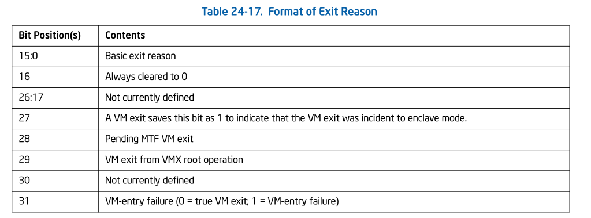

# CHAPTER 24 VIRTUAL MACHINE CONTROL STRUCTURES
## 24.1 OVERVIEW
A logical processor uses virtual-machine control data structures
(VMCSs) while it is in VMX operation. These manage transitions
into and out of VMX non-root operation (VM entries and VM exits)
as well as processor behavior in VMX non-root operation. This
structure is manipulated控制;操纵;影响 by the new instructions VMCLEAR, VMPTRLD,
VMREAD, and VMWRITE.
 

一个逻辑处理器在 VMX operation中使用 virtual-machine control data 
structure (VMCSs)。他们用来管理 转换进入或者退出 VMX non-root operation
(VM entries 和 VM exits) ,也包括在 VMX non-root oeration 中的行为。
该structure 通过新的指令控制: VMCLEAR, VMPRTLD, VMREAD和VMWRITE.

A VMM can use a different VMCS for each virtual machine that it
supports. For a virtual machine with multiple logical processors
(virtual processors), the VMM can use a different VMCS for each
virtual processor. 
 

VMM 可以为它支持的每个virtual machine 使用不同的VMCS。对于带有多个
logical processor (virtual processors)的VM来说，VMM 为每个virtual
processor 使用不同的VMCS。

A logical processor associates a region in memory with each 
VMCS. This region is called the **VMCS region**. Software references
a specific VMCS using the 64-bit physical address of the region
(a **VMCS pointer**). VMCS pointers must be aligned on a 4-KByte 
boundary (bits 11:0 must be zero). These pointers must not set
bits beyond the processor’s physical-address width.
 

逻辑处理器为每个VMCS关联一个内存区域。该区域称为 VMCS region。
软件使用该区域的64-bits物理地址引用特定的 VMCS(**a VMCS pointer**)
VMCS pointer 必须以4-KByte边界对齐(bits 11:0必须为0)。这些pointer
不允许设置bits超过处理器的物理地址宽度。

A logical processor may maintain a number of VMCSs that are 
**active**. The processor may optimize VMX operation by maintaining
the state of an active VMCS in memory, on the processor, or both.
At any given time, **at most one of**最多一个 the active VMCSs is the **current
VMCS**. (This document frequently uses the term术语 “the VMCS” to refer
to the current VMCS.) The VMLAUNCH, VMREAD, VMRESUME, and VMWRITE
instructions operate only on the current VMCS. 
 

一个逻辑处理器可以维护一些active的VMCSs。处理器可以通过维护memory, 
processor 或者两者中active VMCS的状态 来优化 VMX operation。 在任何
给定的时间内, 最多一个 active VMCS 是 current VMCS(该文档经常使用的
"the VMCS"指的是current VMCS.) VMLAUNCH, VMREAD, VMRESUME 和VMWRITE
指令，只操作于 current VMCS.

The following items describe how a logical processor determines
which VMCSs are active and which is current:
 

接下来的条目描述了 logical processor 如何确定哪个 VMCSs是active
哪个是current

* The memory operand of the VMPTRLD instruction is the address
of a VMCS. After execution of the instruction, that VMCS is 
both active and current on the logical processor. Any other 
VMCS that had been active remains so,but no other VMCS is 
current.
 

VMPTRLD 指令的内存操作数是VMCS 的地址。在执行该指令后，该VMCS
在该逻辑处理器上是既 active 又 current。任何其他的之前是active
的VMCS都将仍然是active,但是没有其他的VMCS是current

* The VMCS link pointer field in the current VMCS (see Section
24.4.2) is itself the address of a VMCS. If VM entry is performed
successfully with the 1-setting of the “VMCS shadowing” 
VM-execution control, the VMCS referenced by the VMCS link pointer
field becomes active on the logical processor. The identity of
the current VMCS does not change.
 

current VMCS 中的VMCS link pointer 字段是VMCS本身的地址。如果带有1-setting
 "VMCS shadowing”" VM-execution control 的VM entry 执行成功，
 由VMCS link pointer字段指向的VMCS 将在该逻辑处理器上变为active。
current VMCS的身份不会变。

* The memory operand of the VMCLEAR instruction is also the 
address of a VMCS. After execution of the instruction, that 
VMCS is neither active nor current on the logical processor. 
If the VMCS had been current on the logical processor, the 
logical processor no longer has a current VMCS.
 

VMCLEAR指令的内存操作数也是VMCS的地址。在该指令执行后，该
VMCS 在该逻辑处理器上既不是active 也不是current。如果VMCS
在该逻辑处理器上是current的话，该逻辑处理器不再有current VMCS。

The VMPTRST instruction stores the address of the logical 
processor’s current VMCS into a specified memory location 
(it stores the value FFFFFFFF_FFFFFFFFH if there is no current
VMCS).
 

VMPTRST 指令存储该逻辑处理器上的 current VMCS到一个指定的内存
位置(如果没有current VMCS，它store FFFFFFFF_FFFFFFFFH 值)

The launch state of a VMCS determines which VM-entry instruction
should be used with that VMCS: the VMLAUNCH instruction requires
a VMCS whose launch state is “clear”; the VMRESUME instruction
requires a VMCS whose launch state is “launched”. A logical 
processor maintains a VMCS’s launch state in the corresponding
VMCS region. The following items describe how a logical processor
manages the launch state of a VMCS:
 
 
VMCS 的launch state 决定了VM-entry时，该使用哪个指令用于该VMCS:
VMLAUNCH指令需要该VMCS的launch 状态是 "clear"; VMRESUME 指令需要
VMCS的launch 状态是"launched"。逻辑处理器在相应的VMCS区域里面
维护 VMCS的launch 状态。接下来的条目描述了逻辑处理器如何管理
VMCS的launch 状态.

* If the launch state of the current VMCS is “clear”, successful
execution of the VMLAUNCH instruction changes the launch state
to “launched”.
 

如果current VMCS 的launch state 是"clear", 成功执行 VMLAUNCH 指令
将 launch state 改变为 "launched"

* The memory operand of the VMCLEAR instruction is the address
of a VMCS. After execution of the instruction, the launch state
of that VMCS is “clear”.
 

VMCLEAR的操作数是 VMCS 的地址。执行该指令后，VMCS 的launch state 
为“clear"

* There are no other ways to modify the launch state of a VMCS
(it cannot be modified using VMWRITE) and there is no direct 
way to discover it (it cannot be read using VMREAD).
 

没有其他方法可以来修改 VMCS 的 launch state(通过VMWRITE 也不能修改)
并且没有直接的方法去 发现它(不能通过 VMREAD 读取得到)

Figure 24-1 illustrates the different states of a VMCS. It 
uses “X” to refer to the VMCS and “Y” to refer to any other 
VMCS. Thus: “VMPTRLD X” always makes X current and active; 
“VMPTRLD Y” always makes X not current (because it makes Y 
current); VMLAUNCH makes the launch state of X “launched” 
if X was current and its launch state was “clear”; and VMCLEAR
X always makes X inactive and not current and makes its launch
state “clear”.
 

Figure 24-1 说明了VMCS的不同状态。它使用"X"表明该VMCS, 使用"Y"
表明另一个”VMCS“。虽然: "VMPTRLD X” 总能使 X 成为current 和 active;
"VMPTRLD Y" 总能使 X 变成 not current (因为它使Y current); 如果
X 是current并且他的 launch 状态为 "clear", VMLAUNCH 使X的launch
state 变为"launched"; 并且 VMCLEAR 总能使 X 变为 inactive 并且not 
current并且将 launch state变为 "clear"

The figure does not illustrate operations that do not modify 
the VMCS state relative to these parameters (e.g., execution 
of VMPTRLD X when X is already current). Note that VMCLEAR X 
makes X “inactive, not current, and clear,” even if X’s current
state is not defined (e.g., even if X has not yet been 
initialized). See Section 24.11.3. 
 

该图没有说明相对于这些参数的不会修改VMCS state 的操作(例如, 当
X 已经current时候执行 VMPTRLD)。注意，即使X的current state
没有defined情况下(例如,即使X还没有被初始化), VMCLEAR X可以使
X 变为"inactive, not current 并且clear"。

Because a shadow VMCS (see Section 24.10) cannot be used for
VM entry, the launch state of a shadow VMCS is not meaningful.
Figure 24-1 does not illustrate all the ways in which a shadow
VMCS may be made active.
 

因为shadow VMCS (请看Section 24.10) 不能用于VM entry, 所以关于
shadow VMCS的launch state 是没有意义的。Figure 24-1没有说明使
shadow VMCS变为active 的所有路径。

## 24.4 GUEST-STATE AREA

### 24.4.2 Guest Non-Register State

In addition to the register state described in Section 24.4.1,
the guest-state area includes the following fields that characterize
guest state but which do not correspond to processor registers:
 

除了Section 24.4.1 中描述的 register state之外，guest-state区域还包括
如下字段，这些字段描述了guest state的特征，但是它们并不对应 processor
register。

* **Active state**(32Bit).(略)

* **Interruptibility state** (32 bits). The IA-32 architecture includes
features that permit certain events to be blocked for a period of 
time. This field contains information about such blocking. Details
and the format of this field are given in Table 24-3.
 

Interruptibility state: IA-32 architecture 包含了一些feature，这些
feature允许 某些 events 可以被blocked一段时间。这个字段包含了有关此
blocking的相关信息。关于细节以及这些字段的格式在Table 24-3 中给出。

<table>
	<th>Bit Position(s)</th>
	<th>Bit Name</th>
	<th>Notes</th>
	<tr>
		<td>0</td>
		<td>Blocking by STI</td>
		<td>
		See the “STI—Set Interrupt Flag” section in Chapter 4 of the
		Intel® 64 and IA-32 Architectures Software Developer’s Manual,
		Volume 2B.
		 
		Execution of STI with RFLAGS.IF = 0 blocks maskable interrupts
		on the instruction boundary following its execution.1 Setting
		this bit indicates that this blocking is in effect.
		 
		
		请查看Intel(R)64 sdm Volume 2B Chapter 4 
		"STI-Set Interrupt Flag"章节
		 
		当RFLAGS.IF=0 时，执行STI指令, 会在其执行后，阻止指令边界上的
		可屏蔽中断。查看该bit指示 该blocking 是否生效。
		
		</td>
	</tr>
</table>

* (略s)
* **Guest interrupt status**(16 bits). This field is supported
only on processors that support the 1-setting of the “virtual-
interrupt delivery” VM-execution control. It characterizes part
of the guest’s virtual-APIC state and does not correspond to 
any processor or APIC registers. It comprises包含 two 8-bit subfields:
 

Guest interrupt status: 该字段只在可以设置 VM-execution control
中"virtual-interrupt delivery“为 1 的处理器上支持。它代表了guest的
virtual-APIC state的一部分 并且不对应任何的处理器或者APIC 寄存器。
它包含了两个8-bits的子字段:

	+ **Requesting virtual interrupt** (RVI). This is the low byte of
	the guest interrupt status. The processor treats this value 
	as the vector of the highest priority virtual interrupt that
	is requesting service. (The value 0 implies that there is no
	such interrupt.)
	 
	
	Requesting virtual interrupt (RVI). 该字段是guest interrupt state
	的低字节.处理器将该值视为 在request service的最高有优先级 virtual
	interrupt 的向量。(如果该值为0 意味着这里没有这样的中断)
	
	+ **Servicing virtual interrupt** (SVI). This is the high byte
	of the guest interrupt status. The processor treats this value
	as the vector of the highest priority virtual interrupt that
	is in service. (The value 0 implies that there is no such 
	interrupt.)
	 
	
	该字段是guest interrupt state 的高位字节。处理器将它视为在service
	里最高优先级virtual interrupt 向量。(如果该值为0意味着没有这样的
	中断)
	

See Chapter 29 for more information on the use of this field.
 

请查看Chapter 29了解关于该字段的更多信息。

## 24.9 VM-EXIT INFORMATION FIELDS
The VMCS contains a section of fields that contain information
about the most recent VM exit.
 

VMCS 包含了 含有最后一次VM exit的相关信息的字段中的一部分。

On some processors, attempts to write to these fields with 
VMWRITE fail (see “VMWRITE—Write Field to Virtual-Machine 
Control Structure” in Chapter 30).
 

在某些处理器中，尝试使用VMWRITE去写这些字段会导致失败("请查看Chapter
30 中 VMWRITE-Write Field to VMCS")

### 24.9.1 Basic VM-Exit Information
The following VM-exit information fields provide basic 
information about a VM exit:
 

接下来的VM-exit information 字段包含了一次VM exit的主要信息

* Exit reason (32 bits). This field encodes the reason for the
VM exit and has the structure given in Table 24-17.
 

Exit reason: 该字段编码了 VM exit的原因，并且其结构在Table 24-17
展示给出

	+ Bits 15:0 provide basic information about the cause of the 
	VM exit (if bit 31 is clear) or of the VM-entry failure (if 
	bit 31 is set). Appendix C enumerates the basic exit reasons.
	 
	
	Bit 15:0 提供了关于VM exit原因的主要信息(如果bit 31 是clear的话)
	或者是 VM-entry failure(如果bit 31是set的话)。Appendix C 例举了
	exit 的主要原因。
	
	+ Bit 16 is always cleared to 0.
	+ Bit 27 is set to 1 if the VM exit occurred while the logical
	processor was in enclave mode. A VM exit also sets this bit 
	if it is incident事件/事故/由...产生 to delivery of an event injected by VM entry
	and the guest interruptibility-state field indicates an enclave
	interrupt (bit 4 of the field is 1). See Section 27.2.1 for details.
	 
	
	如果VM exit发生时，逻辑处理器在 enclave 模式，Bit 27 设置为 1.
	如果VM exit由 递送一个由VM entry 注入的event产生，并且 guest 
	interruptibility-state 字段表示是一个 enclave interrupt(字段
	中的第4位设置为1)。请看27.2.1 了解更多细节。
	
	+ Bit 28 is set only by an SMM VM exit (see Section 31.15.2)
	that took priority over an MTF VM exit (see Section 25.5.2) 
	that would have occurred had the SMM VM exit not occurred. 
	See Section 31.15.2.3.
	 
	
	Bit 28 只设置于 SMM VM exit(请查看 Section 31.15.2)设置，
	该事件优先级高于 MTF VM exit(请查看Section 25.5.2)，
	如果SMM VM exit没有发生，就会触发MTF VM exit。
	
	+ Bit 29 is set if and only if the processor was in VMX root
	operation at the time the VM exit occurred. This can happen 
	only for SMM VM exits. See Section 31.15.2.
	 
	
	Bit 29 只会设置于 当发生VM exit时，处理器处于VMX root operation.
	他值发生于SMM VM exits。请查看Section 31.15.2。
	
	+ Because some VM-entry failures load processor state from 
	the host-state area (see Section 26.8), software must be able
	to distinguish such cases from true VM exits. Bit 31 is used
	for that purpose.
	 
	
	因为某些VM-entry failures会从host-state area中加载处理器状态(
	请查看Section 26.8), 软件必须区分这些情形和真正的VM exits.
	Bit 31 用于这个目的.
	
* Exit qualification (64 bits; 32 bits on processors that do 
not support Intel 64 architecture). This field contains additional
information about the cause of VM exits due to the following: 
debug exceptions; page-fault exceptions; start-up IPIs (SIPIs);
task switches; INVEPT; INVLPG;INVVPID; LGDT; LIDT; LLDT; LTR;
SGDT; SIDT; SLDT; STR; VMCLEAR; VMPTRLD; VMPTRST; VMREAD; VMWRITE;
VMXON; XRSTORS; XSAVES; control-register accesses; MOV DR; I/O 
instructions; and MWAIT. The format of the field depends on the
cause of the VM exit. See Section 27.2.1 for details.
 

Exit qualification(64 bits; 32 bits在不支持 Intel 64 architecture 的
处理器上). 该字段 包含了某些额外的信息，关于产生的VM exits 如下原因:
debug exceptions;...(略;见上)...。该字段的格式依赖VM exit 的原因。
请看Section 27.2.1 了解更多细节.

* Guest-linear address (64 bits; 32 bits on processors that do
not support Intel 64 architecture). This field is used in the
following cases:
 

Guest-linear address (64 bits; 32 bits 在不支持 Intel 64 architecture
的处理器上). 该字段用于下面的情形:

	+ VM exits due to attempts to execute LMSW with a memory operand.
	+ VM exits due to attempts to execute INS or OUTS.
	+ VM exits due to system-management interrupts (SMIs) that 
	arrive immediately after retirement of I/O instructions.
	 
	
	由于在I/O 指令退出后立即到达 SMIs
	
	+ Certain VM exits due to EPT violations违规
See Section 27.2.1 and Section 31.15.2.3 for details of when 
and how this field is used.
 

请查看Section 27.2.1 和Section 31.15.2.3 了解这个字段在什么时候
怎么使用的细节。

* Guest-physical address (64 bits). This field is used VM exits
due to EPT violations and EPT misconfigurations. See Section 
27.2.1 for details of when and how this field is used.
 

该字段用 由 EPT 违规和 EPT misconfigurations 造成的VM exits。请
查看Section 27.2.1 了解该字段在什么时候用怎么用的相关细节

### 24.9.2 Information for VM Exits Due to Vectored Events
Event-specific information is provided for VM exits due to the
following vectored events: exceptions (including those generated
by the instructions INT3, INTO, INT1, BOUND, UD0, UD1, and UD2);
external interrupts that occur while the “acknowledge interrupt
on exit” VM-exit control is 1; and non-maskable interrupts (NMIs).
This information is provided in the following fields:
 

Event-specific information

* VM-exit interruption information (32 bits). This field receives
basic information associated with the event causing the VM exit.
Table 24-18 describes this field.
* VM-exit interruption error code (32 bits). For VM exits caused
by hardware exceptions that would have delivered an error code
on the stack, this field receives that error code. 

Section 27.2.2 provides details of how these fields are saved
on VM exits.

### 24.9.3 Information for VM Exits That Occur During Event Delivery
Additional information is provided for VM exits that occur during
event delivery in VMX non-root operation.1 This information is
provided in the following fields:
* IDT-vectoring information (32 bits). This field receives basic
information associated with the event that was being delivered
when the VM exit occurred. Table 24-19 describes this field.
* IDT-vectoring error code (32 bits). For VM exits the occur 
during delivery of hardware exceptions that would have delivered
an error code on the stack, this field receives that error code.

See Section 27.2.4 provides details of how these fields are 
saved on VM exits.
