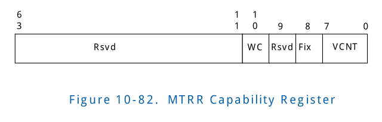

# 10
## 10.4 Register Descriptions
### 10.4.38 MTRR Capability Register

<table>
	<tr>
		<th>Abbreviation</th>
		<th>General Description</th>
		<th>Register Offset</th>
	</tr>
	<tr>
		<td>MTRRCAP_REG</td>
		<td>
		Register reporting the Memory Type Range Register Capability. 
		This register is treated as RsvdZ by implementations reporting
		Memory Type Support (MTS) as not supported in the Extended 
		Capability register. 
		  
		When implemented, value reported in this register must match 
		IA32_MTRRCAP Model Specific Register (MSR) value reported by 
		the host IA-32 processor(s).
		  
		
		Regsiter 报告了Memory Type Range Register Capability.当 
		implementations 报告的 Extended Capability register 不支
		持Memory Type Support (MTS)时，该register 被当作RsvdZ。
		  
		当实现了，该register 报告的值必须匹配host IA-32 processor 中
		IA32_MTRRCAP Model Specific Register (MSR) 值。
		
		</td>
		<td>100</td>
	</tr>
</table>

<table>
	<tr>
		<th>Bits</th>
		<th>Access</th>
		<th>Default</th>
		<th>Field</th>
		<th>Description</th>
	</tr>
	<tr>
		<td>63:11</td>
		<td>RsvdZ</td>
		<td>0</td>
		<td>R: Reserved</td>
		<td>Reserved.</td>
	</tr>
	<tr>
		<td>10</td>
		<td>Ro</td>
		<td>X</td>
		<td>WC:Write Combining</td>
		<td>
			<ul>
			<li>
			0: Write-combining (WC) memory type is
			not supported.
			</li>
			<li>
			1: Write-combining (WC) memory type is
			supported.
			</li>
			</ul>
			
			<ul>
			<li>
			0: 不支持Write-combining (WC) memory type 
			</li>
			<li>
			1: 支持Write-combining (WC) memory type
			</li>
			</ul>
			
		</td>
	</tr>
	<tr>
		<td>9</td>
		<td>RsvdZ</td>
		<td>0</td>
		<td>R: Reserved</td>
		<td>Reserved.</td>
	</tr>
	<tr>
		<td>8</td>
		<td>RO</td>
		<td>X</td>
		<td>FIX: Fixed Range MTRRs Supported</td>
		<td>
		<ul>
			<li>
			0: No fixed range MTRRs are supported
			</li>
			<li>
			1: Fixed range MTRRs(MTRR_FIX64K_00000 through
			MTRR_FIX4K_0F8000) are supported
			</li>
		</ul>
		
		<ul>
			<li>
			0: 没有fixed range MTRRs 支持
			</li>
			<li>
			1: 支持Fixed range MTRRs（MTRR_FIX64K_00000
			到MTRR_FIX4K_0F8000)
			</li>
		</ul>
		
		</td>
	</tr>
	<tr>
		<td>7:0</td>
		<td>RO</td>
		<td>X</td>
		<td>VCNT: Variable MTRR Count</td>
		<td>
		Indicates number of variable range MTRRs
		supported
		</td>
		
		指明 支持的variable range MTRRs 数量
		
	</tr>
</table>
