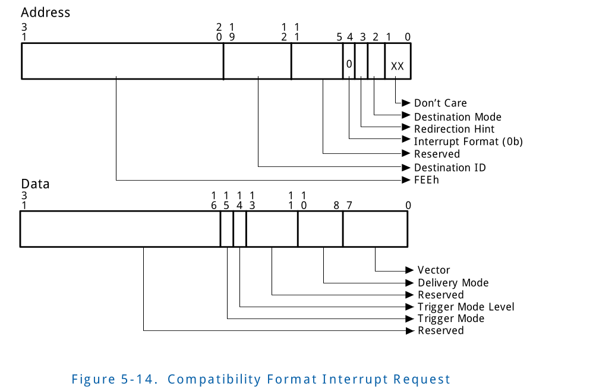
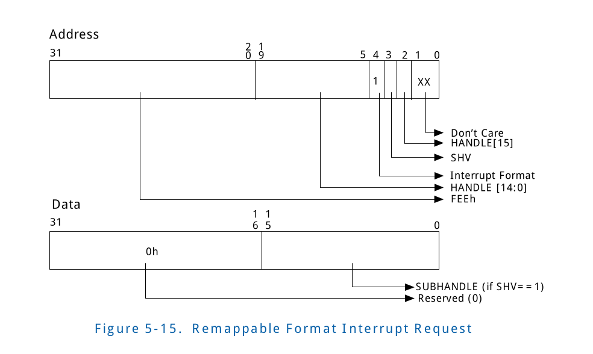

# 5 Interrupt Remapping and Interrupt Posting
This chapter discuss architecture and hardware details for 
interrupt-remapping and interrupt-posting.  
<br/>
<font color=gray face="黑体" size=2>
该章节讲述了interrupt-remapping 和 interrupt-posting的 architecture
和硬件细节。
</font>

## 5.1 Interrupt Remapping 
The interrupt-remapping architecture enables system software 
to control and censor external interrupt requests generated 
by all sources including those from interrupt controllers 
(I/OxAPICs), MSI/MSI-X capable devices including endpoints, 
root-ports and Root-Complex integrated end-points. 
<br/>
<font color=gray face="黑体" size=2>
interrupt-remapping architecture 让系统软件可以控制并审查由所有
中断源产生的外部中断请求, 这些中断源包括interrupt controllers(I/OxAPICs), 
MSI/MSI-X capable devices(包括 endpoints, root-ports和 Root-Complex 
integrated end-points)。
</font>

Interrupts generated by the remapping hardware itself (Fault 
Event and Invalidation Completion Events) are not subject to 
interrupt remapping. Interrupt requests appear to the Root-Complex 
as upstream memory write requests to the interrupt- address-range
0xFEEX_XXXXh. Since interrupt requests arrive at the 
Root-Complex as write requests, interrupt-remapping is co-located
with the remapping hardware units. The interrupt-remapping 
capability is reported through the Extended Capability Register.
<br/>
<font color=gray face="黑体" size=2>
出现在Root-Complex 上面的interrupt request 被当作 在 interruptaddress-range
0XFEEX_XXXXh 范围内的upstream。由于到达Root-Complex 上面的interrupt
requests 被当作 write request, interrupt-remapping 和 remapping hardware
units 位于同一位置上(co-located)。通过Extended Capablility Register
报告interrupt-remapping capability。
</font>

### 5.1.1 Identifying Origination of Interrupt Requests
To support domain-isolation usages, the platform hardware must
be capable of uniquely identifying the requestor (Source-Id) 
for each interrupt message. The interrupt sources in a 
platform and use of source-id in these requests may be 
categorized as follows:
<br/>
<font color=gray face="黑体" size=2>
为了支持 domain-isolation(域隔离)的用法, 硬件平台必须唯一标识
每个interrupt message 得到 requestor(Source-ID)。平台中的interrupt
source 和这些request 中的source-id的使用可能会如下分类:
</font>

* Message Signaled Interrupts from PCI-Express Devices
	+ For message-signaled interrupt requests from PCI-Express 
	devices, the source-id is the requester identifier in the 
	PCI-Express transaction header. The requester-id of a device
	is composed of its PCI Bus/Device/Function number assigned 
	by configuration software an uniquely identifies the hardware
	function that initiated the I/O request. Section 3.4.1 
	illustrates the requester-id as defined by the PCI-Express 
	specification. Section 3.9.4 describes use of source-id 
	field by PCI-Express devices using phantom functions.
	<br/>
	<font color=gray face="黑体" size=2>
	对于来自PCIE 设备的MSI request, source-id 是 requester 
	identifier并且在 PCI-E translation header 中。设备的requester-id
	由configuration software 分配的 PCI Bus/Device/Function number组成
	并且唯一标识I/O request的来自的hardware function。Section 3.4.1
	阐述了由PCI-E spec定义的requester-id。Section 3.9.4 描述了使用了
	phantom functions 的 PCI-E devices的source-id 字段的使用方法。
	</font>
* Message Signaled Interrupts from Root-Complex Integrated Devices
	+ For message-signaled interrupt requests from root-complex 
	integrated PCI or PCI-Express devices, the source-id is its 
	PCI requester-id.
	<br/>
	<font color=gray face="黑体" size=2>
	独有来自于root-complex integrated PCI/PCI-E device的MSI,source-id
	是他的PCI requester-id。
	</font>
* Message Signaled Interrupts from Devices behind PCI-Express
to PCI/PCI-X Bridges
	+ For message-signaled interrupt requests from devices behind
	PCI-Express-to-PCI/PCI-X bridges, the requester identifier 
	in those interrupt requests may be that of the interrupting 
	device or the requester-id with the bus number field equal 
	to the bridge’s secondary interface’s bus number and device 
	and function number fields value of zero. Section 3.9.1 
	describes legacy behavior of these bridges. Due to this aliasing,
	interrupt-remapping hardware does not isolate interrupts from
	individual devices behind such bridges.
	<br/>
	<font color=gray face="黑体" size=2>
	对于来自于PCI-E to PCI/PCI-X Bridges 后面的设备的MSI, 这些
	interrupt request中的requster identifier 可能是interrupting
	device的标识符或者是bus nunmber field和bridge's secondary
	interface的bus number相等并且device 和function number 字段
	为0的requester-id。Section 3.9.1 描述了这些bridge的传统的
	行为。因为这种别名，interrupt-remapping hardware 不能隔离
	来自于这些bridge后面的单独设备的中断。
	</font>
* Message Signaled Interrupts from Devices behind Conventional
 PCI bridges
	+ For message-signaled interrupt requests from devices behind
	conventional PCI bridges, the source-id in those interrupt 
	requests is the requestor-id of the legacy bridge device. 
	Section 3.9.2 describes legacy behavior of these bridges. 
	Due to this, interrupt-remapping hardware does not isolate 
	message-signaled interrupt requests from individual devices 
	behind such bridges.
	<br/>
	<font color=gray face="黑体" size=2>
	对于这些MSI, 这些interrupt requestes中的source-id是legacy
	bridge device 的 requestor-id。Section 3.9.2 描述了这些
	bridge的传统行为。由于上面描述的原因，interrupt-remapping 
	hardware 不能隔离来自于这些bridge后面的单独设备的中断。
	</font>
* Legacy pin interrupts
	+ For devices that use legacy methods for interrupt routing 
	(such as either through direct wiring to the I/OxAPIC input 
	pins, or through INTx messages), the I/OxAPIC hardware 
	generates the interrupt-request transaction. To identify the
	source of interrupt requests generated by I/OxAPICs, the 
	interrupt-remapping hardware requires each I/OxAPIC in the 
	platform (enumerated through the ACPI Multiple APIC Descriptor
	Tables (MADT)) to include a unique 16-bit source-id in its 
	requests. BIOS reports the source-id for these I/OxAPICs via
	ACPI structures to system software. Refer to Section 8.3.1.1
	for more details on I/OxAPIC identity reporting. 
	<br/>
	<font color=gray face="黑体" size=2>
	对于使用传统方法来路由interrupt的设备来说(例如通过直接些I/OxAPIC
	的input pins,或者通过INTx message), I/OxAPIC hardware 生成
	interrupt-request trnaslation。为了识别I/OxAPICs产生的interrupt
	requests的源, interrupt-remapping hardware 需要平台中的每个I/OxAPICs
	去包含在他们的requests中包含一个唯一的16-bit的source-id。BIOS
	通过ACPI structures 
	</font>
	
* Other Message Signaled Interrupts
	 * For any other platform devices that are not PCI discoverable
	 and yet capable of generating message-signaled interrupt 
	 requests (such as the integrated High Precision Event Timer -
	 HPET devices), the platform must assign unique source-ids 
	 that do not conflict with any other source-ids on the 
	 platform. BIOS must report the 16-bit source-id for these 
	 via ACPI structures described in Section 8.3.1.2.
	<br/>
	<font color=gray face="黑体" size=2>
	对于任何其他的平台设备来说，（这些平台设备不是PCI discoverable
	但是能够产生 MSI( 例如 integrated High Precision Event Timer - 
	HPET devices), 平台必须分配一个唯一的source-ids, 这个source-ids
	不能与平台上其他任何source-ids冲突。BIOS必须通过Section 8.3.1.2
	中描述的ACPI structures 报告一个16-bit source-id。
	</font>

### 5.1.2 Interrupt Request Formats On Intel® 64 Platforms
Interrupt-remapping on Intel(R) 64 platforms support two interrupt
request formats. These are described in the following sub-sections.
<br/>
<font color=gray face="黑体" size=2>
在Intel(R) 64p平台上的Interrput-remapping 支持两种interrupt request
formats。在下面的子章节中描述。
</font>

#### 5.1.2.1 Interrupt Requests in Compatibility Format
Figure 5-14 illustrates the interrupt request in Compatibility
format. The Interrupt Format field (Address bit 4) is Clear 
in Compatibility format requests. Refer to the Intel® 64 
Architecture software developer’s manuals for details on other
fields in the Compatibility format interrupt requests. Platforms
without interrupt-remapping capability support only Compatibility
format interrupts.
<br/>
<font color=gray face="黑体" size=2>
图5-14阐述了 Compatibility 格式的interrupt request。Interrupt Format
字段(Address bit 4) 在 Compatibility 中是clear状态。参考Intel sdm
了解关于Compatiblility 格式的interrupt request的其他字段的细节。
没有interrupt-remapping capability 的平台只支持 Compatibility
格式的interrupt。
</font>



#### 5.1.2.2 Interrupt Requests in Remappable Format
Figure 5-15 illustrates the Remappable interrupt request 
format. The Interrupt Format field (Address bit 4) is Set for
Remappable format interrupt requests. Remappable interrupt 
requests are applicable only on platforms with interrupt-remapping
support.
<br/>
<font color=gray face="黑体" size=2>
Figure 5-15 阐述了 Remappable interrupt request format。对于Remappable
format interrupt requests, Interrupt Format field (Address bit 4) 被设
置。Remapping interrupt request 只适用于支持interrupt-remapping的平台。
</font>


Table 6 describes the various address fields in the Remappable
interrupt request format.
<br/>
<font color=gray face="黑体" size=2>
Table 6描述了Remappable interrupt request format中的不同的地址字段
</font>

### 5.1.3 Interrupt Remapping Table
Interrupt-remapping hardware utilizes a memory-resident 
single-level table, called the Interrupt Remapping Table. 
The interrupt remapping table is expected to be setup by 
system software, and its base address and size is specified 
through the Interrupt Remap Table Address Register. Each entry
in the table is 128-bits in size and **is referred to as**
<sup>被称为</sup> Interrupt Remapping Table Entry (IRTE).Section 
9.10 illustrates the IRTE format.
<br/>
<font color=gray face="黑体" size=2>
Interrupt-remapping hardware 利用一个 memory-resident(驻留在内存的)
single-level table,称为Interrupt Remapping Table。该章节讲述了interrupt
remapping table 期望系统软件将其初始化，并且他的基地址和size通过
Interrupt Remapping Table Address Register 指定. 每个table中的entry
是128-bits大小并且被称为Interrupt Remapping Table Entry(IRTE)。
Section 9.10 阐述了IRTE 的格式.
</font>

For interrupt requests in Remappable format, the interrupt-remapping
hardware computes the ‘interrupt_index’ as below. The Handle, SHV
and Subhandle are respective fields from the interrupt address
and data per the Remappable interrupt format. 
<br/>
<font color=gray face="黑体" size=2>
对于Remapping format中的interrupt request, interrupt-remapping
hardware 通过下面计算`interrupt_index`, Handle, SHV和Subhandle来自于
每个Remapping interrupt 格式的interrupt address 和data相应字段
</font>
```
if (address.SHV == 0) {
	interrupt_index = address.handle;
} else {
	interrupt_index = (address.handle + data.subhandle);
}
```
The Interrupt Remap Table Address Register is programmed by 
software to specify the number of IRTEs in the Interrupt 
Remapping Table (maximum number of IRTEs in an Interrupt 
Remapping Table is 64K). Remapping hardware units in the 
platform may be configured to share interrupt-remapping table
or use independent tables. The interrupt_index is used to 
index the appropriate IRTE in the interrupt-remapping table. 
If the interrupt_index value computed is equal to or larger 
than the number of IRTEs in the remapping table, hardware 
treats the interrupt request as error.
<br/>
<font color=gray face="黑体" size=2>
Interrupt Remap Table Address Register被软件编程用来指定
Interrupt Remapping Table中的IRTEs的数量（一个Interrupt
Remapping Table中的IRTEs的最大数量为64K)。平台中的Remapping 
hardware units可能配置来共享interrupt-remapping table或者
使用独立的tables。interrupt_index用来索引interrupt-remapping
table中正确的IRTE。如果interrupt_index值计算大于或等于remapping
table中IRTEs的数量，hardware 将interrupt request当作error对待.
</font>

Unlike the Compatibility interrupt format where all the interrupt
attributes are encoded in the interrupt request address/data,
the Remappable interrupt format specifies only the fields needed
to compute the interrupt_index. The attributes of the remapped
interrupt request is specified through the IRTE referenced by
the interrupt_index.The interrupt-remapping architecture defines
support for hardware to cache frequently used IRTEs for improved
performance. For usages where software may need to dynamically
update the IRTE, architecture defines commands to invalidate
the IEC. Chapter 6 describes the caching constructs<sup>构图/建设/概念</sup> 
and associated invalidation commands. 
<br/>
<font color=gray face="黑体" size=2>
不像Compatibility interrupt format那样，所有interrupt attributes
都被编码到interrupt request address/data，Remapping Interrupt
format只指定了计算interrupt_index所需的字段。remapping interrupt
request 属性通过interrupt_index指向的IRTE指定。interrupt-remapping
architecture 定义了对于硬件缓存经常使用的IRTEs的支持，以用来提升性
能。对于软件可能需要动态更新IRTE的需求，architecture定义了去invalidate
IEC的cmd。Chapter 6  描述了缓存的架构和相关 invalidation commands。
</font>

### 5.1.4 Interrupt-Remapping Hardware Operation
The following provides a functional overview of the 
interrupt-remapping hardware operation:
<br/>
<font color=gray face="黑体" size=2>
下面提供了interrupt-remapping hardware 操作的功能概述:
</font>
* An interrupt request is identified by hardware as a DWORD 
sized write request to interrupt address ranges 0xFEEx_xxxx.
<br/>
<font color=gray face="黑体" size=2>
interrupt request被硬件识别为一个对intererupt address ranges
0xFEEx_xxxx 的DWORD size写请求。
</font>
* When interrupt-remapping is not enabled (IRES field Clear 
in Global Status Register), all interrupt requests are processed
per<sup>根据，按照</sup> the Compatibility interrupt request format described in 
Section 5.1.2.1.
<br/>
<font color=gray face="黑体" size=2>
当interrupt-remapping 没有enable(IRES 字段在Global Status Register
中clear),所有的interrupt request， 所有的interrupt request都按照
Section 5.1.2.1中描述的Compatibility interrupt request 格式处理。
</font>
* When interrupt-remapping is enabled (IRES field Set in Global
Status Register), interrupt requests are processed as follows:
<br/>
<font color=gray face="黑体" size=2>
当interrupt-remapping 是enabled( 设置了Global Status Register 中的IRES
字段), interupt request 会如下处理:
</font>
	+ Interrupt requests in the Compatibility format (i.e requests
	with Interrupt Format field Clear) are processed as follows:
	<br/>
	<font color=gray face="黑体" size=2>
	Compatibility 格式的interrupt request(也就是说 Interrupt Format
	字段清空的request) 被如下处理
	</font>
		* If Extended Interrupt Mode is enabled (EIME field in 
		Interrupt Remapping Table Address Register is Set), or if 
		the Compatibility format interrupts are disabled (CFIS 
		field in the Global Status Register is Clear), the 
		Compatibility format interrupts are blocked.
		<br/>
		<font color=gray face="黑体" size=2>
		如果Extended Interrupt Mode 是enabled(Interrupt Remapping
		Table Address Register 中的EIME字段被设置),或者是如果
		Compatibility format interrupts 是disabled (Global Status
		Register 是清空的), Compatibility format interrupt将
		被block。
		</font>
		* Else, Compatibility format interrupts are processed as
		pass-through (bypasses interrupt-remapping).
		<br/>
		<font color=gray face="黑体" size=2>
		Else,Compatibility format interrupts 将当作pass-through(bypasses
		interrupt-remapping)处理。
		</font>
	+ Interrupt requests in the Remappable format (i.e. request with
	Interrupt Format field Set) are processed as follows:
	<br/>
	<font color=gray face="黑体" size=2>
	Remappable format的Interrupt request （也就是说Interrupt Format
	field设置的request)将被如下处理:
	</font>
		* The reserved fields in the Remappable interrupt requests are
		checked to be zero. If the reserved field checking fails, 
		the interrupt request is blocked. Else, the Source-id, Handle,
		SHV, and Subhandle fields are retrieved from the interrupt 
		request.
		<br/>
		<font color=gray face="黑体" size=2>
		Remapping interrupt requests中的reserved字段将被检查为0.如果
		reserved 字段检查失败, interrupt request将被blocked。否则
		将从interrupt request中检索 Source-id, Handle, SHV和Subhandle
		字段。
		</font>
		* Hardware computes the interrupt_index per the algorithm 
		described in Section 5.1.3. The computed interrupt_index is
		validated to be less than the interrupt-remapping table size
		configured in the Interrupt Remap Table Address Register. If
		the bounds check fails, the interrupt request is blocked.
		<br/>
		<font color=gray face="黑体" size=2>
		hardware 通过Section 5.1.3中描述的算法计算interrupt_index。
		计算的interrupt_index将验证 是否小于Interrupt Remap Table Address
		Register 中配置的interrupt-remapping table size,如果边界检查
		失败，interrupt request将被block。
		</font>
		* If the above bounds check succeeds, the IRTE corresponding
		to the interrupt_index value is either retrieved from the 
		Interrupt Entry Cache, or fetched from the interrupt-remapping
		table. If the Coherent (C) field is reported as Clear in the
		Extended Capability Register, the IRTE fetch from memory will
		not snoop the processor caches. If the Present (P) field in the
		IRTE is Clear, the interrupt request is blocked and treated as
		fault.
		<br/>
		<font color=gray face="黑体" size=2>
		如果上面的边界检查成功了，interrupt_index对应的IRTE的值会
		从Interrupt Entry Cacahe中检索到，或者从interrupt-remapping table
		预取到。如果Coherent ( C ) 字段在 Extended Capablility Register
		中报告为clear，从memory中预取IRTE将不会snoop processor caches。
		如果IRTE中的Present(P) 字段被清空， interrupt request 将被阻塞
		并且将被当作fault对待.
		</font>
		* If IRTE is present (P=1), hardware performs verification 
		of the interrupt requester per the programming of the SVT, 
		SID and SQ fields in the IRTE as described in Section 9.10. 
		If the source-id checking fails, the interrupt request is 
		blocked.
		<br/>
		<font color=gray face="黑体" size=2>
		如果IRTE 是 present (P=1), hardware 通过编程在Section 9.10
		中描述的IRTE 中的SVT, SID,SQ字段执行对interrupt requester
		的验证。如果source-id 检查失败，interrupt request 将被blocked.
		</font>
	+ If IRTE has Mode field clear (IM=0):
		* Hardware interprets<sup>解释/翻译</sup> the IRTE in remappable format (as described
		in Section 9.10). If invalid programming of remappable-format IRTE 
		is detected, the interrupt request is blocked.
		<br/>
		<font color=gray face="黑体" size=2>
		硬件以remappable format解释 IRTE（在 Section 9.10中描述的那样)。如果检测到
		remapping-format IRTE中有非法编程，interrupt request将被阻塞。
		</font>
		* If above checks succeed, a remapped interrupt request is generated
		per the programming of the IRTE fields.
		<br/>
		<font color=gray face="黑体" size=2>
		如果上述检查成功，则根据IRTE中的编程的字段 remap interrupt request.
		</font>
* Any of the above checks that result in interrupt request to be blocked is 
treated as a interrupt-remapping fault condition. The interrupt-remapping fault 
conditions are enumerated in the following section.
<br/>
<font color=gray face="黑体" size=2>
导致interrupt request被 blocked 的上述的任何检查 将被当作 interrupt-remappping fault 
的情况对待。interrupt-remapping faults condition在接下来的的章节中列举。
</font>

#### 5.1.4.1 Interrupt Remapping Fault Conditions

### 5.1.5 Programming Interrupt Sources To Generate Remappable Interrupts

## 5.2 Interrupt Posting
Interrupt-posting capability is an extension of interrupt-remapping
hardware for extended processing of remappable format interrupt 
requests. Interrupt-posting enables a remappable format interrupt
request to be posted (recorded) in a coherent main memory resident
data-structure, with an optional notification event to the CPU
complex to signal pending posted interrupt. Interrupt-posting
capability (along with the support in Intel® 64 processors for
posted-interrupt processing and APIC Virtualization) enables a
Virtual Machine Monitor (VMM) software to efficiently process
interrupts from devices assigned to virtual machines. Section
2.5.3 describes high-level usages and benefits of interrupt-posting.
Refer to ‘Intel® 64 Architecture Software Developer's Manual, Volume 3B:
System Programming’ for details on Intel® 64 processor support
for APIC virtualization and posted-interrupt processing.
<br/>
<font color=gray face="黑体" size=2>
Interrupt-posting capability 为了扩展处理remappable format 
interrupt 的interrupt-remapping hardware 扩展。Interrupt-posting
enables remapping format interrupt request 能够 posted(recorded)
到 一致性的主存中驻留的 数据结构中，并且带有一个可选的 notification
event 到CPU complex，以发出挂起的posted interrupt。Interrupt-posting
capability(与Intel(R) 64 处理器对posted-interrupt processing 和APIC
Virtualization一起) 是的VMM software 可以有效的处理器来自于分配给
VM 设备的中断。Section 2.5.3 描述了高级的用法以及interrupt-posting
的有点。参考Intel sdm Volume 3B 了解更多Intel (R) 64处理器对APIC
virtualization 和 posted-interrupt processing 的支持。
</font>

Remapping hardware support for interrupt-posting capability is
reported through the Posted Interrupt Support (PI) field in the
Capability register (CAP_REG). Section 10.4.2 describes interrupt-posting
capability reporting.
<br/>
<font color=gray face="黑体" size=2>
对于interrupt-posting capability的 Remapping hardware 的支持通过
Capability register (CAP_REG)中的Posted Interrupt Support (PI) 字段
报告。Section 10.4.2 描述了 interrupt-posting capability reporting.
</font>

### 5.2.1 Interrupt Remapping Table Support for Interrupt Posting
All remappable interrupt requests are processed through the 
Interrupt Remapping Table as described in Section 5.1.3. The
IRTE Mode (IM) field in an Interrupt Remapping Table Entry 
(IRTE) specifies if remappable interrupt requests processed 
through that IRTE is subject to interrupt-remapping or 
interrupt-posting.
<br/>
<font color=gray face="黑体" size=2>
酥油的remappable interrupt requests 通过Section 5.1.3 描述的
Interrupt Remapping Table 处理。Interrupt Remapping Table Entry
(IRTE)中的IRTE Mode(IM) 字段 指定了remapping interrupt requests的
处理是否按照interrupt-remapping的IRTE,还是 interrupt-posting的IRTE。
</font>

* If the IM field is 0 in an IRTE, the IRTE is interpreted<sup>解释</sup> in
remappable format (described in Section 9.10) to remap interrupt
requests processed through it. The interrupt-remapping hardware
operation is described in Section 5.1.4.
<br/>
<font color=gray face="黑体" size=2>
如果IRTE中的IM字段为0, IRTE将解释为remappable format(Section 9.10中描述的)
去remap通过它处理器的interrupt request。 interrupt-remapping hardware
操作过程在Section 5.1.4中描述。
</font>
* If the IM field is 1 in an IRTE, the IRTE is interpreted in
posted format (described in Section 9.11) to post interrupt 
requests processed through it. The interrupt-posting hardware
operation is described in Section 5.2.3.
<br/>
<font color=gray face="黑体" size=2>
如果 IRTE中的IM字段为1, IRTE 被解释为posted format(在Section 9.11
中描述) 并通过它来post interrupt requests。interrupt-posting 
hardware 操作过程在Section 5.2.3 中描述.
</font>

IRTE entries in posted format support following new fields:
<br/>
<font color=gray face="黑体" size=2>
posted format 模式下的IRTE entries 支持下面的新字段:
</font>
* Address of the Posted Interrupt Descriptor data structure
to post (record) the interrupt to. Section 5.2.2 describes 
the Posted Interrupt Descriptor.
<br/>
<font color=gray face="黑体" size=2>
Posted Interrupt Descriptor data structure 的地址, 该structure
用于post (record) interrupt。Section 5.2.2 描述了Posted
Interrupt Descriptor.
</font>
* Urgent (URG) qualification to indicate if interrupt requests
processed through this IRTE require real-time processing or 
not. Section 5.2.3 describes the hardware operation with this
field.
<br/>
<font color=gray face="黑体" size=2>
Urgent (URG) qualification(紧急资格) 来指示通过该IRTE处理的interrupts
requests 是否需要实时处理。Section 5.2.3 描述了关于该字段的硬件
操作。
</font>
* Vector field specifies the vector to use when posting 
interrupts processed through an IRTE. Unlike remappable-format
(where the Vector field is used when generating the remapped
interrupt request), the Vector field for posted-format IRTEs
is used to determine which bit to Set when posting the interrupt
to the Posted Interrupt Descriptor referenced by the IRTE.
<br/>
<font color=gray face="黑体" size=2>
Vector field 只是posting interrupts 通过IRTE处理时 使用的vector。
不像remappable-format(该format Vector field 在生成remapped interrupt
request时使用), 对于posted-format IRTEs的Vector 字段被用做确定
当posting interrupt 到有IRTE引用的Posted Interrupt Descriptor 时，
那个位会被设置。
</font>

As with interrupt remapping, interrupts generated by the 
remapping hardware itself are not subject to interrupt 
posting.
<br/>
<font color=gray face="黑体" size=2>
和interrupt remapping 一样，remapping hardware 自身产生
的interrupt不受interrupt posting的影响。
</font>

### 5.2.2 Posted Interrupt Descriptor
Posted Interrupt Descriptor is a 64-byte aligned and sized 
structure in memory used by interrupt-posting hardware to post
(record) interrupt requests subject to posting. Section 9.12 
describes the Posted Interrupt Descriptor Format. System software
must allocate the Posted Interrupt Descriptors in coherent 
(write-back) main memory.
<br/>
<font color=gray face="黑体" size=2>
Posted Interrupt Descriptor 是一个以64-Byte对齐，并且大小也是64
byte的位于内存中的structure, 被interrupt-posting hardware用来
post(record) 要(subject to) posting 的interrupt requests,
</font>

The Posted Interrupt Descriptor hosts the following fields:
* Posted Interrupt Request (PIR) field provides storage for 
posting (recording) interrupts (one bit per vector, for up to
256 vectors).
* Outstanding Notification (ON) field indicates if there is 
a notification event outstanding (not processed by processor 
or software) for this Posted Interrupt Descriptor. When this 
field is 0, hardware modifies it from 0 to 1 when generating 
a notification event, and the entity receiving the notification
event (processor or software) resets it as part of posted 
interrupt processing.
* Suppress Notification (SN) field indicates if a notification
event is to be suppressed (not generated) for non-urgent interrupt
requests (interrupts processed through an IRTE with URG=0).
* Notification Vector (NV) field specifies the vector for 
notification event (interrupt).
* Notification Destination (NDST) field specifies the physical
APIC-ID of the destination logical processor for the notification
eventxxxxxxx

### 5.2.3 Interrupt-Posting Hardware Operation
Interrupt requests in remappable format are processed by hardware
as described in Section 5.1.4. When such processing encounters
a IRTE entry in posted format (IM=1), the interrupt request is
processed through posting (instead of remapping). The following 
provides a functional overview of the interrupt-posting hardware
operation:
* If IRTE retrieved has Mode field as set (IM=1)1 + Hardware
interprets the IRTE in posted format (as described in Section
9.11). If invalid programming of posted-format IRTE is 
detected, the interrupt request is blocked.
	+ If above checks succeed, the IRTE provides the pointer to 
	the Posted Interrupt Descriptor (PDA-L/PDA-H), the vector 
	value (Vector) to be posted, and if the interrupt request 
	is qualified as urgent (URG) or not.
* Hardware performs a coherent atomic read-modify-write 
operation of the posted-interrupt descriptor as follows:
	+ Read contents of the Posted Interrupt Descriptor, 
	claiming exclusive ownership of its hosting cache-line. If 
	invalid programming of Posted Interrupt Descriptor is detected,
	release ownership of the cache-line, and block the interrupt
	request.
	+ If above checks succeed, retrieve current values of Posted
	Interrupt Requests (PIR bits 255:0), Outstanding Notification
	(ON), Suppress Notification (SN), Notification Vector (NV),
	and Notification Destination (NDST) fields in the Posted 
	Interrupt Descriptor.
	+ Modify the following descriptor field values atomically:
		* Set bit in PIR corresponding to the Vector field value 
		from the IRTE
		* Compute X = ((ON == 0) & (URG | (SN == 0)))
		* if (X == 1), Set ON field.
	+ Promote the cache-line to be globally observable, so that 
	the modifications are visible to other caching agents. 
	Hardware may write-back the cache-line anytime after this 
	step.
	+ If (X == 1) in previous step, generate a notification event
	(interrupt) with attributes as follows:
		* NSDT field specifies the physical APIC-ID of destination
		 logical CPU. Refer to Section 9.12
		* NV field specifies the vector to be used for the 
		notification interrupt to signal the destination CPU about 
		pending posted interrupt.
		* Delivery mode field for notification interrupt is forced 
		to Fixed (000b) on how this field is interpreted for xAPIC 
		and x2APIC modes.
		* Re-direction Hint field for notification interrupt is 
		forced to Clear (0b)
		* Trigger Mode field for notification interrupt is forced to 
		Edge (0b)
		* Trigger Mode Level field for notification interrupt is forced
		to Asserted (1b).
* Any of the above checks that result in interrupt request to
be blocked is treated as a interrupt-remapping fault condition
as enumerated in Section 5.1.4.1.

### 5.2.4 Ordering Requirements for Interrupt Posting
This section summarizes the ordering requirements to be met 
by interrupt-posting hardware when posting interrupts.
* Interrupt requests are posted transactions and follow PCI-Express
posted ordering rules. This ensures that an interrupt request
will not be observed by software until all prior inbound posted
requests (writes) are committed to their destinations.
	+ This requirement needs to be maintained even if the interrupt
	requests are posted. i.e., before an interrupt is posted 
	(recorded) in the posted-interrupt descriptor and made visible
	to software, all preceding posted requests must be completed.
* Since interrupt requests are posted transactions, upstream 
read completions must push preceding interrupt requests.
	+ This requirement needs to be maintained even if one or more
	of the preceding interrupt requests are posted. i.e., An 
	upstream read completion must wait until all preceding 
	interrupts (irrespective of if they are remapped or posted) 
	are completed. In case of an interrupt that is posted, ‘completion’
	of the interrupt means, both the atomic update of the posted
	interrupt descriptor and the associated notification event are
	completed.
* In the interrupt-posting operation, hardware must make sure
that modifications to a posted- interrupt descriptor is 
observable to software before issuing the notification event
for that descriptor.

### 5.2.5 Using Interrupt Posting for Virtual Interrupt Delivery
This section is informative and intended to illustrate a 
simplified example1 usage of how a Virtual Machine Monitor 
(VMM) software may use interrupt-posting hardware to support
efficient delivery of virtual interrupts from assigned devices
to virtual machines.

VMM software may enable interrupt-posting for a virtual machine
as follows:
* For each virtual processor in the virtual machine, the VMM 
software may allocate a Posted Interrupt Descriptor. Each such
descriptor is used for posting all interrupts that are to be
delivered to the respective virtual processor.
* The VMM software allocates two physical interrupt vectors 
(across all logical CPUs in the platform) for notification 
events.
	+ One of this physical vectors may be used as the ‘Active 
	Notification Vector’ (ANV) for posted interrupt notifications
	to any virtual processor that is active (executing) at the 
	time of posting an interrupt to it.
	+ The other physical vector allocated may be used as the 
	‘Wake-up Notification Vector’ (WNV) for posted interrupt 
	notifications to any virtual processor that is blocked 
	(halted) at the time of posting an interrupt to it.
* For each interrupt source from any assigned device(s) to 
this virtual machine, the VMM software may intercept and 
virtualize the guest software programming of respective interrupt
resources (IOxAPIC entries and/or MSI/MSI-X registers). Through
this virtualization, the VMM software detects the target virtual
processor and virtual vector assigned by guest software.

* For each such interrupt source, the VMM software allocates 
a posted-format IRTE.
	+ The vector field in each such IRTE is programmed by the VMM
	software with the respective virtual vector value assigned for
	the interrupt source by guest software.
	+ The posted descriptor address field in each such IRTE is 
	programmed by the VMM software to reference the posted descriptor
	allocated for the virtual processor assigned by guest software
	for the interrupt source.
	+ The urgent (URG) field in an IRTE is Set by the VMM software
	if the respective interrupt source is designated as requiring
	immediate (non-deferred) processing.
* The VMM software configures the processor hardware to enable APIC virtualization (including ‘virtual-interrupt delivery’ and ‘process posted interrupts’ capabilities) for the virtual processors. 
	+ The ‘posted-interrupt notification vector’ for the virtual
	processors are configured with the ‘Active Notification Vector’
	(ANV) value described earlier in this section.
	+ The ‘posted-interrupt descriptor’ for the virtual processors
	are configured with the address of the Posted Interrupt Descriptor
	allocated for respective virtual processors.

* The VMM software scheduler may manage a virtual processor’s
scheduling state as follows:

— When a virtual processor is selected for execution, the virtual processor state is designated as
‘active’ before entering/resuming it. This state is specified in its Posted Interrupt Descriptor
by programming its Notification Vector (NV) field with the ANV vector value1. This allows all
interrupts for this virtual processor that are received while it is active (running) are processed
by the processor hardware without transferring control to the VMM software. The processor
hardware processes these notification events (with ANV vector value) by transferring any
posted interrupts in the Posted Interrupt Descriptor to the Virtual-APIC page of the virtual
processor and directly delivering it (without VMM software intervention) to the virtual
processor. Refer to ‘Intel® 64 Architecture Software Developer's Manual, Volume 3: System
Programming Guide’ for details on Intel®64 processor support for APIC Virtualization and
Posted-Interrupt Processing.

— When a virtual processor is preempted (e.g., on quantum expiry), the virtual processor state
is designated as ‘ready-to-run’. This state is specified in its Posted Interrupt Descriptor by
programming the Suppress Notification (SN) field to 1. This allows all non-urgent interrupts
for this virtual processor received while it is in preempted state to be posted to its Posted
Interrupts Descriptor without generating a notification interrupt (thereby avoiding disruption
of currently running virtual processors). If there are interrupt sources qualified as urgent for
targeting this virtual processor, the VMM software may also modify the NV field in the Posted
Interrupt Descriptor to WNV vector value. This enables the VMM software to receive
notifications (with WNV vector value) when urgent interrupts are posted when virtual
processor is not running, allowing appropriate software actions (such as preempting the
current running virtual processor and immediately scheduling this virtual processor).

— When a virtual processor halts (e.g., on execution of HLT instruction), the VMM software may
get control, blocks further execution of the virtual processor, and designate the virtual
processor state as ‘halted’. This state is specified in its Posted Interrupt Descriptor by
programming its Notification Vector (NV) field with the WNV vector value. This enables the
VMM software to receive notifications (with WNV vector value) when any interrupt (urgent or
non-urgent) is posted for this virtual processor, allowing appropriate software action (such as
to schedule the virtual processor for future or immediate activation).
• When entering/resuming a virtual processor, the VMM software may process any pending posted
interrupts in its posted descriptor as follows:
— VMM first transitions the virtual CPU to ‘active’ state by programming the notification vector in
the Posted Interrupt Descriptor to ANV vector value.
— VMM may check if there are pending interrupts in the posted descriptor (e.g. by scanning PIR
field for non-zero value).
— If there are pending posted interrupts, VMM may generate a self-IPI1 (Inter Processor
Interrupt to the same logical CPU) with vector value of ANV, through the Local xAPIC. This
interrupt is recognized by the processor as soon as interrupts are enabled in the virtual
processor enter/resume path. Since the virtual processor is configured with ANV vector value
as the ‘posted-interrupt notification vector’, this results in processor hardware processing it
same as any notification event it may receive while the virtual processor is active. This
approach enables the VMM software to ‘off-load’ the posted interrupt processing (such as
delivering the interrupt to the virtual processor through the Virtual-APIC) to the processor
hardware, irrespective of the scheduling state of the virtual processor when the interrupt was
posted by remapping hardware to the Posted Interrupt Descriptor.
• The VMM software may also apply the ‘posted-interrupt processing’ capability of the processor to
inject virtual interrupts generated by VMM software to a virtual machine (in addition to interrupts
from direct assigned devices to the virtual machine). This may be done by the VMM software
atomically ‘posting’ a virtual interrupt to the Posted Interrupt Descriptor (using atomic/LOCK
instructions that enforces cache-line update atomicity) and generating a notification event (as
IPI) to the logical processor identified as notify destination in the Posted interrupt Descriptor.
• The VMM software may handle virtual processor migrations across logical processors by
atomically updating the Notification Destination (NDST) field in the respective Posted Interrupt
Descriptor to the physical APIC-ID of the logical processor to which the virtual processor is
migrated to. This enables all new notification events from the posted descriptor of this virtual
processor to be routed to the new logical processor.

### 5.2.6 Interrupt Posting for Level Triggered Interrupts
Level-triggered interrupts generated through IOxAPICs Redirection Table Entries (illustrated in
Figure 5-16) can be processed through Interrupt Remap Table Entries (IRTE) for Posted Interrupts
(illustrated in Section 9.11). However, unlike with interrupt-remapping, all interrupts (including level
interrupts) processed by the posted interrupt processing hardware are treated as edge-triggered
interrupts. Thus VMM software enabling posting of Level-triggered interrupts must take special care
to properly virtualize the End of Interrupt (EOI) processing by the virtual processor. For example, the
VMM software may set up the virtual processor execution controls to gain control on EOI operation to
the Virtual APIC controller by guest software, and virtualize the operation by performing a Directed-
EOI to the IOxAPIC that generated the level-triggered interrupt. A Directed-EOI is performed by
software writing directly to the IOxAPIC EOI register. Refer to the IOxAPIC specification for details on
IOxAPIC EOI register.
