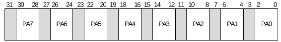
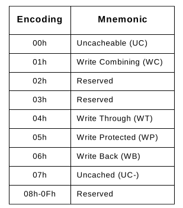

# 9 
## 9.4 Extended-Context-Entry

<table>
	<tr>
		<th>Bits</th>
		<th>Field</th>
		<th>Description</th>
	<tr/>
	<tr>
		<td>127-96</td>
		<td>PAT: Page Attribute Table</td>
		<td>
		This field is treated as Reserved(0) for implementations 
		not supporting Memory Type (MTS=0 in Extended Capability 
		Register).
		 
		
		对于不支持Memory Type 的 implementations (在 Extended 
		Capability Register中 MTS=0) 来说，该字段被当作 Reserved(0)
		
		  
		This field is ignored when PASID Enable (PASIDE) field is 
		Clear. When PASIDE is Set, this field is used to compute 
		memory-type for requests- with-PASID from devices that 
		operate in processor coherency domain. Refer to Section 
		3.6.5, and Section 3.8.4 for hardware handling of memory-type 
		for requests-with-PASID with first-level and nested translation
		respectively.
		 
		
		当 PASID Enable (PASIDE) 字段是clear 时， 该字段被忽略。当PASIDE
		被设置时，该字段用于计算 requests-with-PASID的memory-type, 该
		requests 来自于 operate在处理器一致性domain中的devices。可以
		参考Section 3.6.5和Section 3.8.4 了解硬件对于first-level 和nested
		translation 中的requests-with-PASID 的memory-type的处理
		
		  
		The format of this field is specified below.
		 
		
		字段的格式如下指定:
		
		
		  
		Following encodings are specified for the value programmed 
		in subfields PA0 through PA7.
		 
		
		如下的解码可以用于指定编程子字段PA0 到 PA7的值。
		
		
		</td>
	</tr>
	<tr>
		<td>88</td>
		<td>EAFE: Extended Accessed Flag Enable</td>
		<td>
		This field is treated as Reserved(0) for implementations not 
		supporting Extended Accessed flag (EAFS=0 in the Extended 
		Capability Register).
		 
		If 1, Extended-Accessed (EA) flag is atomically set in any 
		first-level paging-entries referenced by remapping hardware 
		through this Extended-context-entry.
		 
		
		对于 implementations 不支持Extended Accessed flag (Extended 
		Capability Register 中的EAFS = 0), 该字段被当作Reserved(0)对待。
		 
		如果设置为1, remapping  hardware 将会通过 Extended-context-entry 
		引用的任何 first-level paging entries 自动的设置 Extended Accessed
		(EA) flags。
		
		</td>
	<tr/>
	<tr>
		<td>88</td>
		<td>SMEP: Supervisor Mode Execute Protection</td>
		<td>
		This field is ignored when PASID Enable (PASIDE) or 
		Execute Requests Enable (ERE) field is Clear, or when 
		Supervisor Requests Enable (SRE) in PASID-entry used to 
		process request-with-PASID is Clear. 
		 
		If Set, supervisor-level execute requests from a user-mode 
		page (a page that has every first-level translation entry 
		leading up to the page has the U/S flag Set) are blocked 
		and treated as DMA remapping faults.
		 
		
		当PASID Enable (PASIDE) 或者Execute Requests Enable(ERE) 
		字段被清空时，或者当 用于处理request-with-PASID 的PASID-entry
		中的 Supervisor RequestsEnable(SRE) 被清空时，该字段会被忽略
		 
		如果设置了来自于user-mode page (通向该page的每个first-level 
		translation entry 都设置了 U/S flag)的 supervisor-level execute 
		requests 将被blocked 并且会当作 DMA remapping faults 对待.
			
		</td>
	<tr/>
</table>

## 9.7 First-Level Paging Entries
TABLE 18
<table>
	<tr>
		<th>Bits</th>
		<th>Field</th>
		<th>Description</th>
	</tr>
	<tr>
		<td>10</td>
		<td>EA: Extended Accessed</td>
		<td>
		If EAFE=1 in the relevant Extended-context-entry, this bit 
		indicates whether this entry has been used for address 
		translation. Refer to Section 3.6.3 for extended-accessed 
		bit handling.
		 
		If EAFE=0 in the relevant Extended-context-entry, this bit 
		is ignored.
		 
		
		如果相关的 Extended-context-entry 中的EAFE为1, 该bit 表示
		this entry 已经被用于过address translation。关于extended-access
		bit的处理，参照Section 3.6.3 
		
		</td>
	</tr>
	<tr>
		<td>5</td>
		<td>A: Accessed</td>
		<td>
		Indicates whether this entry has been used for address 
		translation. Refer to Section 3.6.3 for accessed bit 
		handling.
		 
		
		表明entry 已经被用于过address translation. 关于access bit 
		处理，请参照Section 3.6.3
		
		</td>
	</tr>
	<tr>
		<td>4</td>
		<td>PCD: Page-level Cache Disable</td>
		<td>
		For devices operating in the processor coherency domain, 
		this field indirectly determines the memory type used 
		to access the page- directory-pointer table referenced 
		by this entry. For other devices, this field is ignored. 
		Refer to Section 3.6.5 for memory-type handling. 		
		 
		
		对于operating 在处理器一致性域中的设备，该字段间接的确定 
		用于访问由该entry 指向的page-directory-pointer 的memory 
		type。对于 其他的devices, 该字段被忽略。请参考Section 
		3.6.5 了解 memory-type的相关处理。
		
		</td>
	</tr>
	<tr>
		<td>3</td>
		<td>PWT: Page-level Write Through</td>
		<td>
		For devices operating in the processor coherency domain, 
		this field indirectly determines the memory type used 
		to access the page- directory-pointer table referenced 
		by this entry. For other devices, this field is ignored. 
		Refer to Section 3.6.5 for memory-type handling. 		
		 
		
		同Table 18(本table) 中的bit4 PCD
		
		</td>
	</tr>
</table>

TABLE 19

<table>
	<tr>
		<th>Bits</th>
		<th>Field</th>
		<th>Description</th>
	</tr>
	<tr>
		<td>63</td>
		<td>PAT: Page Attribute</td>
		<td>
		For devices operating in the processor coherency domain, 
		this field indirectly determines the memory type used to 
		access the 1-GByte page referenced by this entry. For 
		other devices, this field is ignored. Refer to Section 
		3.6.5 for memory-type handling.
		 
		
		对于operating 在处理器一致性域中的设备，该字段间接的确定
		用于访问由该entry 指向的1-GByte page 的memory type。对于
		其他的devices, 该字段被忽略。请参考Section 3.6.5 了解
		memory-type的相关处理。
		
		</td>
	</tr>
</table>
