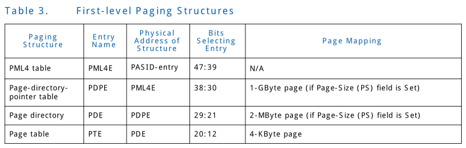

# 3
## 3.6 First-Level Translation
Extended-context-entries can be configured to translate 
requests-with-PASID through first-level translation. 
Extended-context-entries contain the PASID-table pointer 
and size fields used to reference the PASID-table. The 
PASID-number in a request-with-PASID is used to offset into 
the PASID-table. Each present PASID-entry contains a pointer 
to the base of the first-level translation structure for the 
respective process address space. Section 9.5 describes the 
exact format of the PASID-entry.

Extended-context-entries 可以用来配置 来通过 first-level 
translation translate request-with-PASID。Extended-context-entries
包含PASID-table pointer 和size 字段用来引用PASID-table.request-with-PASID
中的PASID-number 用来在PASID-table中提供偏移。每个present PASID-entry 
包含一个指向first-level translation structure 的 基址，这些structure 分别对应process address space。Section 9.5描述了PASID-entry的详细
格式。

First-level translation restricts the input-address to a 48-bit
canonical addresses (i.e., address bits 63:48 has the same 
value as the address bit 47). A device may perform local check
for canonical address before it issues a request-with-PASID, 
and handle a violation in a device specific manner. 
Requests-with-PASID arriving at the remapping hardware are 
subject to canonical address checking, and a violation is 
treated as a translation-fault. Chapter 7 provides details 
of translation-fault conditions and how they are reported to 
software.

First-level translation 将 input-address 限制为48-bit
规范address(例如, address 63:48位和bit 47 位有相同的值).
device 可以在提交 reuqest-with-PASID 之前， 对于规范的地
址执行一些本地的检查, 并且以设备特定的方式处理这些违规的地
址。Request-with-PASID到达remapping hardware 受到规范 
address  检查的影响, 并且 违规地址会被到嗯做translation fault 对待。
Chapter 7提供了translation-fault 情况的细节并且讲述了他们是怎么
报告给software的。

First-level translation supports the same paging structures 
as Intel® 64 processors when operating in 64-bit mode. Table 
3 gives the different names of the first-level translation 
structures, that are given based on their use in the translation
process. It also provides, for each structure, the source of 
the physical-address used to locate it, the bits in the 
input-address used to select an entry from the structure, 
and details of whether and how such an entry can map a page. 
Section 9.7 describes format of each of these paging structures
in detail. 

First-level translation 支持 和Intel 64处理器运行于64-bit 模型
相同的paging structures。Table 3 给出了first-level translation 
不同的names, 这些名称是根据他们在translation 过程中的用途给出的。
它还为每一个structure 提供了，定位他们的物理地址的source , 用于从
结构中选择entry的input-address 的bits, 以及此类条目是否或者如何map page
的详细信息。Section 9.7 描述了每个paging structure 格式的细节。

First-level translation may map input addresses to 4-KByte 
pages, 2-MByte pages, or 1-GByte pages. Support for 4-KByte 
pages and 2-MBytes pages are mandatory for first-level 
translation. Implementations supporting 1-GByte pages report 
it through the FL1GP field in the Capability Register (see 
Section 10.4.2). Figure 3-9 illustrates the translation process
when it produces a 4- KByte page; Figure 3-10 covers the case
of a 2-MByte page; Figure 3-11 covers the case of a 1-GByte page.

First-level translation 可以将input address map到一个4-KByte
page, 2-MByte page, 或者1-GByte page。对4-KByte和2-MByte page
的支持，交给first-level translatin 去做。Implementation通过
Capability Register( Section 10.4.2) 中的FL1GP 字段报告是否支持
1-GByte pages。Figure3-9 图示了当产生了一个4-KByte page时的translation
过程; Figure 3-10 涉及2-MByte page 的情形; Figure 3-11 涉及
1-GByte page 的情形。

The following describe the first-level translation in more 
detail and how the page size is determined:

接下来描述first-level translation 的更多细节，并且page size 
是如何确定的。

* A 4-KByte naturally aligned PML4 table is located at the 
physical address specified in First-level- page-table-pointer
(FLPTPTR) field in the PASID-entry (see Section 9.5). A PML4 
table comprises 512 64-bit entries (PML4Es). A PML4E is 
selected using the physical address defined as follows: 
	— Bits 2:0 are all 0. 	 
	— Bits 11:3 are bits 47:39 of the input address. 	 
	— Bits 12 and higher are from FLPTPTR field in the PASID-entry.  
	Because a PML4E is identified using bits 47:39 of the input 
	address, it controls access to a 512-GByte region of the 
	input-address space. 
 

4-KByte naturally aligned(自然对齐, 有点像强制对齐) PML4 table位于
PASID-entry (请看section 9.5) 中的 First-level-page-table-pointer
(FLPTPTR) 字段指定的物理地址。PML4 table包含512 64-bit entries(PML4Es）。
使用下面定义物理地址选择PML4E。 
&emsp;&emsp;- Bit 2:0 都是0 (3 位 地址对应64bit ) 
&emsp;&emsp;- Bit 11:3 是input address 的 47:39位 
&emsp;&emsp;- Bit 12 更高的位来自PASID-entry 中的FLPTPTR 字段 
&emsp;&emsp;因为PML4 使用input address 的47:39 bits定位PML4E，所以
它可以控制去访问input-address 空间的 512-GByte的region。

* A 4-KByte naturally aligned page-directory-pointer table 
is located at the physical address specified in address (ADDR)
field in the PML4E (see Table 18). A page-directory-pointer 
table comprises 512 64-bit entries (PDPEs). A PDPE is selected
using the physical address defined as follows: 
	— Bits 2:0 are all 0. 
	— Bits 11:3 are bits 38:30 of the input address. 
	— Bits 12 and higher are from the ADDR field in the PML4E. 
	Because a PDPE is identified using bits 47:30 of the input 
	address, it controls access to a 1-GByte region of the 
	input-address space. Use of the PDPE depends on its page-size (PS)
	field:
 

4-KByte naturally aligned(自然对齐) page-directory-pointer table
位于PML4E(see Table 18) 中的address(ADDR)字段指定的物理地址。
page-directory-pointer table 包含512 个 64-bit entries(PDPEs)。使用
接下来定义的物理地址选择PDPE: 
&emsp;&emsp;- Bits 2:0 都是0 （同上） 
&emsp;&emsp;- Bits 11:3 是input address 的 38:30位 
&emsp;&emsp;- Bits 12 和更高的位来自PML4E的ADDR字段 
&emsp;&emsp;因为PDPE通过input address 的47:30位指定PDPE, 所以它
控制访问input-address space的1-GByte region。PDPE的使用依赖他的
PS字段:

* If the PDPE’s PS field is 1, the PDPE maps a 1-GByte page 
(see Table 19). The final physical address is computed as 
follows: 
	— Bits 29:0 are from the input address. 
	— Bits 30 and higher are from the ADDR field in the PDPE.
 

如果PDPE的PS字段为战，PDPE 将会映射一个1-GByte的page (see Table 
19)。最终的物理地址由下面组成: 
&emsp;&emsp;- Bits 29:0 来自于input address 
&emsp;&emsp;- Bits 30和更高的位来自于PDPE的ADDR字段

* If the PDPE’s PS field is 0, a 4-KByte naturally aligned 
page directory is located at the physical address specified 
in the address (ADDR) field in the PDPE (see Table 20). A page
directory comprises 512 64-bit entries (PDEs). A PDE is 
selected using the physical address defined as follows:
	— Bits 2:0 are all 0. 
	— Bits 11:3 are bits 29:21 of the input address. 
	— Bits 12 and higher are from the ADDR field in the PDPE. 
	Because a PDE is identified using bits 47:21 of the input 
	address, it controls access to a 2-MByte region of the 
	input-address space. Use of the PDPE depends on its 
	page-size (PS) field:
 

如果PDPE的PS字段为0, 4KByte 自然对齐的page directory 
位于PDPE（see Table 20)中的address(ADDR)字段指定的物理地址。
page directory 包含512 个 64 bit 的entries(PDEs)。通过
使用下面定义的物理地址选择PDE:
&emsp;&emsp;- Bits 2:0 都是0  
&emsp;&emsp;- Bits 11:3 是input address的29:21位。 
&emsp;&emsp;- Bits 12和更高的位来自于PDPE的ADDR字段 
&emsp;&emsp;因为PDE使用input address的47:21 bits指定，
所以它控制访问 input-address 2-MByte region。PDPE的使用
依赖他的page-size(PS)字段:

* If the PDE’s PS field is 1, the PDE maps a 2-MByte page 
(see Table 21). The final physical address is computed as 
follows:
	— Bits 20:0 are from the input address.
	— Bits 21 and higher are from the ADDR field in the PDE.
 

如果PDE的PS字段为1, PDE 会映射一个2-MByte page(see Table 21)。
最终的物理地址由以下组成:
&emsp;&emsp;-Bits 20:0 来自于input address。
&emsp;&emsp;-Bits 21 或者更高的位来自于PDE的ADDR字段。

* If the PDE’s PS field is 0, a 4-KByte naturally aligned page
table is located at the physical address specified in the 
address (ADDR) field in the PDE (see Table 22). A page table 
comprises 512 64-bit entries (PTEs). A PTE is selected using 
the physical address defined as follows:
	— Bits 2:0 are all 0. 
	— Bits 11:3 are bits 20:12 of the input address. 
	— Bits 12 and higher are from the ADDR field in the PDE. 
	Because a PTE referenced by a PDE is identified using bits 
	47:12 of the input address, every such PTE maps a 4-KByte page
	(Table 23). The final page address is translated as follows: 
	— Bits 11:0 are from the input address. 
	— Bits 12 and higher are from the ADDR field in the PTE.
 

如果PDE的PS字段为0, 4-KByte自然对齐的page table 位于PDE中的address
(ADDR)字段中指定的物理地址。page table 由512个 64-bit的entries(PTEs）
组成。使用如下定义的物理地址选择PTE:
&emsp;&emsp;- Bits 2:0 都是0. 
&emsp;&emsp;- Bits 11:3 是input address的20:12 bits 
&emsp;&emsp;- Bits 12以及更高位来自PDE的ADDR字段。 
&emsp;&emsp;因为PDE引用的(指向的)PTE是使用input address 47:12位
确定的，所以每个PTE maps 一个4-KByte page （Table 23)。最终翻译
的页面地址如下: 
&emsp;&emsp;-Bits 11:0 来自于 input address 的11:0 
&emsp;&emsp;-Bits 12和更高的字节来自于PTE的ADDR字段。

If a paging-structure entry’s Present (P) field (bit 0) is 0 
or if the entry sets any reserved field, the entry is used 
neither to reference another paging-structure entry nor to 
map a page. A reference using a input address whose translation 
would use such a paging-structure entry causes a translation
fault (see Chapter 7).

如果page-structure entry中的Present(P) field(bit 0)是0,或者
如果entry 设置了任何的保留字段，entry 不再用作引用另一个
paging-structure entry 或者map a page. 使用这样的input address
的reference(引用?)会导致translation fault(see Chapter 7),
该input address他的翻译会使用上述的paging-structure entry

The following bits are reserved with first-level translation:

下面的bits将在first-level translation中保留。

* If the P field of a paging-structure entry is 1, bits 51:HAW
(Host Address Width) are reserved.
 

如果paging-structure entry 中的P 字段为1, bit 51:HAW(Host Address
Width) 将被保留

* If the P field of a PML4E is 1, the PS field is reserved.
 

如果PML4E中的P字段为1, PS字段被保留

* If 1-GByte pages are not supported and the P field of a 
PDPE is 1, the PS field is reserved.
 

如果1-GByte page 不被支持，并且PDPE中的P字段为战， PS字段
将被保留。

* If the P field and PS field of a PDPE are both 1, bits 29:13
are reserved.
 

如果P字段和PDPE中的PS字段都为1, bits 29:13字段将被保留。

* If the P field and PS field of a PDE are both 1, bits 20:13
are reserved.
 

如果PDE和PS字段都为1, 20:13字段被保留。

* If Extended-Accessed flag is not supported, the EA field in
the paging entries are ignored.
 

如果 Extended-Accessed flags 不支持，paging entires中的EA字段
将被忽略。

* If No-Execute-Enable (NXE) field is 0 in the extended-context-entry 
and the P field of a paging-structure entry is 1, the Execute-Disable 
(XD) field is reserved
 

如果extended-context-entry 中的No-Execute-Enable(NXE)字段为0， 并且
paging-structure中的P字段为1,则Execute-Disable(XD)字段被预留。

### 3.6.1 Translation Faults
Requests-with-PASID can result in first-level translation 
faults for either of two reasons: (1) there is no valid 
translation for the input address; or (2) there is a valid 
translation for the input address, but its access rights do 
not permit the access. There is no valid translation if any 
of the following are true:

Requests-with-PASID由于下面两种原因导致在 first-level 
translation 产生faults:(1) 对于input address 没有合法的
translation;或者(2) 对于input address 有合法的translation,
但是他的访问权限不允许本次访问。如果下面的任何条件为真, 则
没有合法的translation。

* The Root Table Type (RTT) field in Root-table 
Address register (RTADDR_REG) is 0.
 

Root-table Adress register 中的Root Table Type(RTT) 字段
为0(表明不支持extended-root-entry)

* The input address in the request is not canonical (i.e., 
address bits 63:48 not same value as address bit 47).
 

request中的 input address不符合规则(例如: address bits 63:48
和address中bit 47 值不相同)

* Hardware attempt to access a translation entry (extended-root-entry, 
extended-context-entry, PASID-table entry, or a first-level 
paging-structure entry) resulted in error.
 

Hardware 尝试去访问translation entry（ entended-root-entry, 
extended-context-entry, PASID-table entry, 或者 first-level paging-structure
entry )将会导致错误。

* The extended-root-entry used to process the request (as noted
in Section 3.4.2) has the relevant present field as 0, has 
invalid programming, or has a reserved bit set.
 

用于处理request 的extended-root-entry 中相关present field 为0(Section
3.4.2 提到的), 或者 编程为非法的值，或者设置了reserved 的bit.

* The extended-context-entry used to process the request 
(as noted in Section 3.4.3) has the P field as 0, PASIDE 
field as 0, ERE field as 0 (for requests with Execute-Requested (ER)
field Set), SMEP field as 1 (for requests with Execute-Requests (ER)
and Privileged-mode-Requested (PR) fields Set), has invalid programming,
T field is programmed to block requests-with-PASID, or has a reserved 
bit set.
 

用于处理request的extend-context-entry 中的P field 是0 (如Section 3.4.3
提到的), PASIDE 字段为0, ERE字段为0 (对于设置了Execute-Requested (ER)
字段的request),SMEP 字段为0 (对于设置了Execute-Requests(ER) 和Privileged-mode-Requested
(PR)字段的request), 或者是编程为非法的值，或者是T 字段被编程为 block request-with-PASID,
（这个并未找到!!!),  或者是设置了reserved位

* The PASID-entry used to process the request (as noted in 
Section 3.6) has the P field as 0, or has the SRE field as 0 
(for requests with Privileged-mode-Requested (PR) field Set).
 

处理request的PASID-entry 中的P字段为0， 或者是SRE字段为0(对于
设置了 Privileged-mode-Requested (PR) 字段的request)

* The translation process for that address (as noted in Section 3.6)
used a paging-structure entry in which the P field is 0 or one 
that sets a reserved bit.
 

对于 使用的paging-structure entry 中的P 字段为0 , 或者该entry中设置了 
reserved bit 的address的 translationd的处理。

If there is a valid translation for an input address, its 
access rights are determined as described in Section 3.6.2.

如果对于一个input address 的translation 是合法的话，他的访问
权限，如Section 3.6.2 描述的那样被确定。

Depending on the capabilities supported by remapping hardware 
units and the endpoint device, translations faults may be 
treated as non-recoverable errors or recoverable page faults. 
Chapter 7 provides detailed hardware behavior on translation 
faults and reporting to software. 

依赖 remapping hardware units 和 endpoint devices  的 capabilities,
translation faults 可能当作 non-recoverable(不可恢复的) 错误或者
recoverable page faults。Chapter 7 提供了translation faults 硬件行为
和 报告给软件(暴露软件接口) 的细节

### 3.6.2 Access Rights
The accesses permitted for a request-with-PASID whose input 
address that is successfully translated through first-level 
translation is determined by the attributes of the request 
and the access rights specified by the paging-structure 
entries controlling the translation.

对于是否允许对requst-with-PASID 的访问(该input addresss
已经成功的通过first-level translation )由 request的 attributes和
控制 translation 的paging-structure entries的访问权限决定。

Devices report support for requests-with-PASID through the 
PCI-Express PASID Capability structure. PASID Capability allows
software to query and control if the endpoint can issue 
requests-with-PASID that request execute permission (such as 
for instruction fetches) and requests with supervisor-privilege. 
Remapping hardware implementations report support for requests
seeking execute permission and requests seeking supervisor 
privilege through the Extended Capability Register (see ERS and
SRS fields in Section 10.4.3).

Device 通过 PCI-Express PASID Capability structure 报告了对于
request-with-PASID的支持。PASID Capability 允许软件查询并控制
enpoint是否可以提交 execute permission的request-with-PASID
（对于指令预取来说) 或者带有 supervisor-privilege的requests.
Remapping hardware implementations 通过 Extended Capability Register
(见Section 10.4.3 中的ERS和SRS字段) 报告了对于查询 request的
execute permission 和 查询 request 的 supervisor privilege
的支持

The following describes how first-level translation determines
access rights:

接下来描述了first-level translation如何确定访问权限:

* (1) For requests-with-PASID with supervisor privilege (value
 of 1 in Privilege-mode-Requested (PR) field) processed through
 a PASID-entry with SRE (Supervisor Requests Enable) field Set:
  
 
 通过PASID-entry 中的SRE (Supervisor Request Enable） 字段的设置
 处理带有 supervisor privilege 的request-with-PASID( Privilege-
 mode-Requested 字段为1) .
 
	+ (1.1) Data reads (Read requests with value of 0 in 
	Execute-Requested (ER) field)
	  
	
	Data reads( Execute-Requested(ER) 字段为0 的Read requests)
	
		* (1.1.1)Data reads are allowed from any input address 
		with a valid translation.
		  
		
		来自于任何合法translation 的input address 的Data read
		
	+ (1.2) Instruction Fetches (Read requests with value of 1 
	in Execute-Requested (ER) field)
	  
	
	指令预取（带有Execute-Requested(ER)字段为1 的Read requests)
	
		* (1.1.2) If No-Execute-Enable (NXE) field in 
		extended-context-entry used to translate request is 0
		  
		
		如果translate reques使用的extended-context-entry 中的
		No-Execute-Enable(NXE) 字段为0
		
			+ (1.1.2.1) If Supervisor-Mode-Execute-Protection (SMEP) 
			field in extended-context-entry used to translate 
			request is 0, instruction may be fetched from any 
			input address with a valid translation.
			  
			
			如果 translate request 使用的 extended-context-entry 
			中的 SMEP 字段为0, 指令可能从任何合法的translation de 
			input address 中预取到
			
			+ (1.1.2.2) If Supervisor-Mode-Execute-Protection (SMEP)
			field in extended-context-entry used to translate request 
			is 1, instruction may be fetched from any input address 
			with a valid translation for which the U/S field (bit 2) 
			is 0 in at least one of the paging-structure entries 
			controlling the translation.
			  
			
			如果translation request使用的 extended-context-entry 中的
			SMEP 字段为1, 指令可以从任何下面描述的input address 中预取到:
			该input address 具有合法的translation 并且 控制translation 的
			paging-structure entries 中至少有一个entries他的U/S field(bit 2)
			为0 
			
			
			(!!!WHY  AT LEAST ONE ???)
			
		* (1.1.3) If No-Execute-Enable (NXE) field in 
		extended-context-entry used to translate request is 1
		 
		
		如果用于translate request 的extended-context-entry 
		中的 No-Execute-Enable (NXE)字段为1
		
			+ (1.1.3.1) If Supervisor-Mode-Execute-Protection (SMEP) 
			field in extended-context-entry used to translate request
			is 0, instruction may be fetched from any input address 
			with a valid translation for which the XD field (bit 63) 
			is 0 in every paging-structure entry controlling the 
			translation.
			 
			
			如果 用于translate request 的extended-context-entry 中的
			Supervisor-Mode-Execute-Protection(SMEP)字段为0, 指令可以
			从下面买哦书的任何input address中预取到，该input address 
			具有合法的 translation 并且 控制translation 的每个 paging-structure
			中的XD field(bit 63) 都是0
			
			+ (1.1.3.2) If Supervisor-Mode-Execute-Protection (SMEP) 
			field in extended-context-entry used to translate request 
			is 1, instruction may be fetched from any input address 
			with a valid translation for which, the U/S field is 0 in 
			at least one of the paging-structure entries controlling 
			the translation, and the XD field is 0 in every 
			paging-structure entry controlling the translation.
			 
			
			如果用于translate request 的entended-context-entry 中的SMEP
			字段为1, instruction 可以从下面任何的带有合法translation 的
			input address取出，控制该translation的至少一个paging structure
			entries U/S字段为0, 并且控制该translation的每个paging structure
			的 XD 字段为0
			
			
			(!!!WHY  AT LEAST ONE ???)
			
	+ (1.3) Write requests and Atomics requests
	 
	
	Write request 和 atomic requests
	
		* (1.3.1) If Write-Protect-Enable (WPE) field in 
		extended-context-entry used to translate request is 0, 
		writes are allowed to any input address with a valid 
		translation.
		 
		
		如果用于translate request 的 extended-context-entry 中的
		Write-Protect-Enable(WPE) 字段为0, 允许带有任何合法
		translation de input address 的写操作。
		
		* (1.3.2) If WPE=1, writes are allowed to any input address 
		with a valid translation for which the R/W field (bit 1) 
		is 1 in every paging-structure entry controlling the 
		translation.
		 
		
		如果WPE = 1, 允许下面任何带有合法translation的input address
		写操作。该input address 需满足: 控制translation 的每个
		paging-structure entry 中的R/W字段(bit 1) 都为1
		

* (2) For requests-with-PASID with user privilege (value of 
0 in Privilege-mode-Requested (PR) field):
 

对于带有user privilege( Privilege-mode-Requested(PR) 字段为0)
的request-with-PASID

	+ (2.1) Data reads (Read requests with value of 0 in 
	Execute-Requested (ER) field)
	 
	
	Data read(Read request的Execute-Request(ER) field为0)
	
		* (2.1.1)  Data reads are allowed from any input address 
		with a valid translation for which the U/S field is 1 in 
		every paging-structure entry controlling the translation.
		 
		
		Data read 允许下面的任何带有合法translation 的input address ,
		旭满足控制 translation的每个paging-structure的U/S字段都为1
		
	+ (2.2) Instruction fetches (Read requests with value of 1 
	in Execute-Requested (ER) field)
	 
	
	指令预取(Read requests的 Execute-Requested (ER) 字段为1)
	
		* (2.2.1) If No-Execute-Enable (NXE) field in 
		extended-context-entry used to translate request 
		is 0, instructions may be fetched from any input 
		address with a valid translation for which the 
		U/S field is 1 in every paging structure entry 
		controlling  the translation.
		 
		
		如果用于translate request 的 extended-context-entry 
		中的No-Execute-Enable(NXE) 字段为0, 指令可以从下面任何
		的带有合法translation 的input address中预取到。需满足
		控制translation 的每个 paging structure entry 的 U/S 
		字段都为1
		
		* (2.2.2) If No-Execute-Enable (NXE) field in 
		extended-context-entry used to translate request is 1, 
		instructions may be fetched from any input address with a 
		valid translation for which the U/S field is 1 and XD 
		field is 0 in every paging-structure entry controlling 
		the translation.
		 
		
		如果用于translate request 的extended-context-entry 中的
		No-Execute-Enable(NXE)字段为1, 指令可以从下面任何合法
		translate 的地址中预取到, 需满足每个控制translation 的
		paging-structure entry 中的 U/S字段为1 并且XD字段为0。
		
	+ (2.3) Write requests and Atomics requests
	 
	
	Write request 和 atomic requests
	
		* (2.3.1)  Writes are allowed to any input address with 
		a valid translation for which the R/W field and the U/S 
		field are 1 in every paging-structure entry controlling 
		the translation.
		 
		
		允许任何下面任何带有合法translation 写入 input address,
		需要满足每个控制translation 的paging-structure entry 中的R/W
		字段和U/S字段都为1
		

Remapping hardware may cache information from the paging-structure 
entries in translation caches. These caches may include information
about access rights. Remapping hardware may enforce access rights 
based on these caches instead of on the paging structures in memory.
This fact implies that, if software modifies a paging-structure 
entry to change access rights, the hardware might not use that 
change for a subsequent access to an affected input address. 
Refer to Chapter 6 for details on hardware translation caching
and how software can enforce consistency with translation caches
when modifying paging structures in memory. 

Remapping hardware 可以从paging-structure entries 在translation caches
缓存信息。这些缓存可以包括访问权限的相关信息。Remapping hardware 可以
基于这些cache 执行访问权限，而不是基于内存中的paging structures。
这个带来的实际影响是，如果软件修改了paging-struture entry 来改变
访问权限，硬件对于接下来的对于受影响的input address的访问使用的是
未改动的。了解更多hardware translation caching 和软件如何 在修改memory中的
paging structure 的时候， 让 translation cache 报纸一致性, 请参照Chapter 6 

### 3.6.3 Accessed, Extended Accessed, and Dirty Flags
For any paging-structure entry that is used during first-level
translation, bit 5 is the Accessed (A) flag. For first-level 
paging-structure entries referenced through a Extended-context-entry
with EAFE=1, bit 10 is the Extended-Accessed flag. For 
paging-structure entries that map a page (as opposed to 
referencing another paging structure), bit 6 is the Dirty (D)
flag. These flags are provided for use by memory-management 
software to manage the transfer of pages and paging structures
into and out of physical memory.

在first-level translation中，使用的任何paging-structure entry 的bit 5
都是 Accessed(A) flag。对于通过带有EAFE的Extended-context-entry 指向的
first-level paging-structure entries, bit 10是Extended-Accessed flag.
对于map 了 page(和引用了另一个paging structure相反)的 pag-structure 
entries, bit 6 是Dirty(D) flag. 这些flags 提供给 memory-management
software 使用，用来管理page和paging structures 转移 into 或者
out of 物理内存。

* Whenever the remapping hardware uses a first-level 
paging-structure entry as part of input-address translation,
it atomically sets the A field in that entry (if it is not 
already set).
 

每当remapping hardware 使用 first-level paging structure entry 
作为input-address translation 一部分时, 他会atomically设置该entry的
A(access) field(如果他没有被设置)

* If the Extended-Accessed-Flag-Enable (EAFE) is 1 in a 
Extended-context-entry that references a first-level 
paging-structure entry used by hardware, it atomically 
sets the EA field in that entry. Whenever EA field is 
atomically set, the A field is also set in the same atomic 
operation. For software usages where the first-level paging 
structures are shared across heterogeneous agents (e.g., CPUs
and accelerator devices such as GPUs), EA flag may be used by
software to identify pages accessed by non-CPU agent(s) (as 
opposed to the A flag which indicates access by any agent 
sharing the paging structures).
 

如果Extended-context-entry 中的 Extend-Accessed-Flag-Enable
(EAFE) 是1, 该Extend-context-entry 引用的first-level paging-
structure entry 会被hardware 使用到，它会atomically 设置该
entry 的EA field。每当EA field 被 atomically 设置，A field
也会在相同的atomic 操作中被设置。对于在不同的agents 之间
共享 first-level paging structures的用法(agents e.g. CPUs
和 加速器devices 例如 GPUs)，EA flags可能用于软件来表示这些pages
是被non-CPU agent(s) 访问的（与之对应的是A flags，表示由
任意的共享了paging structure 的 agents访问)。

* Whenever there is a write to a input address, the remapping
hardware atomically sets the D field (if it is not already 
set) in the paging-structure entry that identifies the final 
translated address for the input address (either a PTE or a 
paging-structure entry in which the PS field is 1). The atomic
operation that sets the D field also sets the A field (and the
EA field, if EAFE=1 as described above).
 

每当有一个对input address 的write 操作，remapping hardware 会
atomically 设置paging-structure entry 中D field(如果它还没有被设置),
该entry 确认了input address 的最终的translated address( PTE或者
paging-structure 中的PS字段为1)。atomic操作会社值D field同时
也会设置A field (如果上面买哦书的EAFE=1, 也会设置EA 字段)

> PS: PAGE_SIZE,为1表示指向具体的页表，为0表示指向paging structure.

Memory-management software may clear these flags when a page 
or a paging structure is initially loaded into physical memory.
These flags are “sticky”, meaning that, once set, the remapping
hardware does not clear them; only software can clear them.

Memory-management 软件可能会清空这些flags 当page 或者paging strctures
被初始化load 到物理内存时。之后这些flags 是"sticky", 意思是，一旦被设置，
remapping hardware 不会在clear 他们; 只有software 会clear 他们.

Remapping hardware may cache information from the first-level
paging-structure entries in translation caches (see Chapter 6).
These caches may include information about accessed, 
extended-accessed, and dirty flags. This fact implies that, 
if software modifies an accessed flag, extended- accessed flag,
or a dirty flag from 1 to 0, the hardware might not set the 
corresponding bit in memory on a subsequent access using an 
affected input address. Refer to Chapter 6 for details on 
hardware translation caching and how software can enforce 
consistency with translation caches when modifying paging 
structures in memory. 

Remapping hardware 会 cache 来自first-level paging structure 
entries 中的信息到translation caches中(请看 Chapter 6）。
这些cache 可能包括信息有: accessed, extended-accessed,和
dirty flags。这带来的实际影响是，如果软件将accessed flags, 
extended-accessed flags, 或者dirty flags 从1 修改为0, 
hardware 可能不会在随后的使用受影响的input address 访问
设置内存中相应的bit. 请查阅Chapter 了解 hardware translation
caching 和 软件在修改内存中paging structures 时，如何保持
translation cache 的一致性的细节。

### 3.6.4 Snoop Behavior
Snoop behavior for a memory access (to a translation structure
entry or access to the mapped page) specifies if the access is
coherent (snoops the processor caches) or not. The snoop behavior
is independent of the memory typing described in Section 3.6.5.
When processing requests-with-PASID through first-level 
translation, the snoop behavior for various accesses is 
specified as follows:

对于memory access (访问translation structure entry 或者 访问 mapped
page)的Snoop behavior(窥探行为) 用于指定 该访问 是否是 一致性的(snoop
processor cache)

(这个行为像是说，snoop behavior 会向cpu 一样， 去保证内存和cache 的一致性)
。

snoop 行为不同于Section  3.6.5 中描述的memory typing。当通过first-level
translation 处理request-with-PASID时，对于不同的访问, snoop behavior 通过
下面的情形指定:

* Access to extended-root and extended-context-entries are 
snooped if the Coherency ( C ) field in Extended Capability 
Register (see Section 10.4.3) is reported as 1. These accesses
are not required to be snooped if the field is reported as 0.
 

如果Extended Capability Register(请看Section 10.4.3 ) 中的 
Coherency( C ) 字段报告为1,  则访问extended-root和
extended-context-entries 是snooped 。 如果该字段报告为0, 这些
字段不需要是snooped。

* Access to PASID-table entries are always snooped.
 

访问PASID-table entries 总是snooped

* Accesses to first-level paging-entries (PML4E, PDPE, PDE, PTE)
are always snooped.
 

访问first-level paging-entries (PML4E, PDPE, PDE, PTE) 总是snooped。

* Access to the page mapped through first-level translation is
always snooped (independent of the value of the No-Snoop (NS)
attribute in the request). 
 

通过first-level translation 访问page mapped 总是snooped(无论request
中 No-Snoop(NS) 属性的值是什么）

### 3.6.5 Memory Typing
The memory type of a memory access (to a translation structure
entry or access to the mapped page) refers to the type of 
caching used for that access. Refer to Intel® 64 processor 
specifications for definition and properties of each supported
memory-type (UC, UC-, WC, WT, WB, WP). Support for memory typing
in remapping hardware is reported through the Memory-Type-Support
(MTS) field in the Extended Capability Register (see Section 
10.4.3). This section describes how first-level translation 
contributes to determination of memory typing.

memory access (访问 translation structure entry 或者是 访问一个
mapped page)的 memory type 指的是本次访问使用的 cache 的 type。
参考Intel（R）64 processor 手册了解每个支持的memory-type(UC,UC-,
WC, WT, WB, WP) 的定义和属性。remapping hardware 中支持的memory 
typing 通过Extended Capability Register (请查看Section 10.4.3) 
Memory-Type-Support(MTS)字段报告。该章节描述了first-level 
translation 如何有助于确定memory typing。

* Memory-type has no meaning (and hence ignored) for memory 
accesses from devices operating outside the processor 
coherency domain.
 

对于来自于 operating 在处理器一致性域之外的devices 的内存访问，
Memory-type是没有意义的(并且由此可以被忽略)

* Memory-type applies for memory accesses from devices (such 
as Intel® Processor Graphics device) operating inside the 
processor coherency domain. 
 

Memory-type 适用于来自于 operating 在处理器一致性域之内的device
(例如 Intel (R) Processor Graphics device) 的内存访问。

When processing requests-with-PASID from devices operating in 
the processor coherency domain, the memory type for any access
through first-level translation is computed as follows:

当处理来自于 operating 在处理器一致性之内的devices 的request-with-PASID
时，对于任何通过first-level translation 的access 对象的memory type
被如下计算:

* If cache-disable (CD) field in the extended-context-entry 
used to process the request is 1, all accesses use memory-type
of uncacheable (UC)
 

如果用于处理request的extended-context-entry 中cache-disable (CD) 
字段为1，任何访问使用uncacheable 的 memory-type 。

* If CD field is 0, the memory-type for accesses is computed 
as follows:
 

如果CD字段为0, accesses 的memory-type会被如下计算:

	+ Access to extended-root & extended-context-entries use 
	memory-type of uncacheable (UC).
	 
	
	访问 extended-root & extended-context-entries 使用 UC
	memory-type
	
	+ Access to PASID-table entries use memory-type from MTRR 
	(described in Section 3.6.5.2).
	 
	
	访问PASID-table entries 使用来自于MTRR的memory-type。
	(在Section 3.6.5.2 中描述)
	
	+ Memory-type for access to first-level translation-structure
	entries (PML4E, PDPE, PDE, and PTE), and for access to the 
	page itself is computed as follows:
	 
	
	对于对first-level translation-structures entries (PML4E, PDPE, 
	PDE, 和PTE) 的访问, 并且对于对于该page本身的访问，被如下计算:
	
		* First, the memory-type specified by the Page Attribute 
		Table (PAT) is computed. PAT is a 32-bit field in the 
		extended-context-entry, comprising eight 4-bit entries 
		(entry i comprises bits 4i+3:4i). Refer to Section 9.4 
		for the exact format of the PAT field in the 
		extended-context-entry.
		 
		
		首先由Page Attribute Table(PAT) 指定的memory-type 会被计算。
		PAT是一个extended-context-entry 中的32-bit 字段,  由8个4-bit
		的entries组成(entry 1 由bits 4i+3:4i组成)。参考Section 9.4
		了解extended-context-entry 中的PAT字段的详细的格式。
		
		* Second, the memory-type for the target physical address 
		as specified by the Memory Type Range Registers (MTRRs) 
		is computed. MTRRs provide a mechanism for associating the
		memory types with physical-address ranges in system memory. 
		MTRR Registers are described in detail in Section 10.4.38, 
		Section 10.4.39, Section 10.4.40, and Section 10.4.41. For 
		details on MTRR usage and configuration requirements refer 
		to Intel(R)64 processor specifications.
		 
		
		再者，由 Memory Type Range Register (MTRRs) 指定的target physical
		address 的memory-type 会被计算。MTRRs提供了一个关联memory types和
		系统内存中的physical-address 范围的机制。MTRR Register 在Section
		10.4.38, Section 10.4.40, Section 10.4.41 中详细描述。对于MTRR
		用法和配置需求，请参考Intel(R) 64 processor spec
		 
		
		4.9 PAGING AND MEMORY TYPING
		
		
		* Finally, the effective memory-type is computed by combining 
		the memory-types computed from PAT and MTRR.
		 
		
		最终，有效的memory-type 会通过来自于PAT和MTTR中的memory-types
		结合计算。
		

The following sub-sections describe details of computing memory-type 
from PAT, memory type from MTRR, and how to combine them to 
form the effective memory type.

接下来的子章节，描述了来自于PAT memory-type, 和来自于MTRR memory的计算细节，
并且如何结合他们形成有效的memory type.

#### 3.6.5.1 Selecting Memory Type from Page Attribute Table

Memory-type selection from Page Attribute Table requires hardware
to form a 3-bit index made up of the PAT, PCD and PWT bits from
the respective paging-structure entries. The PAT bit is bit 7 in
pagetable entries that point to 4-KByte pages and bit 12 in 
paging-structure entries that point to larger pages. The PCD
and PWT bits are bits 4 and 3, respectively, in paging-structure
entries that point to pages of any size.

从Page Attribute Table中选择 Memory-type  需要硬件形成一个3-bits
的 index, 该index有来自于各个paging-structure entries 的PAT, PCD,
PWT组成。PAT bits 位于第pagetable-entries中的第7位，当该entries
指向4-KByte page 并且 当该entries 指向更大大小的pages时，位于该
pagetable-entries的第12位。PCD 和 PWD 分别为于paging-structure entries
中的4 和 3 bits, 该entries 可以指向任意大小的page。

The PAT memory-type comes from entry i of the Page Attribute
Table in the extended-context-entry controlling the request,
where i is defined as follows:

PAT memory-type 来自extended-conetxt-entry中的Page Attribute
Table 中的第i个entry, 这里的i 被如下定义:

* For access to PML4E, i = 2*PCD+PWT, where the PCD and PWT 
 values come from the PASID-table entry.
 

如果访问PML4E, i = 2 * PCD + PWT, 这里PCD 和 PWT 的值来自于
PASID-table entry。

* For access to a paging-structure entry X whose address is 
in another paging structure entry Y (i.e., PDPE, PDE and PTE),
i = 2*PCD+PWT, where the PCD and PWT values come from Y.
 

如果访问 page-structure entry X, X的address 位于另一个paging 
structure entry Y(例如PDPE, PDE和PTE) , i = 2 * PCD + PWT, 
这里的PCD和PWT 的值来自于Y。

* For access to the physical address that is the translation
of an input address, i = 4*PAT+2*PCD+PWT, where the PAT, PCD,
and PWT values come from the relevant PTE (if the translation 
uses a 4-KByte page), the relevant PDE (if the translation uses
a 2-MByte page), or the relevant PDPE (if the translation uses 
a 1-GByte page).
 

对于访问的物理地址是一个 input address 的translation(也就是
说该访问是一个translation 事物， input address --> physical
address), i = 4*PAT+2*PCD+PWT, 这里的PAT,PCD和PWT值均来自于
相应的PTE（如果translation 使用的是4-KByte page), 相应的PDE
（如果translation 使用的是2-MByte page）, 或者相应的PDPE（如果
translation使用的是1-GByte page)。

可见PCD和PWT的来源都位于其父entry (指向该entry的entry)

#### 3.6.5.2 Selecting Memory Type from Memory Type Range Registers 

Remapping hardware implementations reporting Memory-Type-Support 
(MTS) field as Set in the Extended Capability Register support
the Memory Type Range Registers (MTRRs). These include the MTRR
Capability Register (see Section 10.4.38), MTRR Default Type 
Register (see Section 10.4.39), fixed-range MTRRs (see Section
10.4.40), and variable-range MTRRs (see Section 10.4.41).

Selection of memory-type from the MTRR registers function as
follows:

* If the MTRRs are not enabled (Enable (E) field is 0 in the
 MTRR Default Type Register), then MTRR memory-type is uncacheable (UC).
* If the MTRRs are enabled (E=1 in MTRR Default Type Register),
 then the MTRR memory-type is determined as follows:
    + If the physical address falls within the first 1-MByte 
     and fixed MTRRs are enabled, the MTRR memory-type is the 
     memory-type stored for the appropriate fixed-range MTRR 
     (see Section 10.4.40).
    + Otherwise, hardware attempts to match the physical address
    with a memory type set by the variable-range MTRRs ((see 
    Section 10.4.41):
        * If one variable memory range matches, the MTRR 
	memory-type is the memory type stored in the 
	MTRR_PHYSBASEn_REG Register for that range.
        * If two or more variable memory ranges match and the 
	memory-types are identical, then MTRR memory-type is 
	that memory-type.
        * If two or more variable memory ranges match and one 
	of the memory types is UC, then MTRR memory-type is UC.
        * If two or more variable memory ranges match and the 
	memory types are WT and WB, then MTRR memory-type is WT.
        * For overlaps not defined by above rules, hardware 
	behavior is undefined.
    + If no fixed or variable memory range matches, then the 
    MTRR memory-type is the default memory-type from the MTRR 
    Default Type Register (see Section 10.4.39). 
