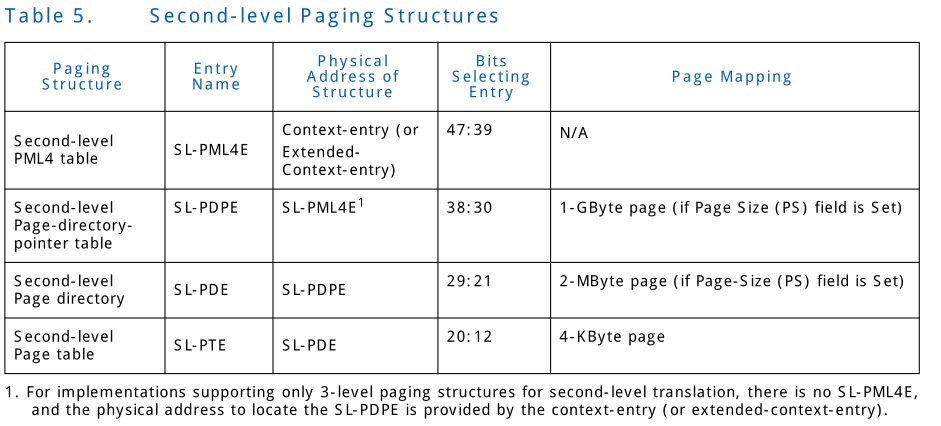

## 3.7 Second-Level Translation
Context and extended-context-entries can be configured to 
support second-level translation. Second-level translation 
applies to requests-without-PASID, but can also be applied 
(nested) with first-level translation for requests-with-PASID.
This section describes the use of second-level translation 
for requests-without-PASID. Section 3.8 describes the nested 
use of second-level translation for requests-with-PASID.
 

Context和 extended-context-entries 可以被配置支持 second-level
translation。 Second-level translation 适用于 requests-without-PASID,
但是也适用于带有first-level translation(nested)的 request-with-PASID。
该章节描述了对于request-without-PASID的 second-level translation 的用法。
Section 3.8 描述了对于request-with-PASID的 second-level translation的
nested 用法。

Context and extended-context-entries contain a pointer to 
the base of the second-level translation structure. Section 
9.3 and Section 9.4 describe the exact format of the context 
and extended- context-entries. Second-level translation 
restricts input-address to an implementation specific 
address-width reported through the Maximum Guest Address Width
(MGAW) field in the Capability Register. Requests-without-PASID
arriving at the remapping hardware are subject to MGAW address
checking, and any violations违反;违背 are treated as translation-fault.
Chapter 7 provides details of fault conditions and its reporting
to software.
 

Context 和 extended-context-entries 包含了一个指向second-level
translation structure的 base。Section 9.3和 Section 9.4 描述了
该context和 extended-context-entries的确切的格式。Second-level
translation 把input-address 限制在通过 Capability Register 中的
Maximum Guest Address Width (MGAW) 字段报告的特定实现的
address-width。Request-without-PASID到达 remapping hardware 会遭受
MGAW address的检查，任何不符合的都将被当作 translation-fault对待.

Second-level translation uses a hierarchical paging structure
as described in Section 3.5. To allow page-table walks with 9-bit
stride大步;跨步, the Adjusted Guest Address Width (AGAW) value for a 
domain is defined as its Guest Address Width (GAW) value adjusted,
such that (AGAW-12) is a multiple倍数 of 9. The AGAW indicates the
number of levels of page-walk. Hardware implementations report
the supported AGAWs through the Capability Register. Second-level
translation may map input addresses to 4-KByte pages, 
2-MByte pages, or 1-GByte pages. Implementations report 
support in second-level translation for 2-MByte and 1-GByte 
large-pages through the Capability Register. Figure 3-9 illustrates
the translation process for a 4-level paging structure when it
produces a 4-KByte page; Figure 3-10 illustrates mapping to a
2-MByte page; Figure 3-11 illustrates mapping to a 1-GByte page. 
 

Second-level translation 使用如Section 3.5 描述的层级的paging 
structure。为了允许以9-bits步长为单位的 pagg-table walks,
domain的AGAW的值被定义为调整后的GAW的值，使得AGAW-12 是9的倍数。
AGAW只是了 page-walk 层级的数量。Hardware 实现 通过 Capability
Register 报告对 AGAWs的支持。Second-level trnaslation 可能 映射
input address 到 4-KBytes pages, 2-MByte pages,或者1-GByte pages。
实现通过 Capability Register 报告了对 2-MByte 1GByte等大页的
second-level translation 的支持。Figure 3-9 阐述了对于产生了一个
4-KByte page的时, 4-level paging structure 的translation 过程。
Figure 3-10 阐述了映射到一个2-MByte page; Figure 3-11 阐述了
映射到1-GByte page。

Table 5 gives the different names of the second-level translation
structures, that are given based on their use in the translation 
process. It also provides, for each structure, the source of 
the physical-address used to locate it, the bits in the 
input-address used to select an entry from the structure, and
details of whether and how such an entry can map a page. Section
9.8 describes format of each of these paging structures in detail.
 

Table 5 给出了second-level translation structures 的不同的名字，
这些名称根据他们在translation 过程中的用于给定的。它为每个structure
提供了用于定位它的physical-address的源(上一级)，input-address用来选择
从该structure中选择一个entry的bits, 并且这样的entry 是否能&&怎么map 
page等信息。Section 9.8 描述了这些paging structure中的每个的格式细节。

The following describe the second-level translation in more 
detail and how the page size is determined:
 

接下来描述了 second-level translation 的更多细节以及page size
是如何给定的。

* For implementations supporting a 4-level paging structure for
second-level paging, a 4-KByte naturally aligned second-level-PML4
table is located at the physical address specified in the SLPTPTR
field in the extended-context-entry (or context-entry). A 
second-level-PML4 table comprises 512 64-bit entries (SL-PML4Es).
A SL-PML4E is selected using the physical address defines as follows:
 

对于支持second-level paging 的4-level page structure的实现，一个
4-KByte 自然对齐的 second-level-PML4 table 位于 extended-context-entry
(或者 context-entry)中的SLPTPTR 字段指定的物理地址。second-level-PML4
table由512个64-bits的entries构成（SL-PML4Es)。一个SL-PML4E 使用如下
定义的物理地址选择:

	* Bits 2:0 are all 0.
	* Bits 11:3 are bits 47:39 of the input address.
	* Bits 12 and higher are from SLPTPTR field in the 
	extended-context-entry (or context-entry).Because a 
	SL-PML4E is identified using bits 47:39 of the input
	address, it controls access to a 512-GByte region of 
	the input-address space.
	 
	
	* bit 2:0 都是0
	* Bits 11:3 是input address 的47:39
	* Bits 12 和更高的位来自于extended-context-entry(或者
	context-entry)中的SLPTPTR字段。因为SL-PML4E使用input
	address 的47:39位指定，所以它可以控制Input address 512-GByte
	的范围空间的访问。
	
* For implementations supporting a 4-level paging structure 
for second-level paging, a 4-KByte naturally aligned 
page-directory-pointer table is located at the physical 
address specified in the address (ADDR) field in the SL-PML4E
(see Table 24). For implementations supporting 3-level paging
structure, the 4-KByte naturally aligned page-directory-pointer
table is located at the physical address specified in the 
SLPTPTR field in the extended-context-entry (or context-entry).
A page-directory-pointer table comprises of 512 64-bit entries
(SL-PDPEs). A SL-PDPE is selected using the physical address 
defined as follows: 
 

对于支持second-level paging的4-level page structure的实现, 4-KByte自然对齐
的physical address 通过SL-PML4E（请查看Table 24) 中的address(ADDR)字段
指定。对于支持3-level paging structure的实现，4-KByte 自然对齐的
page-directory-pointer table 位于extended-context-entry(或者context-entry)
中的SLPTPTR字段指定的物理地址。page-directory-pointer table由512个64-bit
entries 构成(SL-PDPEs) 。SL-PDPE选择使用如下定义的physical address:

	* Bits 2:0 are all 0.
	* Bits 11:3 are bits 38:30 of the input address.
	* Bits 12 and higher are from the ADDR field in the SL-PML4E
	(or from the SLPTPTR field in the extended-context-entry 
	(or context-entry) for implementations supporting 3-level 
	paging structure).
	 
	
	* Bits 2:0 都是0
	* Bits 11:3 是input-address 的38:30
	* Bits 12或者更高的位来自于SL-PML4E中的ADDR字段(或者来自于extend-context
	-entry/context-entry中的SLPTPTR字段) 用于支持3-level paging structure
	的实现。
	

Because a SL-PDPE is identified using bits 47:30 of the input 
address, it controls access to a 1-GByte region of the input-address
space. Use of the SL-PDPE depends on its page-size (PS) field:
 

因为SL-PDPE使用input address 47:30位指定，所以它可以控制1-GByte input-address
范围空间的访问。SL-PDPE的用法依赖于它的page-size(PS)字段:

* If the SL-PDPE’s PS field is 1, the SL-PDPE maps a 1-GByte 
page (see Table 25). The final physical address is computed as
follows:
 

如果SL-PDPE的PS字段为1, SL-PDPE 映射一个1-GByte大小的页(请查看Table 25)。
最终的物理地址如下面描述的构成。

	+ Bits 29:0 are from the input address.
	+ Bits 30 and higher are from the ADDR field in the SL-PDPE.
	 
	
	* Bits 29:0 来自于Input address
	* 30 位或者更高的位来自于SL-PDPE的ADDR字段
	
* If the SL-PDPE’s PS field is 0, a 4-KByte naturally aligned
second-level page directory is located at the physical address
specified in the address (ADDR) field in the SL-PDPE (see Table
26). A second-level page directory comprises 512 64-bit entries
(SL-PDEs). A PDE is selected using the physical address defined
as follows:
 

如果SL-PDPE 的PS字段为0，4-KByte字段对齐的second-level page directory
位于SL-PDPE(请查看Table 26) 中的address(ADDR）字段指定的物理地址。
second-level page directory 有512个 64-bits entries(SL-PDEs)构成。
一个PDE选择使用如下定义的物理地址:

	+ Bits 2:0 are all 0.
	+ Bits 11:3 are bits 29:21 of the input address.
	+ Bits 12 and higher are from the ADDR field in the SL-PDPE.
	 
	
	* Bits 2:0 都是0
	* Bits 11:3 是input address 29:21位
	* Bits 12或者更高的位来自于SL-PDPE中的ADDR字段
	
	
Because a SL-PDE is identified using bits 47:21 of the input
address, it controls access to a 2-MByte region of the 
input-address space. Use of the SL-PDPE depends on its 
page-size (PS) field:
 

因为SL-PDE使用input address 的47:21位指定，所以它控制2-MByte
的input address的范围空间的访问。SL-PDPE的用法依赖于他的page-size(PS)
字段:

* If the SL-PDE’s PS field is 1, the SL-PDE maps a 2-MByte 
page (see Table 27). The final physical address is computed 
as follows:
 

如果SL-PDE's的PS字段为1, SL-PDE映射到一个2-MByte page（请查看
Table 27)。最终的物理地址如下构成:

	+ Bits 20:0 are from the input address.
	+ Bits 21 and higher are from the ADDR field in the SL-PDE.
	 
	
	* Bits 20:0 来自于input address。
	* Bits21和更高的位来自于SL-PDE的ADDR字段。
	
* If the SL-PDE’s PS field is 0, a 4-KByte naturally aligned 
second-level page-table is located at the physical address 
specified in the address (ADDR) field in the SL-PDE (see Table
28). Such a second-level page-table comprises 512 64-bit 
entries (SL-PTEs). A SL-PTE is selected using the physical 
address defined as follows:
 

如果SL-PDE‘s的PS字段为0， 4-KByte自然对齐的second-level page-table
位于SL-PDE中的address(ADDR)字段指定的物理地址。这样的second-level
page-table 使用如下定义的物理地址选择：

	+ Bits 2:0 are all 0.
	+ Bits 11:3 are bits 20:12 of the input address.
	+ Bits 12 and higher are from ADDR field in the SL-PDE.
	 
	
	* Bit 2:0 都是0
	* Bits 11:3 是input address 的20:12位
	* Bits 12和更高的位来自于SL-PDE的ADDR字段
	

Because a SL-PTE referenced by a SL-PDE is identified using 
bits 47:12 of the input address, every such SL-PTE maps a 
4-KByte page (Table 29). The final page address is translated
as follows:
 

因为通过SL-PDE指向的SL-PTE使用input address的47:12位指定，
所以每个这样的SL-PTE映射一个4-KByte page(Table 29)。最终的
page address 如下翻译:

	+ Bits 11:0 are from the input address.
	+ Bits 12 and higher are from the ADDR field in the SL-PTE.
	 
	
	* Bits 11:0 来自于input address 的11:0
	* Bits 12或者更高的位来自于SL-PTE的ADDR字段
	

If a second-level paging-structure entry’s Read (R) and 
Write (W) fields are both 0 or if the entry sets any reserved
field, the entry is used neither to reference another 
paging-structure entry nor to map a page. A reference using an
input address whose translation would use such a paging-structure
entry causes a translation error (see Chapter 7).
 

如果second-level paging structure entry's中的Read(R)和Write(R)
字段都是0或者该entry设置了任何reserved字段，该entry不再用于指向
另一个paging-structure entry 或去映射一个page。使用上述的paging-
structure entry 的input address 的引用（访问这个地址?) 将会造成
translation error(请看 Chapter 7)

The following bits are reserved with second-level translation:
 

在second-level translation中下面的字段是reserved。

* If either the R or W field of a paging-structure entry is 1,
bits 51: HAW are reserved.
* If either the R or W field of a SL-PML4E is 1, the PS field
is reserved.
* If 1-GByte pages are not supported and the R or W fields of
a SL-PDPE is 1, the PS field is
reserved.
 

* 如果paging-structure entry中的R或者W字段是1, bit 51:HAW是reserved
 
* If the R or W fields of a SL-PDPE is 1, and PS field in that SL-PDPE is 1, bits 29:12 are reserved.
* If 2-MByte pages are not supported and the R or W fields of a SL-PDE is 1, the PS field is
reserved.
* If either the R or W field of a SL-PDE is 1, and the PS field in that SL-PDE is 1, bits 20:12 are
reserved.
* If either the R or W field of a non-leaf paging-structure entry (i.e. SL-PML4E, SL-PDPE, or SL-PDE
with PS=0) is 1, the SNP (Snoop) field and the TM (Transient Mapping) field are reserved.
* If either the R or W field of a SL-PTE is 1, and Snoop Control (SC) is reported as 0 in Extended
Capability Register, the SNP field is reserved.
* If either the R or W field of a SL-PTE is 1, and Device-TLBs (DT) is reported as 0 in Extended
Capability Register, the TM field is reserved.

### 3.7.1 Translation Faults
Requests-without-PASID can result in second-level translation faults for either of two reasons: (1)
there is no valid translation for the input address; or (2) there is a valid translation for the input
address, but its access rights do not permit the access. There is no valid translation if any of the
following are true:
• A hardware attempt to access a translation entry (root/extended-root entry, context/extended-
context entry, or a second-level paging-structure entry) resulted in error.
• The root-entry or extended-root-entry used to process the request (as described in Section 3.4.2)
has the relevant present field as 0, has invalid programming, or has a reserved bit set.
• The context-entry or extended-context-entry used to process the request (as described in
Section 3.4.3) has the present (P) field as 0, has invalid programming, is programmed to block
requests-without-PASID, or has a reserved bit set.
• The input address in the request-without-PASID is above (2X - 1), where X is the minimum of
MGAW and AGAW corresponding to address-width programmed in the context-entry or extended-
context-entry.
• The translation process for that address (as described in Section 3.6) used a second-level paging-
structure entry in which the R and W fields are both 0 or one that sets a reserved bit.
If there is a valid translation for an input address, its access rights are determined as described in
Section 3.7.2. Depending on capabilities supported by remapping hardware and endpoint device,
translations faults can be treated as non-recoverable errors or recoverable faults (see Chapter 7 for
details).

### 3.7.2 Access Rights
The accesses permitted for a request-without-PASID whose input address is successfully translated
through second-level translation is determined by the attributes of the request and the access rights
specified by the second-level paging-structure entries controlling the translation.
Devices can issue requests-without-PASID for reads, writes, or atomics. The following describes how
second-level translation determines access rights for such requests:
• Read request without PASID:
— Reads are allowed from any input address with a valid translation for which the Read (R) field
is 1 in every paging-structure entry controlling the translation.
• Write request without PASID:
— Writes are allowed to any input address with a valid translation for which the Write (W) field is
1 in every paging-structure entry controlling the translation.
• Atomics request without PASID:
— Atomics requests are allowed from any input address with a valid translation for which the
Read (R) and Write (W) fields are both 1 in every paging-structure entry controlling the
translation.
Remapping hardware may cache information from the second-level paging-structure entries in
translation caches. These caches may include information about access rights. Remapping hardware
may enforce access rights based on these caches instead of on the paging structures in memory. This
fact implies that, if software modifies a paging-structure entry to change access rights, the hardware
might not use that change for a subsequent access to an affected input address. Refer to Chapter 6
for details on hardware translation caching and how software can enforce consistency with translation
caches when modifying paging structures in memory.

### 3.7.3 Snoop Behavior
When processing requests-without-PASID through second-level translation, the snoop behavior for
various accesses are specified as follows:
• Access to extended-root and extended-context-entries are snooped if the Coherency (C) field in
Extended Capability Register (see Section 10.4.3) is reported as 1. These accesses are not
required to be snooped if the field is reported as 0.
• Accesses to second-level paging-entries (SL-PML4E, SL-PDPE, SL-PDE, SL-PTE) are snooped if the
Coherency (C) field in Extended Capability Register (see Section 10.4.3) is reported as 1. These
accesses are not required to be snooped if the field is reported as 0.
• Accesses to a page mapped through second-level translation has snoop behavior as follows:
— If the Snoop Control (SC) field in extended capability Register is reported as 0, snoop
behavior for access to the page mapped through second-level translation is determined by the
no-snoop attribute in the request.
— If the SC field in Extended Capability Register is reported as 1, the snoop behavior for access
to the translated address is controlled by the value of the Snoop (SNP) field in the leaf
paging-structure entry controlling the second-level translation. If the SNP field in the paging-
structure entry is 1, the processor caches are snooped independent of the no-snoop attribute

### 3.7.4 Memory Typing
This section describes how second-level translation contributes to determination of memory typing for
requests-without-PASID.
• Memory-type is ignored for memory accesses from remapping requests from devices operating
outside the processor coherency domain.
• Memory-type applies for memory accesses from remapping requests from devices operating
inside the processor coherency domain.
When processing requests-without-PASID from devices operating in the processor coherency domain,
the memory type for any access through second-level translation is computed as follows:
• If cache-disable (CD) field in the extended-context-entry used to process the request is 1, all
accesses use memory-type of uncacheable (UC).
• If cache-disable (CD) is 0 in the extended-context-entry, or if the context-entry is used, the
memory-type for accesses is computed as follows:
— Access to root/extended-root entries and context/extended-context-entries use memory-type
of uncacheable (UC).
— Access to second-level translation entries (SL-PML4E, SL-PDPE, SL-PDE, SL-PTE) and the final
page use memory-type of write-back (WB).in the request. If the SNP field in the paging-structure entry is 0, the snoop behavior follows
the no-snoop attribute in the request.

