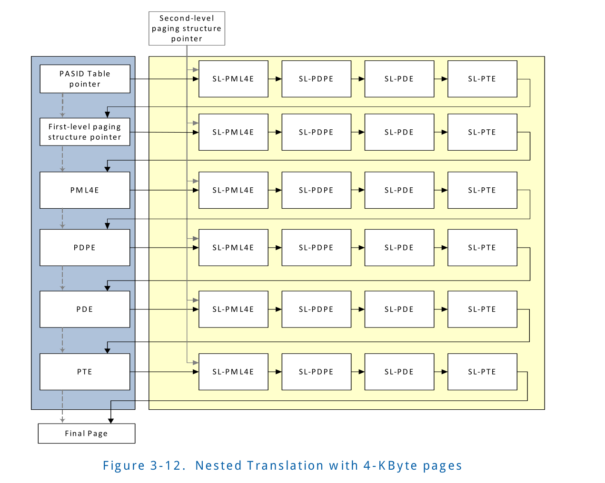

## 3.8 Nested Translation
When Nesting Enable (NESTE) field is 1 in extended-context-entries,
requests-with-PASID translated through first-level translation
are also subjected to nested second-level translation. Such 
extended-context-entries contain both the pointer to the 
PASID-table (which contains the pointer to the first- level 
translation structures), and the pointer to the second-level 
translation structures. Figure 3-12 illustrates the nested 
translation for a request-with-PASID mapped to a 4-KByte page
through first-level translation, and interleaved through 4-KByte
mappings in second-level paging structures. 
 

当extended-context-entries中的 Nesting Enable(NESTE)字段为1, 通过first-
level translation翻译的request-with-PASID 也要经过nested second-level 
translation。这样的 extended-context-entries 包含了指向PASID-table(该table
包含了指向first-level translation structure的指针)指针，同时包含了指向
second-level translation structures的指针。Figure 3-12 阐述了对于request-with-
PASID通过first-level translation映射到4-KByte page的nested translation,
并且通过在second-level paging structure 的4-KByte 映射交错。

With nesting, all memory accesses generated when processing a
request-with-PASID through first-level translation are 
subjected to second-level translation. This includes access to
PASID-table entry, access to first-level paging structure entries
(PML4E, PDPE, PDE, PTE), and access to the output address from
first-level translation. With nested translation, a guest 
operating system running within a virtual machine may utilize
first-level translation as described in Section 2.5.1.3, while
the virtual machine monitor may virtualize memory by enabling
nested second-level translations.  
 

当nesting, 当通过first-level translation 处理一个request-with-PASID
时，所有内存的访问产生都收second-level translation的控制。包括
访问PASID-table entry, 访问first-level paging structure entries
(PML4E, PDPE, PDE, PTE), 和访问来自于first-level translation的
output address。在nested translation中，guest OS在虚拟机中运行
并且可能会利用Section 2.5.1.3中描述的first-level translation,
当VMM 可能会内存通过enable nsted second-level translation 可能会
虚拟化内存（可能会使用first-leve translation paging structure
虚拟化内存)

The first-level translation follows the same process as 
described in Section 3.6 to map input addresses to 4-KByte,
2-MByte or 1-GByte pages. The second-level translation is
interleaved at each step, and follows the process described
in Section 3.7 to map input addresses to 4-KByte,2-MByte or
1-GByte pages.
 

First-level translation遵循Section 3.6中描述映射 input address
到4-KByte, 2-MByte或者1-GByte page的相同的过程。second-level translation
会在每一步中交错，并且遵循Section 3.7 中描述的过程，来映射input address
到4-KByte, 2-MByte或者1-GByte pages。

### 3.8.1 Translation Faults
Requests-with-PASID subjected to nested translation can result
in fault at the first-level translation or any of the second-level
translation stages. Translation faults at a level can result 
from either of two reasons: (1) there is no valid translation
for the respective input address; or (2) there is a valid 
translation for the respective input address, but its access 
rights do not permit the access. There is no valid translation
if any of the following are true:
 

受nested translation影响的Request-with-PASID可以在first-level 
translation或者second-level translation 的任何阶段都可能造成
fault。在某个level 中的Translation faults可能由下面两种原因造成 
(1)对于相应的input address 没有合法的translation 
(2)对于响应的input address,有合法的translation 但是他的访问权限
不允许本次访问 
如果下面的任何一个条件为真，则没有合法的translation: 
* The Root Table Type (RTT) field in Root-table Address 
register (RTADDR_REG) is 0
* The input address in the request-with-PASID is not canonical
(i.e., address bits 63:48 not same value as address bit 47).
* A hardware attempt to access a translation entry (extended-
root-entry, extended-context-entry, PASID-table entry, first-
level paging-structure entry, second-level paging-structure 
entry) resulted in error.
* The extended-root-entry used to process the request (as noted
in Section 3.4.2) has the relevant present field as 0, has 
invalid programming, or has a reserved bit set.
* The extended-context-entry used to process the request (as 
noted in Section 3.4.3) has the P field as 0, PASIDE field as 
0, ERE field as 0 (for requests with Execute-Requested (ER) 
field Set), SMEP field as 1 (for requests with Execute-Requests
(ER) and Privileged-mode-Requested (PR) fields Set), has invalid
programming, T field is programmed to block requests-with-PASID,
or has a reserved bit set.
* The PASID-entry used to process the request (as noted in 
Section 3.6) has the P field as 0, or has the SRE field as 0 
(for requests with Privileged-mode-Requested (PR) field Set).
* The first-level translation process for the address in the 
request-with-PASID (as noted in Section 3.6) used a first-level
paging-structure entry in which the P field is 0 or one that 
sets a reserved bit.
* Input address for any of the second-level translation stages
is above (2X - 1), where X is the minimum of MGAW and AGAW 
corresponding to the address-width programmed in the 
extended-context-entry used.
* The second-level translation (as noted in Section 3.6) for 
address of a paging-structure entry (PASID-entry, PML4E, PDPE,
PDE, PTE) used a second-level paging-structure entry in which
both the R and W field is 0, or one that sets a reserved bit.
* The second-level translation (as noted in Section 3.6) for 
output address from first-level translation (address of final
page) used a second-level paging-structure entry in which both
the R and W field is 0, or has a reserved field set.

If there is a valid second-level translation for output address
from first-level translation (address of final page), its access
rights are determined as described in Section 3.8.2.

Depending on the capabilities supported by remapping hardware
units and the endpoint device, translations faults may be 
treated as non-recoverable errors or recoverable page faults.
Chapter 7 provides detailed hardware behavior on translation 
faults and reporting to software.

### 3.8.2 Access Rights
For requests-with-PASID subjected to nested translation, access rights are checked at both first and
second levels of translation.
Access rights checking for first-level translation follows the behavior described in Section 3.6.2.
Access rights for second-level translations function as follows:
• Access to paging structures (First-level paging structure pointer, PML4E, PDPE, PDE, PTE) are
treated as requests-without-PASID.
— Reads of paging structures
• Read of paging structures are allowed from any input address with a valid translation for
which the Read (R) field is 1 in every second-level paging-entry controlling the translation.
— Accessed (A), Extended-Accessed (EA), Dirty (D) flag update of first-level paging-structure
entries
• Atomic A/EA/D flag update of first-level paging-entries are allowed from any input address
with a valid translation for which the Read (R) and Write (W) fields are 1 in every second-
level paging-entry controlling the translation to the respective first-level paging-entry.
• Access to the final page is treated as request-with-PASID. Access rights checking for the final
page access functions as follows:
— Data reads (Read requests with value of 0 in Execute-Requested (ER) field)
• Data reads are allowed from any input address with a valid translation for which the Read
(R) field is 1 in every second-level paging-structure entry controlling the translation.
— Instruction Fetches (Read requests with value of 1 in Execute-Requested (ER) field)
• If Second-level Execute-Enable (SLEE) field in extended-context-entry used to translate
request is 0
— Instruction fetches are allowed from any input address with a valid translation for which
the Read (R) field is 1 in every second-level paging-entry controlling the translation.
• If Second-level Execute-Enable (SLEE) field in extended-context-entry used to translate
request is 1
— Instruction fetches are allowed from any input address with a valid translation for which
the Read (R) and Execute (X) fields are both 1 in every second-level paging-entry
controlling the translation.
— Write requests
• Writes are allowed from any input address with a valid translation for which the Write (W)
field is 1 in every second-level paging-entry controlling the translation.
— Atomics requests
• Atomics requests are allowed from any input address with a valid translation for which both
the Read (R) and Write (W) fields are 1 in every second-level paging-entry controlling the
translation.
With nested translations, remapping hardware may cache information from both first-level and
second-level paging-structure entries in translation caches. These caches may include information
about access rights. Remapping hardware may enforce access rights based on these caches instead of
on the paging structures in memory. This fact implies that, if software modifies a paging-structure
entry to change access rights, the hardware might not use that change for a subsequent access to an
affected input address. Refer to Chapter 6 for details on hardware translation caching and how
software can enforce consistency with translation caches when modifying paging structures in
memory.

### 3.8.3 Snoop Behavior
When processing requests-with-PASID through nested translation, the snoop behavior for various
accesses are specified as follows:
• Access to extended-root and extended-context-entries are snooped if the Coherency (C) field in
Extended Capability Register (see Section 10.4.3) is reported as 1. These accesses are not
required to be snooped if the field is reported as 0.
• Accesses to second-level paging-entries (SL-PML4E, SL-PDPE, SL-PDE, SL-PTE) are snooped if the
Coherency (C) field in Extended Capability Register (see Section 10.4.3) is reported as 1. These
accesses are not required to be snooped if the field is reported as 0.
• Access to PASID-table entries are always snooped.
• Accesses to first-level paging-entries (PML4E, PDPE, PDE, PTE) are always snooped.
• Access to the page mapped through nested (first-level and second-level) translation is always
snooped.

### 3.8.4 Memory Typing
This section describes how nested translation contributes to determination of memory typing for
requests-with-PASID.
• Memory-type is ignored for memory accesses from remapping requests from devices operating
outside the processor coherency domain.
• Memory-type applies for memory accesses from remapping requests from devices operating
inside the processor coherency domain.
When processing requests-with-PASID from devices operating in the processor coherency domain,
the memory type for any access through nested translation is computed as follows:
• If cache-disable (CD) field in the extended-context-entry used to process the request is 1, all
accesses use memory-type of uncacheable (UC).
• If CD field is 0, the memory-type for accesses is computed as follows:
— Access to extended-root-entries & extended-context-entries use memory-type of uncacheable
(UC).
— Memory-type for access to second-level translation-structure entries (SL-PML4E, SL-PDPE, SL-
PDE, and SL-PTE) used to translate access to PASID-table entry, PML4, PDPE, PDE and PTE
entries is computed as follows:
• If extended memory-type enable (EMTE) field in the extended-context-entry used is 0,
memory-type of write-back (WB) is used.
• If EMTE field in extended-context-entry used is 1, memory-type specified in the extended
memory-type (EMT) field in the extended-context-entry is used.
— Memory-type for access to PASID-table entries is computed as follows:
• If extended memory type enable (EMTE) field in the extended-context-entry used is 0,
memory-type from MTRR (as described in Section 3.6.5.2) is used.
• If EMTE field in extended-context-entry used is 1, memory-type specified in the EMT field in
the last (leaf) second-level paging-structure entry used to translate the PASIDPTR field is
used.
— Memory-type for access to first-level translation-structure entries (PML4E, PDPE, PDE, and
PTE), and memory-type for access to the final page, is computed as follows:
• First, the first-level memory-type specified by the Page Attribute Table (PAT) is computed.
This is identical to the PAT memory-type computation with first-level only translation as
described in Section 3.6.5.1.
• If extended memory-type enable (EMTE) field in the extended-context-entry used is 0,
effective memory-type used is computed by combining the first-level PAT memory-type
computed above with the MTRR memory-type as described in Section 3.6.5.3.
• If EMTE field in extended-context-entry used is 1, memory-type is computed as follows:
— During the second-level translation to access the respective first-level paging entry, the
ignore-PAT (IGPT) and extended memory-type (EMT) fields from the last (leaf) second-
level translation-structure entry used is fetched.
— If IGPT field is 1, the PAT memory-type computed from first-level translation is ignored,
and memory-type specified by the EMT field is used as the memory-type for the access.
— If IGPT field is 0, the effective memory-type for the access is computed by combining the
first-level PAT memory-type above with the EMT field. The effective memory-type
computation follows the same rules described in Table 4 in Section 3.6.5.3, except
memory-type specified by the EMT field is used instead of the MTRR memory-type.
With nesting, remapping hardware may cache information from the first-level and second-level
paging-structure entries in translation caches (see Chapter 6). These caches may include information
about memory typing. Hardware may use memory-typing information from these caches instead of
from the paging structures in memory. flags. This fact implies that, if software modifies a paging-
structure entry to change the memory-typing bits, hardware might not use that change for a
subsequent translation using that entry or for access to an affected input-address. Refer to Chapter 6
for details on hardware translation caching and how software can enforce consistency with translation
caches when modifying paging structures in memory.
