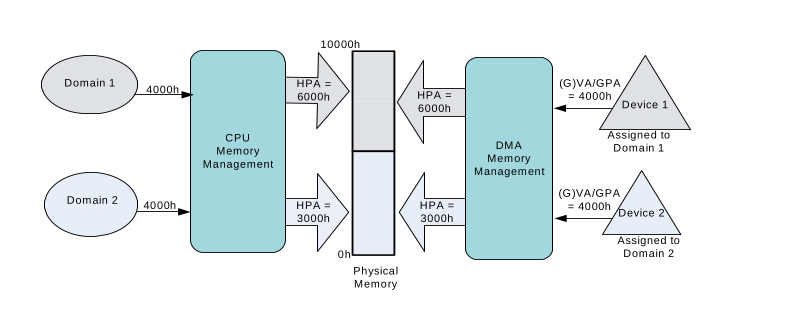
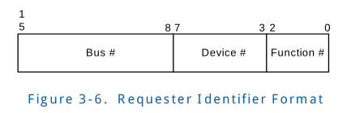
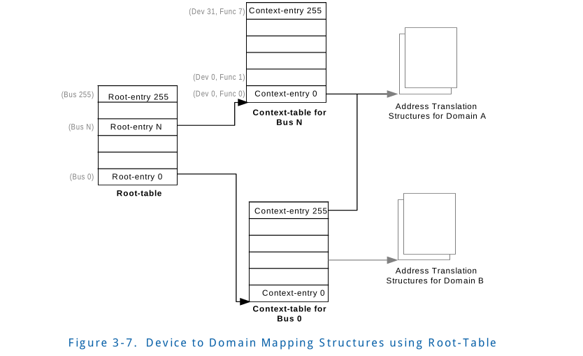
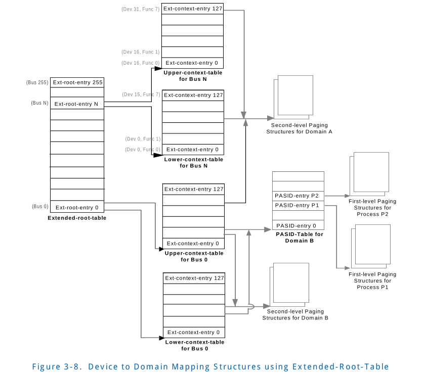

# 3 DMA Remapping

This chapter describes the hardware architecture for DMA 
remapping. The architecture envisions remapping hardware 
to be implemented in Root-Complex components, such as the 
memory controller hub (MCH) or I/O hub (IOH).

该章节描述了DMA remapping 硬件架构。该架构设想remapping hardware
会在 Root-Complex 组件中实现，例如 memory controller hub(MCH)或者
I/O hub(IOH)。

## 3.1 Types of DMA request
Remapping hardware treats inbound memory requests from
root-complex integrated devices and PCI-Express attached
discrete devices into two categories:

Remapping hardware 对来自于 root-complex integrated
(结合在一起的) devices和PCI-Express attached discrete
(分离的) devices的 inbound memory request划分两个种类
对待:

* Requests without address-space-identifier: These are the 
normal memory requests from endpoint devices. These 
requests typically specify the type of access (read/write/atomics), 
targeted DMA address/size, and identity of the device 
originating the request.
 

不带有address-space-identifier 的request: 有一些来自于endpoint devices
的 normal memory requests.这些request 通常包含了访问类型(read/write/atomics),
targeted DMA address/size 和该request 发起的设备本身。

* Requests with address-space-identifier: These are memory 
requests with additional information identifying the targeted
process address space from endpoint devices supporting virtual
memory capabilities. Beyond attributes in normal requests, 
these requests specify the targeted process address space 
identifier (PASID), and extended attributes such as 
Execute-Requested (ER) flag (to indicate reads that are 
instruction fetches), and Privileged-mode-Requested (PR) flag 
(to distinguish user versus supervisor access). For details, 
refer to the Process Address Space ID (PASID) Capability in 
the PCI-Express specifications. 
 

Request with address-space-identifier: 这些memory request来自
支持 了virtual memory capabilities的 endpoint  devices, 并且
带有 一些额外的信息用来标识  targeted process address space 。
除了normal request 带有的一些属性之外，这些requests 指定了
targeted process address space identifier(PASID), 和一些额外
的属性，例如 Execute-Requested(ER) flags(用来表明这些读操作是
instruction fetches(指令预取?),和 Privileged-mode-Requested(PR)
flag (来区分用户权限和特权权限)。如果要了解这些细节，请参考
PCI-E 规范中的 PASID Capability 章节。

For simplicity, this document refers to these categories as 
Requests-without-PASID, and Requests-with-PASID. Previous 
versions of this specification supported only remapping of 
requests-without-PASID.

简单来说，该文档将这些Request 类型称为 Requests-without-PASID和
Requests-with-PASID。在此之前的spec版本 只支持 requests-with-PASID
的重映射。

## 3.2 Domains and Address Translation
A domain is abstractly defined as an isolated environment 
in the platform, to which a subset of the host physical memory
is allocated. I/O devices that are allowed to access physical
memory directly are allocated to a domain and are referred to
as the domain’s assigned devices. For virtualization usages, 
software may treat each virtual machine as a separate domain.

domain 抽象的定义是一个平台中的隔离环境，该环境是指已分配的
host physical memory 的一个子集。对于一个允许直接访问物理内存
的I/O device , 分配给了一个domain，也被称作是domain的assigned device.
对于虚拟化的用法，software可能会认为每个virtual machine 是一个
单独的domain.

The isolation property of a domain is achieved by blocking 
access to its physical memory from resources not assigned to 
it. Multiple isolated domains are supported in a system by 
ensuring that all I/O devices are assigned to some domain 
(possibly a null domain), and that they can only access the 
physical resources allocated to their domain. The DMA 
remapping architecture facilitates flexible assignment of I/O 
devices to an arbitrary number of domains. Each domain has a 
view of physical address space that may be different than the
host physical address space. Remapping hardware treats the 
address in inbound requests as DMA Address. Depending on the 
software usage model, the DMA address space may be the 
Guest-Physical Address (GPA) space of the virtual machine to 
which the device is assigned, or application Virtual Address 
(VA) space defined by the PASID assigned to an application, 
or some abstract I/O virtual address (IOVA) space defined by 
software. In all cases, **DMA remapping transforms the address 
in a DMA request issued by an I/O device to its corresponding
Host-Physical Address (HPA)**.

domain的隔离特性是通过blocking access(阻止访问) 没有分配给
它的物理内存实现的。通过确保系统中所有的I/O 设备都被分配给
一些domains(可能是一个null domain)和确保他们只能访问分配到
他们domain 的物理资源来实现多个 isolated(隔离）的domains。
DMA remapping architecture 有助于将 I/O 设备灵活分配到任意
数量的域。每个domain 有一个物理地址空间的视图，这个视图可能
和host 的物理地址空间不一样。Remapping hardware 把 inbound 
request 的地址看作 DMA 地址。依赖软件使用模型，DMA address
space 可能是 设备分配给的virtual machine  的 GPA  空间，也
可能是被 PASID 划定的 应用虚拟空间（VA）,并且该PASID分配给
该应用, 或者是一些某些软件定义的 I/O virtual address (IOVA) 
空间。在上面所有的情况中，DMA将由I/O设备提交的DMA request
的地址 转换成 它响应的 Host-Physical Address (HPA)

For simplicity, this document refers to address in requests-without-PASID 
as GPA, and address in requests-with-PASID as Virtual Address
(VA) (or Guest Virtual Address (GVA), if such request is from
a device assigned to a virtual machine). The translated address
is referred to as HPA.

简单来说，文章 将address in request-without-PASID称作
GPA，将 address in request-with-PASID称作 Virtual Address(VA)
(或者是Guest Virtual Address(GVA), 如果这些请求来自于分配给
Virutal machine 的设备)。转换后的地址称之为 HPA。

Figure 3-5 illustrates DMA address translation. I/O devices 
1 and 2 are assigned to domains 1 and 2, respectively. The 
software responsible for creating and managing the domains 
allocates system physical memory for both domains and sets up 
the DMA address translation function. DMA address in requests
initiated by devices 1 & 2 are translated to appropriate HPAs
by the remapping hardware. 

图片3-5描述了 DMA address translation。I/O device 1和2分别分配
给了 domain 1和 2。负责创建和管理domain 的software 为者两个域分
配物理内存并且初始化 DMA address translation 相关功能。有 设备1 
和张 发起的 request 的 DMA address通过 remapping hardware 转换成
相应的 HPAs

The host platform may support one or more remapping hardware 
units. Each hardware unit supports remapping DMA requests 
originating within its hardware scope. For example, a desktop
platform may expose a single remapping hardware unit that 
translates all DMA transactions at the memory controller hub 
(MCH) component. A server platform with one or more core 
components may support independent translation hardware units
in each component, each translating DMA requests originating 
within its I/O hierarchy (such as a PCI-Express root port). 
The architecture supports configurations in which these hardware
units may either share the same translation data structures 
(in system memory) or use independent structures, depending on 
software programming.

host平台可能支持一个或者多个 remapping hardware units。每个
hardware unit 支持 在它的hardware scope下发起的remapping DMA
request操作。例如, desktop platform 可能暴露一个单独的remapping 
hardware unit, 该unit 转换memory controller hub 组件中的所有的
DMA transactions。带有一个或多个core 组件的server platform 可能需要
在每一个组件中支持独立的 translation hardware unit, 每一个translating
DMA request都来自它的I/O hierarchy( 例如 PCI-Express root port) 。
architecture 支持共享这些 translation data structures(在系统内存中)
或者使用独立的 structures, 由软件编程决定。

The remapping hardware translates the address in a request 
to host physical address (HPA) before further hardware 
processing (such as address decoding, snooping of processor 
caches, and/or forwarding to the memory controllers). 

remapping hardware 在 硬件进一步处理之前，现将 request中的
address 转换为 host physical address(HPA) （进一步的处理
包括 address decoding , snooping(窥探）处理器cache, 以及
转发到内存控制器)。

## 3.3 Remapping Hardware - Software View
The remapping architecture allows hardware implementations 
supporting a single PCI segment group to expose (to software)
the remapping function either as a single hardware unit 
covering the entire PCI segment group, or as multiple hardware
units, each supporting a mutually exclusive subset of devices
in the PCI segment group hierarchy. For example, an 
implementation may expose a remapping hardware unit that supports
one or more integrated devices on the root bus, and additional
remapping hardware units for devices behind one or a set of 
PCI-Express root ports. The platform firmware (BIOS) reports 
each remapping hardware unit in the platform to software. 
Chapter 8 describes a proposed reporting structure through 
ACPI constructs.

remapping architecture 允许 hardware 实现 允许一个单独的 PCI
segment group 暴露（向软件暴露）remmapping function 是一个硬
件单元覆盖了整个PCI segment group, 或者是多个硬件单元，每一个
允许有一些在PCI segment group hierarchy 的设备中相互互斥的一个
子集。举个例子，某个实现可能暴露了一个硬件单元支持 一个或多个
root bus 上的intergated  devices, 而另一个remapping hardware 
units对应的支持 一个或一系列的PCI-Express root ports 后面的设备。
platform firmware (BIOS) 想软件report 平台中的每一个remapping 
hardware units。Chapter 8 通过 ACPI constructs 给出了一个推荐的
reporting structure.

For hardware implementations supporting multiple PCI segment 
groups, the remapping architecture requires hardware to expose
independent remapping hardware units (at least one per PCI 
segment group) for processing requests originating within the
I/O hierarchy of each segment group. 

为了hardware implementations 支持 多个 PCI segment groups,
remapping architecture 需要硬件暴露独立的remapping hardware 
units (至少每个PCI segment group 一个) ,用来处理来自于每个
segment group I/O 层级中的requests

## 3.4 Mapping Devices to Domains
The following sub-sections describe the DMA remapping 
architecture and data structures used to map I/O devices to 
domains.

接下来的子章节描述了DMA remapping architecture 和 用来表示I/O
devices 到domains映射关系的数据结构。

### 3.4.1 Source Identifier
Each inbound request appearing at the address-translation 
hardware is required to identify the device originating the 
request. The attribute identifying the originator of an I/O 
transaction is referred to as the “source-id” in this document.
The remapping hardware may determine the source-id of a 
transaction in implementation-specific ways. For example, some
I/O bus protocols may provide the originating device identity
as part of each I/O transaction. In other cases (for Root-Complex 
integrated devices, for example), the source-id may be derived
based on the Root-Complex internal implementation.

每个inbound request 到达 address-translation hardware 需要被
识别出request的发起设备。用来识别I/O transaction 的发起者的
属性在文章中被称为"source-id"。remapping hardware 会以
implementation-specific 的方式识别出一个transaction中的source-id。
例如，某些I/O bus protocols 会在每个I/O transactions 的部分
字段提供 发起设备的身份。在其他的情况中（例如Root-Complex
integrated device), source-id 可以基于 Root-Complex 内部的
实现 获取到source-id。

For PCI-Express devices, the source-id is the requester 
identifier in the PCI-Express transaction layer header. The 
requester identifier of a device, which is composed of its 
PCI Bus/Device/Function number, is assigned by configuration 
software and uniquely identifies the hardware function that 
initiated the request. Figure 3-6 illustrates the requester-id
as defined by the PCI-Express Specification. 

对于PCI-E设备来说，source-id 是一个 requester identifier, 
在PCI-E transaction 层的header部分被提供。设备的requester identifier
是一个PCI Bus/Device/Function number的组合，被配置软件分配
并且唯一标识发起request 的hardware function. 图片3-6 图示了
在 PCI-E spec中定义的requester-id。

The following sections describe the data structures for 
mapping I/O devices to domains.

接下来的部分描述了 mapping I/O devices 到 domain 的数据结构。

### 3.4.2 Root-Entry & Extended-Root-Entry
The root-table functions as the top level structure to map 
devices to their respective domains. The location of the 
root-table in system memory is programmed through the Root 
Table Address Register described in Section 10.4.6. The 
root-table is 4-KByte in size and contains 256 root-entries 
to cover the PCI bus number space (0-255). The bus number 
(upper 8-bits) encoded in a request’s source-id field is used 
to index into the root-entry structure.

root-table function 作为top level structure 来建立devices到
它们相应的 domains的映射关系。root-table在系统内存中的位置通过
Section 10.4.6 章节中的Root Table Address Register 指定。root-table
的大小是4KB并且包含了256个root-entries 来覆盖 PCI bus number
空间（0-255)。bus number( 高8-bits) 被解码为 request's source-id
字段用来在root-entry struture 中索引（定位）。

Each root-entry contains the following fields:

每个root-entry 包含了下面的字段:

* Present flag: The present field indicates the root-entry is
present and the context-table pointer (CTP) field is 
initialized. Software may Clear the present field for root 
entries corresponding to bus numbers that are either not 
present in the platform, or don’t have any downstream devices
attached. DMA requests processed through root-entries with 
present field Clear result in translation-fault.
 

Present flag: present 字段表明该 root-entry 是present 被并且
context-table pointer (CTP) 字段是初始化好的。软件可能清除
present 位由于entries 对应的bus number 在平台中不再present, 
或者没有任何 downstream devices attached.。 DMA request在处理
时, 如果 root-entries带有present field clean的情况，将导致
translation-fault。

* Context-table pointer: The context-table pointer references 
the context-table for devices on the bus identified by the 
root-entry. Section 3.4.3 describes context-entries in the 
context-table. 
 

Context-table pointer: context-table pointer 引用（指向） 
context-table, 该table用于（服务于) root-entry标识的总线上的devices。
Section 3.4.3 描述了 context-table中的context-entries。

Section 9.1 provides the exact root-table entry format. 

Section 9.1 提供了详细的root-table entry 格式。

For implementations supporting Extended-Context-Support
(ECS=1 in Extended Capability Register), the Root Table Address
Register (RTADDR_REG) points to an extended-root-table when 
Root-Table-Type field in the Register is Set (RTT=1). The 
extended-root-table is similar to the root-table (4KB in size 
and containing 256 extended-root-entries to cover the 0-255 
PCI bus number space), but has an extended format to reference
extended-context-tables.

对于支持 Extended-Context-Support 的实现来说(在Extended Capability
Register中 ECS=1）, Root Table Adress Register(RTADDR_REG) 指向
一个 extended-root-table, 当Register 中的Root-Table-Type 字段被设置
（RTT=1）。extended-root-table和root-table相似(size是4KB, 包含了256
extended-root-entries 来覆盖0-255 PCI bus number 空间)，但是不同的是，
该entries 是一个 extended 格式来指向 extended-context-tables。

Each extended-root-entry contains the following fields: 

每个extended-root-entry 包含下面的字段:

* Lower Present flag: The lower-present field indicates the 
lower 64-bits of the extended-root-entry is present and the 
lower-context-table pointer (LCTP) field is initialized. 
Software may Clear the lower-present field for extended-root-entries 
corresponding to bus numbers that are either not present in 
the platform, or don’t have downstream devices with device 
numbers 0-15 attached. DMA requests processed through the lower 
part of an extended-root-entry with the lower-present field 
Clear result in translation-fault.
 

Lower Present flags: lower-present 字段表明 低64-bits的
extended-root-entry 是present 并且 lower-context-table pointer(LCTP)
字段是初始化好的。软件可能清除lower-present 字段，因为
extended-root-entries 相对应的bus number 在平台中没有present,
或者 没有devices number 0-15 的 downstream devices attached。
DMA request 处理 extended-root-entry 低字节部分带有 lower-present
filed clean 时，将会导致 translation-fault。

* Lower Context-table pointer: The lower-context-table pointer
references the lower-context-table for devices with device 
number 0-15, on the bus identified by the referencing 
extended-root-entry. Section 3.4.4 describes extended-context-entries 
in the lower-context-table.
 

Lower Context-table pointer: lower-context-table pointer
指向 lower-context-table, 该table 用于(服务于) device number 0-15
的device, 并且device 是在 extended-root-entry 标识的总线上。
Section 3.4.4 描述了 在lower-context-table 中的extended-context-entries。

* Upper Present flag: The upper-present field indicates the 
upper 64-bits of the extended-root-entry is present and the 
upper-context-table pointer (UCTP) field is initialized. 
Software may Clear the upper-present field for extended-root-entries 
corresponding to bus numbers that are either not present in 
the platform, or don’t have downstream devices with device 
numbers 16-31 attached. DMA requests processed through the 
upper part of an extended-root-entry with the upper-present 
field Clear result in translation-fault.
 

Upper Present flags: upper-present field 表明 extened-root-entry
中的高64-bites是present并且 upper-context-table pointer (UCTP) 
字段是初始化好的。Software 可能清空upper-present字段，因为
extended-root-entries对应的bus number 在平台中没有present, 
或者没有number 16-31的下游设备attached。 DMA requests 在processed
带有 upper-present field Clean 的 高位extended-root-entry会
导致translation-fault。

* Upper Context-table pointer: The upper-context-table pointer
references the upper-context- table for devices with device 
number 16-31, on the bus identified by the referencing 
extended-root-entry. Section 3.4.4 describes extended-context-entries 
in the upper-context-table.
 

upper Context-table prointer : upper-context-table pointer指向 upper-context-table
对于device number 16-31, 并且在总线上属于该 extended-root-entry。Section
3.4.4 描述了 upper-context-table中的extended-context-entries.

Section 9.2 provides the exact extended-root-table entry format. 

Section 9.2 提供了详细的 extended-root-table entry的格式。

### 3.4.3 Context-Entry

A context-entry maps a specific I/O device on a bus to the 
domain to which it is assigned, and, in turn, to the address 
translation structures for the domain. The context entries 
are programmed through memory-resident context-tables. Each 
root-entry in the root-table contains the pointer to the 
context-table for the corresponding bus number. 
Each context-table contains 256 entries, with each entry 
corresponding to a PCI device function on the bus. For a PCI 
device, the device and function numbers (lower 8-bits) of 
source-id are used to index into the context-table. 
Figure 3-7 illustrates device to domain mapping through 
root-table. 

一个context-entry 映射了一个bus上指定的I/O 设备 到它所分配的
domain上，进而映射到domains的 translation structures。context
entries 通过 memory-resident(常驻) context-tables 编程。每个
root-table 中的 root-entry 包含了一个指向 它相应bus number 的
context-table 的指针。 每个context-table 包含256个entries, 每个
entry对应着该bus 上的一个PCI device function。对于一个PCI devices
来说，source-id 的 device 和function number (lower-8bit) 用来在
context-table 索引。Figure 3-7 展示了通过 root-table 将device
mapping 到domains。

Context-entries support only requests-without-PASID, and 
contains the following fields:

context-entries 只支持 request-without-PASID并且，包含了下面的
字段:

* Present Flag: The present field is used by software to 
indicate to hardware whether the context-entry is present and
initialized. Software may Clear the present field for context
entries corresponding to device functions that are not present
in the platform. If the present field of a context-entry used
to process a request is Clear, the request is blocked, resulting
in a translation- fault.
 

Present Flag: present field 用作软件示意硬件判断 该context-entry
是否是present 并且初始化好的。软件可能清空 present 位, 因为context 
entries 相对应的 device function 在平台中没有present。如果处理的request
的context-entry 的present 字段是 clear, request会被阻塞，并且导致
一个 translation -fault
field

* Translation Type: The translation-type field indicates what
types of requests are allowed through the context-entry, and
the type of the address translation that must be used for such
requests.
 

Translation Type: translation-type 字段只是context-entry 允许哪些
request types, 以及必须用于这些request的 address translation 类型

* Address Width: The address-width field indicates the 
address-width of the domain to which the device corresponding
to the context-entry is assigned.
 

Address Width: address-width字段指示context-entry 对应的 devices
被分配到域的address-width

* Second-level Page-table Pointer: The second-level page-table
pointer field provides the host physical address of the address
translation structure in system memory to be used for remapping
requests-without-PASID processed through the context-entry.
 

Second-level Page-table pointer: second-levl page-table pointer
字段提供了 关于 在system memory 中的address translation structure 
的物理内存地址，该address translation structure 用做 通过context-entry
来处理重映射request-without-PASID。

* Domain Identifier: The domain-identifier is a software-assigned
field in a context-entry that identifies the domain to which 
a device with the given source-id is assigned. Hardware may 
use this field to tag its caching structures. Context entries 
programmed with the same domain identifier must reference the 
same address translation structure. Context entries referencing
the same address translation structures are recommended to use
the same domain-identifier for best hardware efficiency.
 

Domain Identifier: domain-identifier 是一个在context-entry 中的一个
software-assigned 字段，该字段用于表明带有给定的source-id的devices
分配到哪个domain。hardware 可能使用该字段来tag 他的 caching structures.
编程为相同domain identifier 的 Context entries 必须引用相同的address
translation structure。 引用相同address translation structure 的
context entries 为了达到最好的硬件效率，推荐使用相同的 domain-identifier。

* Fault Processing Disable Flag: The fault-processing-disable
field enables software to selectively disable recording and 
reporting of remapping faults detected for requests processed
through the context-entry.
 

Fault Processing Disable Flag: fault-processing-disable field
可以让软件选择性的disable recording 或者 reporting 通过 context-entry
处理的requests中探测到的 remapping fault

Multiple devices may be assigned to the same domain by programming
the context-entries for the devices to reference the same 
translation structures, and programming them with the same 
domain identifier. Section 9.3 provides the exact context-entry
format.

Multiple device 分配给相同的domain , 通过编程device 的context-entries , 
让其 引用相同的translation structures, 并且编程他们 让其有相同的
domain identifier. Section 9.3 提供了详细的context-entry format。

### 3.4.4 Extended-Context-Entry
For implementations supporting Extended-Context-Support 
(ECS=1 in Extended Capability Register), when using extended-root-table,
each extended-root-entry references a lower-context-table and
a upper-context-table. The Lower-context-table is 4-KByte in 
size and contains 128 extended-context- entries corresponding
to PCI functions in device range 0-15 on the bus. The Upper-context-table 
is also 4-KByte in size and contains 128 extended-context-entries
corresponding to PCI functions in device range 16-31 on the 
bus. Figure 3-8 illustrates device to domain mapping through 
extended- root-table.

Extended-context-entries are capable of supporting both 
requests-without-PASID and requests-with- PASID. For 
requests-without-PASID, it supports the same fields as in the 
regular context-entry (described above). Section 9.4 provides
the exact extended-context-entry format. For requests-with-PASID,
extended-context-entries contain the following additional fields:

* Extended Translation Type: The translation-type field is 
extended to provide additional controls to specify how requests
with and without PASID should be processed. Extended-context-entries
supports two levels of translation, referred to as first-level
translation and second-level translation. First-level translation
applies to requests-with-PASID. Second-level translation applies
to requests-without-PASID. When nested translation is specified
in the extended-context-entry, requests-with-PASID are subject
to nested first-level and second-level translation.

* Translation Structure Pointers: For first-level translation,
the extended-context-entry contains a pointer to a PASID-table.
Each 8-byte PASID-table-entry corresponds to a PASID value, and
contains the root of first-level translation structures used to
translate requests-with-PASID tagged with the respective PASID.
For second-level translation, extended-context-entry contains 
a pointer to the second-level page-table, which is the same as
the second-level page-table pointer field in the regular 
context-entry (described in Section 3.4.3).

* Translation Controls: These include additional controls such
as Page-Global-Enable, Write- Protect-Enable, No-Execute-Enable,
Supervisor-Mode-Execute-Protection, etc. that are applied when
processing requests-with-PASID.

* Memory-type Attributes: Extended-context-entries support fields
such as Page-Attribute-Table, Extended-memory-type etc., that
are used to compute the effective memory-type for requests-with-PASID 
from devices operating in the processor coherency domain.

* Page Request Enable: The page-request-enable field in the 
extended-context-entry allows software to selectively enable 
or disable page-fault requests from the device. When enabled,
page-requests from the device are reported to software through
a memory-resident page- request-queue. Chapter 7 provides 
details on page request processing.

* Deferred Invalidation Controls: The PASID-state table pointer
field enables devices to communicate whether a given 
address-space (PASID) is active or not at the device. Software
can utilize the PASID-state tables for deferred invalidation 
of cached mappings for inactive PASIDs in translation caches 
(TLBs). Chapter 6 describes the various translation caching 
structures and invalidation operations, including deferred 
invalidation support.

Figure 3-8 illustrates device to domain mapping using 
extended-root-table.

 

