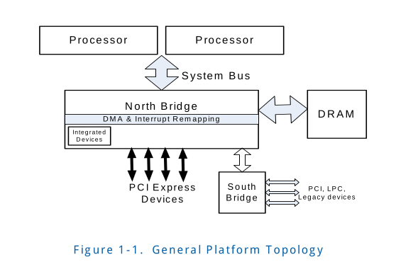
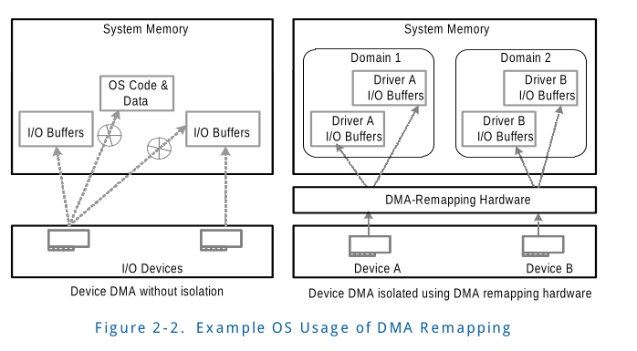
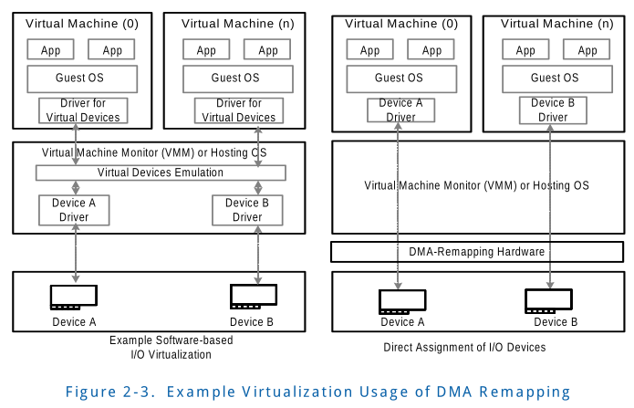
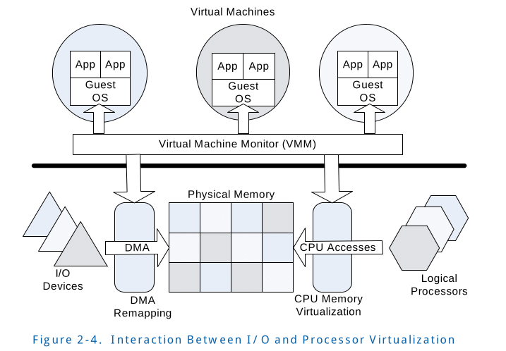

# 1. Introduction

##
This document describes the Intel® Virtualization Technology 
for Directed I/O (“Intel® VT for Directed I/O”); specifically, 
it describes the components supporting I/O virtualization as it 
applies to platforms that use Intel® processors and core logic 
chipsets complying with Intel® platform specifications.

Figure 1-1 illustrates the general platform topology.

这个文档描述了 Intel Virtualization Technology中的 Directed I/O
(Intel VT for Directed I/O). 确切的说，文档描述了支持 I/O虚拟化
的组件，这些组件适用于符合Intel 平台规范的Intel 逻辑处理器和芯片组

图片1-1 展示了通用平台的拓扑图

The document includes the following topics:
* An overview of I/O subsystem hardware functions for virtualization support
* A brief overview of expected usages of the generalized hardware functions
* The theory of operation of hardware, including the programming interface

The following topics are not covered (or are covered in a limited context):
* Intel® Virtualization Technology for Intel® 64 Architecture. For more 
information, refer to the “Intel® 64 Architecture Software Developer's 
Manual, Volume 3B: System Programming Guide”.

该文当主要包括下面几点:
<ul>
	<li>
	支持虚拟化的I/O子系统hardware functions 的概述
	</li>
	<li>
	一般的hardware functions 预期用途的简述
	</li>
	<li>
	硬件运行的原理, 包括编程接口
	</li>
</ul>

下面的部分将不会涉及:
<ul>
	<li>
	Intel Virtualization Technology for Intel 64 Architecture.
	(处理器虚拟化的部分)。如果要了解更多信息，请参照"Intel 64
	Architecture Software Developer's Manual, Volume 3B: System
	Programming Guide"
	</li>
</ul>

## 1.1 Audience(适用者)
This document is aimed at hardware designers developing Intel 
platforms or core-logic providing hardware support for virtualization. 
The document is also expected to be used by Operating System
(OS) and Virtual Machine Monitor (VMM) developers utilizing 
the I/O virtualization hardware functions.

该文档针对于 开发 Intel 平台或者 为硬件提供虚拟化的core-logic (I/O设备
虚拟化的核心逻辑?) 的hareware designers. 这个文档也可用于 Operating System
(OS) 和 Virtual Machine Monitor (VMM) 研发人员去使用 I/O virtualization 
hardware 功能

## 1.2 Glossary (专业术语)

<table>
	<tr>
		<th>Term</th>
		<th>Definition</th>
	</tr>
	<tr>
		<td>Context</td>
		<td>
		A hardware representation of state that identifies 
		a device and the domain to which the device is 
		assigned.
		 
		
		描述硬件状态，这些状态标识设备和设备分配到的domain
		
		</td>
	</tr>
</table>

# 2. Overview
This chapter provides a brief overview of Intel® VT, the 
virtualization software ecosystem it enables, and hardware 
support offered for processor and I/O virtualization.

该章节简述了Intel VT, 它支持的虚拟化生态软件和为处理器和
I/O虚拟化提供硬件支持.

## 2.1 Intel® Virtualization Technology Overview
Intel® VT supports virtual machine architectures comprised 
of two principal classes of software:

Intel VT 由下面两类主要软件构成的虚拟化架构

*  Virtual-Machine Monitor (VMM): A VMM acts as a host 
and has full control of the processor(s) and other platform 
hardware. VMM presents guest software (see below) with an 
abstraction of a virtual processor and allows it to execute 
directly on a logical processor. A VMM is able to retain
selective control of processor resources, physical memory, 
interrupt management, and I/O.
* Guest Software: Each virtual machine is a guest software 
environment that supports a stack consisting of an operating 
system (OS) and application software. Each operates independently 
of other virtual machines and uses the same interface to 
processor(s), memory, storage, graphics, and I/O provided by 
a physical platform. The software stack acts as if it were 
running on a platform with no VMM. Software executing in 
a virtual machine must operate with reduced privilege so that 
the VMM can retain control of platform resources.

<ul>
	<li>
	Virtual-Machine Monitor (VMM) : VMM 作为 host运行并且
	对处理器和其他平台硬件完全控制。VMM 给 guest software 
	提供了一个抽象的逻辑处理器并且允许它直接在逻辑处理器
	上执行。 VMM可以保持对处理器, 物理内存，中断管理， 和
	IO等资源的选择性的控制。
	</li>
	<li>
	Guest Software: 每个 virtual machine 是guest software 环境，支持
	由OS和应用软件构成的软件栈。每个virtual machines 都是独立于
	其他VM运行并且使用由物理平台提供的相同的processors, memory, storage,
	graphics,和I/O 接口. 软件栈软件就像没有VMM的平台上运行一样。
	软件在virual machine上必须低特权运行以便VMM 保持对平台资源的
	控制。
	</li>
</ul>

The VMM is a key component of the platform infrastructure 
in virtualization usages. Intel® VT can improve the 
reliability and supportability of virtualization 
infrastructure software with programming interfaces to 
virtualize processor hardware. It also provides a foundation 
for additional virtualization support for other hardware 
components in the platform.

VMM是虚拟化使用中平台基础架构的关键部件。Intel VT 通过虚拟化
处理器硬件的编程接口来提高虚拟化基础架构软件的可靠性和可支持性。
它还为平台中其他硬件组件的额外虚拟化支持奠定了基础。

## 2.3 Hardware Support for Processor Virtualization
Hardware support for processor virtualization enables simple, 
robust and reliable VMM software. VMM software relies on 
hardware support on operational details for the handling 
of events, exceptions, and resources allocated to virtual machines.

对处理器虚拟化的硬件支持让简单，健壮和可靠的VMM software变得可能。
VMM software依赖 硬件对于这些处理细节的支持: events， exceptions,
VM的 resources allcate 

Intel® VT provides hardware support for processor virtualization. 
For Intel® 64 processors, this support consists of a set of 
virtual-machine extensions (VMX) that support virtualization of 
processor hardware for multiple software environments by using 
virtual machines.

Intel VT 提供了对处理器虚拟化的支持。对于Intel 64 processor来说，
它提供了一系列的 虚拟化扩展（VMX）， 这些扩展通过使用VM支持多个
软件环境的硬件处理器虚拟化（多套虚机同时运行?）

## 2.4 I/O Virtualization
A VMM must support virtualization of I/O requests from guest software. 
I/O virtualization may be supported by a VMM through any of the 
following models:

VMM必须支持来自guest software I/O请求的虚拟化, I/O虚拟化可能被VMM
以下面几种模型支持:

* Emulation: A VMM may expose a virtual device to guest software 
by emulating an existing (legacy) I/O device. VMM emulates the 
functionality of the I/O device in software over whatever
physical devices are available on the physical platform. I/O 
virtualization through emulation provides good compatibility (by 
allowing existing device drivers to run within a guest), but pose
limitations with performance and functionality.
 

模拟: VMM可能通过模拟一个已知(legacy) I/O设备向 guest software
暴露一个虚拟设备。VMM以软件的方式模拟I/O设备的功能，无论物理设备
是否可以在物理平台上可用。通过模拟实现的I/O虚拟化提供了比较好的
兼容性。（支持先有的设备驱动在guest中可以运行), 但是带来了一些
性能和功能上的限制。

* New Software Interfaces: This model is similar to I/O emulation, 
but instead of emulating legacy devices, VMM software exposes a 
synthetic device interface to guest software. The synthetic
device interface is defined to be virtualization-friendly to enable 
efficient virtualization compared to the overhead associated with 
I/O emulation. This model provides improved performance over
emulation, but has reduced compatibility (due to the need for 
specialized guest software or drivers utilizing the new software 
interfaces).
 

新的软件接口: 该模型和I/O emulation很相似，但是替代了模拟legacy devices,
VMM software对guest software 暴露了一个合成的设备接口(不是模拟现有的物
理设备, 而是人工合成的设备, 对应virtio)。这个 synthetic 设备接口对虚拟化
很友好, 相比于I/O emulation 的开销，这种方式更高效。这种模型提供了比I/O 
emulation更高的性能，但是降低了兼容性（以为使用新的软件接口 需要特定的 
guest software或者驱动)

* Assignment: A VMM may directly assign the physical I/O devices to 
VMs. In this model, the driver for an assigned I/O device runs in 
the VM to which it is assigned and is allowed to interact directly
with the device hardware with minimal or no VMM involvement. Robust 
I/O assignment requires additional hardware support to ensure the 
assigned device accesses are isolated and restricted to resources 
owned by the assigned partition. The I/O assignment model may also 
be used to create one or more I/O container partitions that support 
emulation or software interfaces for virtualizing I/O requests from 
other guests. The I/O-container-based approach removes the need for 
running the physical device drivers as part of VMM privileged software.
 

分配(direct IO): VMM 可以直接给VM分配物理I/O设备。在这个模型中，分配
的IO设备的驱动在分配给它的VM中运行，并允许直接和硬件设备交互，而VMM
尽量少的或者不参与。(尽量不会参与控制）。健壮的I/O分配需要额外的硬件支持，
来确保assigned device 访问是独占的和受限的。I/O分配模型可能用来创建
一个或多个IO 容器分区，这些分区支持用于虚拟化来自其他guest 的 IO requests
的 emulation 或者软件接口。基于I/O容器的方法无需将物理设备驱动程序作为
VMM 特权软件的一部分运行。

* I/O Device Sharing: In this model, which is an extension to the I/O 
assignment model, an I/O device supports multiple functional interfaces, 
each of which may be independently assigned to a VM. The device hardware 
itself is capable of accepting multiple I/O requests through any of these
functional interfaces and processing them utilizing the device's hardware 
resources. 
 

I/O device Sharing : 这个模型是I/O assignment 模型的一个扩展， 一个I/O
device 支持多个functional 接口，每一个接口可以独立分配给一个VM。设备硬件
本身可以通过这些functional interfaces 中的任意接口接收多路经请求，并且
可以通过设备的硬件资源处理他们。

Depending on the usage requirements, a VMM may support any of 
the above models for I/O virtualization. For example, I/O emulation 
may  be best suited for virtualizing legacy devices. I/O assignment 
may  provide  the best performance when hosting I/O-intensive 
workloads in a guest. Using  new software interfaces makes a 
trade-off between compatibility and performance,  and device I/O 
sharing provides more virtual devices than the number of  physical 
devices in the platform.
 

根据这些需求，VMM 可能支持上述任何I/O虚拟化模型。例如，I/O emulation
可能最适用于虚拟化legacy devices. I/O 分配 在guest 处于I/O 密集型工
作负载时，会提供了最好的性能。device I/O sharing 提供了比平台中的
physicae device 数量更多的虚拟化设备。

## 2.5 Intel® Virtualization Technology For Directed I/O Overview
A general requirement for all of above I/O virtualization models 
is the ability to isolate and restrict device accesses to the 
resources owned by the partition managing the device. Intel® VT 
for Directed I/O provides VMM software with the following capabilities:
 

上述所有的I/O 虚拟化模型的一般需求是能够隔离和限制设备对管理设备分区
所拥有的资源的访问。(owned by the partition managing the device)

* I/O device assignment: for flexibly assigning I/O devices to 
VMs and extending the protection and isolation properties of VMs 
for I/O operations.
 

I/O 设备分配: 用于灵活给VM分配I/O device并扩展VM I/O 操作的保护和
隔离属性

* DMA remapping: for supporting address translations for Direct 
Memory Accesses (DMA) from devices.
 

DMA remapping: 用于保护对于来自于device 的Direct Memory Accesses
(DMA) 请求的地址翻译。

* Interrupt remapping: for supporting isolation and routing of 
interrupts from devices and external interrupt controllers to 
appropriate VMs.
 

Interrupt remapping: 用于支持隔离和路由来自于设备和外部中断控制器
，送往合适的VMs的中断

* Interrupt posting: for supporting direct delivery of virtual 
interrupts from devices and external interrupt controllers to 
virtual processors.
 

Interrupt posting: 用于直接递送来自于设备和外部中断控制器到
virtual processors的虚拟中断。

* Reliability: for recording and reporting of DMA and interrupt
errors to system software that may otherwise corrupt memory or 
impact VM isolation.
 

Reliability(可靠性?): 用于记录和报告可能破坏内存或者影响VM隔离的
系统软件中的DMA和interrupt错误。

### 2.5.1 Hardware Support for DMA Remapping
To generalize I/O virtualization and make it applicable to 
different processor architectures and operating systems, this 
document refers to domains as abstract isolated environments 
in the platform to which a subset of host physical memory is 
allocated.

为了概述I/O虚拟化并且让他适用于不同的processor 架构和操作系统，
本文档将域定义为平台中抽象的隔离环境，其中该环境分配了主机物理
内存。

DMA remapping provides hardware support for isolation of device 
accesses to memory, and enables each device in the system to 
be assigned to a specific domain  through a distinct set of 
paging structures. When the device attempts to access system 
memory, the DMA-remapping hardware intercepts the access and 
utilizes the page tables to determine whether the access can 
be permitted; it also determines the actual location to access. 
Frequently used paging structures can be cached in hardware. 
DMA remapping can be configured independently for each device, 
or collectively across multiple devices.

DMA remapping 提供了对于设备访问内存隔离的硬件支持，并且enable
让系统中的每个设备通过一个特定的分页数据结构分配到指定的domain
中。当设备尝试去访问系统内存时，DMA-remapping hardware 拦截
该访问，并且利用page tables 来确认此次访问是否被许可; 它也会
决定访问的实际位置。经常使用的page structures 可以被缓存到硬件中。
DMA remapping 可以被独立的配置到每一个device上，也可以跨多个设备
共同配置。

#### 2.5.1.1 OS Usages of DMA Remapping
There are several ways in which operating systems can use DMA 
remapping:

这里有一些操作系统使用DMA remapping的方法:

* OS Protection: An OS may define a domain containing its critical 
code and data structures, and restrict access to this domain 
from all I/O devices in the system. This allows the OS to limit 
erroneous or unintended corruption of its data and code through 
incorrect programming of devices by device drivers, thereby 
improving OS robustness and reliability.
 

OS 保护: OS可能定义一个domain, 该domain中有关键代码和数据结构，
并且限制系统中所有的I/O设备对这个domain的访问。这样允许OS去限
制来自于其数据和代码错误或者意外损坏（这些是由于设备驱动对设备
不正确的编程导致)，因此提升了OS的健壮行和可靠性。

* Feature Support: An OS may use domains to better manage DMA 
from legacy devices to high memory (For example, 32-bit PCI 
devices accessing memory above 4GB). This is achieved by 
programming the I/O page-tables to remap DMA from these devices 
to high memory. Without such support, software must resort to 
data copying through OS “bounce buffers”.
 

Feature Support(特性支持): OS可以使用这些domains更好的管理来自于
legacy device到 high memory的DMA（ 例如, 32-bit PCI 设备访问超过
4GB的内存). 这是通过编程I/O page-tables来重映射来自于这些device到
hign memory的DMA达到的。没有这个支持，软件必须通过操作系统"bounce 
(反弹, jump, 跳转) buffers" 进行数据复制。

* DMA Isolation: An OS may manage I/O by creating multiple 
domains and assigning one or more I/O devices to each domain. 
Each device-driver explicitly registers its I/O buffers with 
the OS, and the OS assigns these I/O buffers to specific domains, 
using hardware to enforce DMA domain protection. See Figure 2-2.
 

DMA隔离: OS可以通过创建多个domain并且分配一个或者多个I/O设备
到每个domain来管理I/O。每个设备驱动程序都向操作系统显示的注册
他的I/O缓冲器，并且OS把这些I/O buffers分配给在特定的domain,
让hardware来强制执行DMA domain protection. 请看Figure 2-2

* Shared Virtual Memory: For devices supporting appropriate 
PCI-Express capabilities, OS may use the DMA remapping hardware 
capabilities to share virtual address space of application 
processes with I/O devices. Shared virtual memory along with 
support for I/O page-faults enable application programs to 
freely pass arbitrary data-structures to devices such as graphics 
processors or accelerators, without the overheads of pinning 
and marshalling of data.
 

共享虚拟内存: 对于支持appropriate(适当的;合适的) PCI-Express
capabilities, OS可以使用DMA remapping hardware capabilities来
应用程序中I/O device相关的共享虚拟地址空间。支持I/O page faults
的共享虚拟内存使得应用程序自由的将任意数据结构传递给显卡或者加
速器等设备，而无需固定的和 marshalling(安排集结)数据 的开销

#### 2.5.1.2 VMM Usages of DMA Remapping
The limitations of software-only methods for I/O virtualization 
can be improved through direct assignment of I/O devices to 
partitions. With this approach, the driver for an assigned I/O 
device runs only in the partition to which it is assigned and 
is allowed to interact directly with the device hardware with 
minimal or no VMM involvement. The hardware support for DMA 
remapping enables this direct device assignment without 
device-specific knowledge in the VMM. See Figure 2-3.

只使用软件方法来实现I/O虚拟化的限制可以通过直接分配I/O device到
partitions来改进。使用这种方法，分配的I/O 设备的驱动只运行在partition
中，该 partition 在几乎没有 或者没有VMM介入情况下,被分配并且允
许直接和设备硬件交互。 hardware 支持 的 DMA remapping 可以在
VMM中没有device-specific knowledge 情况下直接将设备分配。

In this model, the VMM restricts itself to enabling direct 
assignment of devices to their partitions. Rather than 
invoking the VMM for all I/O requests from a partition, the 
VMM is invoked only when guest software accesses protected 
resources (such as configuration accesses, interrupt management, 
etc.) that impact system functionality and isolation. 

在这个模型中，VMM 要求直接分配设备到他们的 partition。相对于
VMM 接管来自于 partition的素有的I/O request, 该VMM 只有当 guest
软件 访问保护性资源会涉及(例如配置空间的accesses, 中断管理等等)
这种影响系统功能性和隔离性的资源。

To support direct assignment of I/O devices, a VMM must enforce 
isolation of DMA requests. I/O devices can be assigned to 
domains, and the remapping hardware can be used to restrict 
DMA from an I/O device to the physical memory presently owned 
by its domain. For domains that may be relocated in physical 
memory, the remapping hardware can be programmed to perform 
the necessary translation.

为了支持I/O 设备的直接分配，VMM 必须强制隔离DMA requests。
I/O 设备可以分配到domains上，并且remapping hardware可以用来
限制来自于I/O device到 该domain中的physical memory presently 
的DMA。对于可能在物理内存中重定位的domains, remapping hardware
可以被编程以执行必要的 translation。

I/O device assignment allows other I/O sharing usages — for 
example, assigning an I/O device to an I/O partition that 
provides I/O services to other user partitions. Remapping 
hardware enables virtualization software to choose the right 
combination of device assignment and software-based methods 
for I/O virtualization. 

I/O 设备的分配允许 I/O sharing 用法。 例如,分配一个I/O 设备到
一个 I/O partition， 该partition 提供 I/O services给他的 user 
partition。 remapping hardware 让虚拟化软件去选择设备分配和基于
软件的 I/O 虚拟化 method 的正确的组合。

#### 2.5.1.3 DMA Remapping Usages by Guests
A guest OS running in a VM may benefit from the availability 
of remapping hardware to support the usages described in Section 
2.5.1.1. To support such usages, the VMM may virtualize the 
remapping hardware to its guests. For example, the VMM may 
intercept guest accesses to the virtual remapping hardware 
registers, and manage a shadow copy of the guest remapping 
structures that is provided to the physical remapping hardware. 
On updates to the guest I/O page tables, the guest software 
performs appropriate virtual invalidation operations. The virtual 
invalidation requests may be intercepted by the VMM, to update 
the respective shadow page tables and perform invalidations of 
remapping hardware. Due to the non-restartability of faulting 
DMA transactions (unlike CPU memory management virtualization),
a VMM cannot perform lazy updates to its shadow remapping 
structures. To keep the shadow structures consistent with the 
guest structures, the VMM may expose virtual remapping hardware 
with eager pre-fetching behavior (including caching of not-present 
entries) or use processor memory management mechanisms to 
write-protect the guest remapping structures. 

VM中的guest OS 可能收益于 remapping hardware 的可用性来支持
Section 2.5.1.1 中描述的那些用法。为了支持这些用法，VMM 会
给他的guests 虚拟化 remapping  hardware。例如，VMM 可能会 
拦截guest 对virtual remapping registers的访问，并且管理了
guest remapping structures 的shadow copy,该shadow 提供给
physical remapping hardware。为了更新guest I/O page tables，
guest software 会适当的执行virtual invalidation operations。
virtual invalidation requests 可能会被VMM拦截，来更新各自的
shadow page tables 并且执行remapping hardware 的 invalidations
操作。由于 faulting DMA translations 的 non-restartability
（不像CPU memory 虚拟化管理 [不可以通过异常，让VMM捕捉到，再
完成一系列的emulation ]), VMM 不能去对他的shadow remapping
structures 执行者lazy updates 。为了保证shadows structure与
guest structures保持一致，VMM 可能用更加积极的预取行为暴露
virtual remapping hardware,（包括缓存not-present entries)
或者使用processor的内存管理机制去写保护guest remapping structures.

On hardware implementations supporting two levels of address 
translations (first-level translation to remap a virtual address 
to intermediate (guest) physical address, and second-level 
translations to remap a intermediate physical address to machine 
(host) physical address), a VMM may virtualize guest OS use of 
first-level translations (such as for Shared Virtual Memory 
usages) without shadowing page-tables, but by configuring 
hardware to perform nested translation of first and second-levels. 

在hardware 实现支持 two levels of address translations情况下
( first level translations 去聪颖设virtual address 到 intermediate
(guest)(中间的，guest physical address) 物理地址，second-level
translations 去重映射 intermediate physical address 到 machine
(host) physical address), VMM可能虚拟化使用first-level translations
虚拟化guest OS（例如 Shared Virtual Memory的用法) , 不使用shadowing
page-tables, 而是配置硬件去执行 first 和 second-level 的nested 
translation。

#### 2.5.1.4 Interaction with Processor Virtualization
Figure 2-4 depicts how system software interacts with 
hardware support for both processor-level virtualization 
and Intel® VT for Directed I/O.

Figure 2-4描述了系统软件如何将 processor-level virtualization
和Intel VT for Directed I/O 这两种硬件支持结合起来使用。

The VMM manages processor requests to access physical memory 
via the processor’s memory management hardware. DMA requests 
to access physical memory use remapping hardware. Both processor 
memory management and DMA memory management are under the 
control of the VMM.

VMM 管理 processor端通过 processor's memory management hardware (MMU)
access 物理内存的请求。DMA request 使用 remapping hardware 去访问
物理内存。processor memory management和DMA memory management 
都VMM的控制下进行。

### 2.5.2 Hardware Support for Interrupt Remapping
Interrupt remapping provides hardware support for remapping 
and routing of interrupt requests from I/O devices (generated 
directly or through I/O interrupt controllers). The indirection 
achieved through remapping enables isolation of interrupts 
across partitions.

Interrupt remapping 提供了对于 来自 I/O devices interrupt 
(直接获取，或者通过 I/O interrupt controllers) 请求的 remapping
和 routing支持。通过remapping 可以间接的达到 跨 partitions 的
中断隔离目的。

The following usages are envisioned for the interrupt-remapping 
hardware.

为中断重映射硬件设想了以下用法。

#### 2.5.2.1 Interrupt Isolation
On Intel architecture platforms, interrupt requests are 
identified by the Root-Complex as write transactions 
targeting an architectural address range (0xFEEx_xxxxh). 
The interrupt requests are self-describing (i.e., attributes 
of the interrupt request are encoded in the request address 
and data), allowing any DMA initiator to generate interrupt 
messages with arbitrary attributes. 

在Intel architecture platform，中断请求会被Root-Complex识别
出来, 该请求是一个targeting 到 architecture 地址空间（0xFEEx_xxxxh)
的写请求。中断请求是self-describing的(也就是说中断请求的属性
被解码为request address 和data), 并且允许任何DMA发起者生成
任意属性的中断消息。

The interrupt-remapping hardware may be utilized by a Virtual
Machine Monitor (VMM) to improve the isolation of external 
interrupt requests across domains. For example, the VMM may 
utilize the interrupt-remapping hardware to distinguish 
interrupt requests from specific devices and route them to the 
appropriate VMs to which the respective devices are assigned. 
The VMM may also utilize the interrupt-remapping hardware to 
control the attributes of these interrupt requests (such as 
destination CPU, interrupt vector, delivery mode etc.). 

Interrupt-remapping hardware 可以被Virtual Machine Monitor 利用
来提高 across domains的外部中断请求的隔离性。例如，VMM 可以
利用interrupt-remapping hardware 来区分来自于特定设备的中断请求
并且将他们路由到正确的VMs上, 这些VM分配了相应的设备。VMM 也可以
利用 interrupt-remapping hardware 来控制这些中断请求的属性(例如:
destination CPU, interrupt vector，delivery mode 等等)。

Another example usage is for the VMM to use the interrupt-remapping 
hardware to disambiguate external interrupts from the VMM owned 
inter-processor interrupts (IPIs). Software may enforce this by 
ensuring none of the remapped external interrupts have attributes 
(such as vector number) that matches the attributes of the VMM IPIs. 

另外一个用法例子是 VMM使用者interrupt-remapping hardware 来区分
external interrupts 和 VMM 的 inter-processor interrupts(IPIs)。
软件可以强制通过 没有任何重映射的外部中断的属性能匹配上 VMM IPIs 
的属性(例如vector number) 来达到这一目的。

> MY NOTE:
> IPI的触发是通过write LAPIC地址空间，HOST os可以保证没有外部中断
> Vector会和 IPI 重合，但是不能保证VM， 所以这里搞了中间一层。

#### 2.5.2.2 Interrupt Migration
The interrupt-remapping architecture may be used to support 
dynamic re-direction of interrupts when the target for an 
interrupt request is migrated from one logical processor to 
another logical processor. Without interrupt-remapping hardware 
support, re-balancing of interrupts require software to reprogram 
the interrupt sources. However re-programming of these resources 
are non-atomic (requires multiple registers to be re-programmed), 
often complex (may require temporary masking of interrupt source), 
and dependent on interrupt source characteristics (e.g. no 
masking capability for some interrupt sources; edge interrupts 
may be lost when masked on some sources, etc.) 

interrupt-remapping architecture 可以用来支持interrupt 动态
重定位，当interrupt request 的target 从一个logical processor
迁移到另一个logical processor。如果没有 interrupt-remapping 
hardware的支持，中断的re-balancing 需要软件去编程interrupt sources.
但是重新编程这些资源的这个行为不是原子的(需要重新编程多个 registers),
often complex(经常耦合)(可能需要interrupt source的临时masking),
并且依赖interrupt source 的某些特征(例如. 对于某些中断源是没有
masking capability; 当masked 到某个source上， edge interrupt可能
会丢失等等).

Interrupt-remapping enables software to efficiently re-direct 
interrupts without re-programming the interrupt configuration 
at the sources. Interrupt migration may be used by OS software 
for balancing load across processors (such as when running I/O 
intensive workloads), or by the VMM when it migrates virtual 
CPUs of a partition with assigned devices across physical 
processors to improve CPU utilization. 

Interrupt-remapping 让软件可以在没有re-programming 中断源的配置
情况下，有效的进行re-direct interrupts。Interrupts migration 可以
用作 OS software 平和处理器间负载。(例如在运行I/O密集型工作负载时),
或者是当VMM在 physical processors 之间迁移 virtual CPUs ，这些virtual
CPUs 具有已经分配的设备， 来提高cpu利用率。

#### 2.5.2.3 x2APIC Support
Intel® 64 x2APIC architecture extends the APIC addressability 
to 32-bits (from 8-bits). Refer to Intel® 64 Architecture 
Software Developer's Manual, Volume 3B: System Programming 
Guide for details. Interrupt remapping enables x2APICs to 
support the expanded APIC addressability for external interrupts 
without requiring hardware changes to interrupt sources (such 
as I/OxAPICs and MSI/MSI- X devices). 

Intel 64 x2APIC architecture 扩展了 APIC 寻址能力到32-bits。（从
8-bits扩展而来)。参考 Volume 3B: System Programming Guide 了解细节。
Interrupt remapping 让 x2APICs支持 对于外部中断 APIC 扩展的寻址能力。
在没有对interrupt source进行改变的情况下（例如: I/OxAPICs 和 MSI/MSI-x
设备)。

注：这里的address是指的cpu address, xAPIC(APIC)支持256个cpu（8位）
而x2APIC支持 2 ^ 32cpu。

### 2.5.3 Hardware Support for Interrupt Posting
Interrupt posting includes hardware support for optimized 
processing of interrupt requests from I/O devices (Physical 
Functions, or Single Root I/O Virtualization (SR-IOV) Virtual 
Functions) that are directly assigned to a virtual machine. 
The following usages are envisioned for the interrupt-posting 
hardware. 

Interrupt posting 包含 硬件 对于来自于I/O devices(Physical Function,
或者Single Root I/O Virtualization(SR-IOV） Virtual Functions) 的
中断请求的处理上的优化, 这些I/O 设备直接分配给了VM。接下来
设想了interrupt-posting hardware 的几种用法

#### 2.5.3.1 Interrupt Vector Scalability(可扩展性)
Devices supporting I/O virtualization capabilities such as 
SR-IOV, virtually increases the I/O fan-out of the platform, 
by allowing multiple Virtual Functions (VFs) to be enabled for 
a Physical Function (PF). Any of these PFs or VFs can be 
assigned to a virtual machine. Interrupt requests from such 
assigned devices are referred to as virtual interrupts as they 
target virtual processors of the assigned VM.

设备支持I/O virtualization capabilities(例如SR-IOV), 实际上增加了
平台上I/O fan-out(扇出)， SR-IOV 对于一个 Physical Functions
允许多个 Virtual Functions 使能。任何PFs或者VFs 都可以分配到
一个virutal machine上。来自于这些分配设备上的Interrupt requests 
被当作 它target assigned VM的虚拟处理器的虚机中断。

> MY NOTE
>
> fan-out: 指的封装工艺 
> https://zhuanlan.zhihu.com/p/477211120?utm_medium=social&utm_oi=716064201423990784

Each VF requires its own independent interrupt resources, 
resulting in more interrupt vectors needed than otherwise 
required without such I/O virtualization. Without interrupt-posting 
hardware support, all interrupt sources in the platform are 
mapped to the same physical interrupt vector space (8-bit 
vector space per logical CPU on Intel®64 processors). For 
virtualization usages, partitioning the physical vector space 
across virtual processors is challenging in a dynamic environment 
when there is no static affinity between virtual process and 
logical processors. 

每个VF 需要拥有自己独立的中断资源，这样导致了比起没有这些I/O
Virtualization 来说，需要更多的interrupt vectors。没有interrupt-posting
的硬件支持，所有平台上的中断源需要同一个physical interrupt vector
space (在Intel 64 processor上, 每个逻辑处理器有8-bit的向量空间)。
对于虚拟化使用情况，将physical viector space 进行跨 virtual
processor 的分区在动态的环境下也是一个挑战。这个动态环境是指
在virtual process 和logical processor之前 没有固定的亲和性。

Hardware support for interrupt posting addresses this vector 
scalability problem by allowing interrupt requests from device 
functions assigned to virtual machines to operate in virtual 
vector space, thereby scaling naturally with the number of 
virtual machines or virtual processors. 

对于interrupt post addresss硬件通过允许 来自分配到virtual machines
的device function 的中断请求可以在虚拟vecotr空间中操作，这样一来，
随着 virtual machine 或者virtual processors自然扩展。(自动扩展)

#### 2.5.3.2 Interrupt Virtualization Efficiency
Without hardware support for interrupt posting, interrupts 
from devices assigned to virtual machines are processed through 
the VMM software. Specifically, whenever an external interrupt 
destined for a virtual machine is received by the CPU, control 
is transferred to the VMM, requiring the VMM to process and 
inject corresponding virtual interrupt to the virtual machine. 
The control transfers associated with such VMM processing of 
external interrupts incurs both hardware and software overheads.

没有interrupt posting 硬件支持, 来自于分配给VM 的device 
interrupt 会通过VMM software 来处理。确切来说，无论cpu收到的
external interrupt 是否dest for VM, 控制权一定会交到VMM中，
需要VMM 去编程并且注入相应的virtual interrupt 到VM中。
对于这种VMM处理外部中断控制权的转让会产生硬件和软件上的开销。

With hardware support for interrupt posting, interrupts from 
devices assigned to virtual machines are posted (recorded) in 
memory descriptors specified by the VMM, and processed based 
on the running state of the virtual processor targeted by the 
interrupt.

hardware 支持 interrupt posting, 来自于分配给VM 设备的interrupts
会被posted(recorded) 在VMM指定的memory descriptors中，并且基于
中断target 到的virtual processor 的running 状态来处理该interrupt。

For example, if the target virtual processor is running 
on any logical processor, hardware can directly deliver 
external interrupts to the virtual processor without any VMM 
intervention. Interrupts received while the target virtual 
processor is pre-empted (waiting for its turn to run) can be 
accumulated in memory by hardware for delivery when the virtual 
processor is later scheduled. This avoids disrupting execution 
of currently running virtual processors on external interrupts 
for non-running virtual machines. If the target virtual processor 
is halted (idle) at the time of interrupt arrival or if the 
interrupt is qualified as requiring real-time processing, 
hardware can transfer control to VMM, enabling VMM to schedule 
the virtual processor and have hardware directly deliver pending 
interrupts to that virtual processor.

举例来说，如果target virtual processor 是running 在任意的逻辑处理器上，
hardware 可以在没有VMM参与的情况下直接deliver 外部中断到virtual processor。
当target virtual processor 是pre-empted状态( 等待运行的状态)时收到中断，
可以通过硬件累积存储到内存中，当virtual processor 随后schedule到时，
进行中断delivery。这样避免因为来自于non-running VM的外部中断打乱当前
运行的逻辑处理器的执行。如果在中断到达或者中断被认为需要实时处理时, 
target virtual processor是 halted(idle)状态，硬件可以将控制权转让
给VMM， 使VMM去schedule 这个virtual processor 并且 hardware 直接deliver
pending interrupts到virtual processor中。

This target virtual processor state based processing of interrupts 
reduces overall interrupt latency to virtual machines and reduces
overheads otherwise incurred by the VMM for virtualizing interrupts. 

这种基于virtual processor state 的中断处理降低了到VM整体的中断延迟
减少了由于VMM 虚拟化中断带来的开销。

#### 2.5.3.3 Virtual Interrupt Migration
To optimize overall platform utilization, VMM software may 
need to dynamically evaluate the optimal logical processor to 
schedule a virtual processor, and in that process, migrate 
virtual processors across CPUs.

为了整体优化平台利用率，VMM software 可能需要动态的评估最佳的
逻辑处理器来调度virtual processor, 并在该过程中，跨CPU迁移virtual
processor.

For virtual machines with assigned devices, migrating a virtual 
processor across logical processors either incurs the overhead 
of forwarding interrupts in software (e.g. via VMM generated IPIs), 
or complexity to independently migrate each interrupt targeting 
the virtual processor to the new logical processor. Hardware 
support for interrupt posting enables VMM software to atomically 
co-migrate all interrupts targeting a virtual processor when the 
virtual processor is scheduled to another logical processor. 

对于带有分配设备的VM来说，跨逻辑处理器迁移一个  virtual processor
会导致软件中转发中造成开销（例如: 通过VMM 生成 IPIs) , 或者针对每个
target 到virtual processor 中断独立的迁移到 新的逻辑处理器。对于
interrupt posting 的硬件支持可以让VMM software以原子方式迁移所有
的target 到 virtual processor 上的中断, 当virtual processor 
被调度到另一个逻辑处理器上时。

