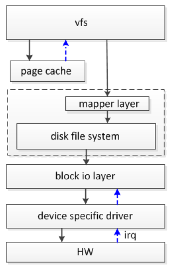
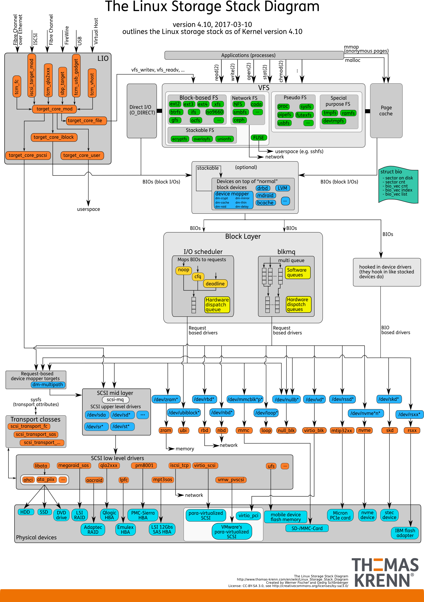
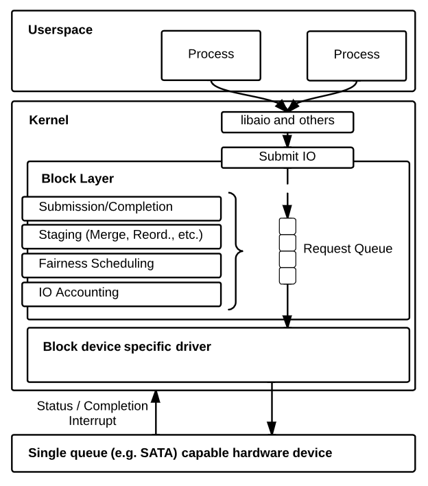
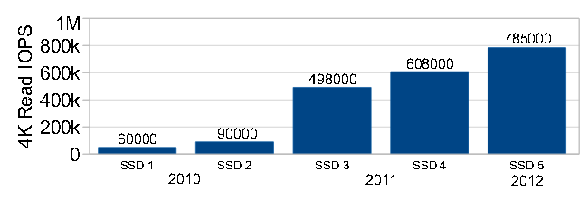
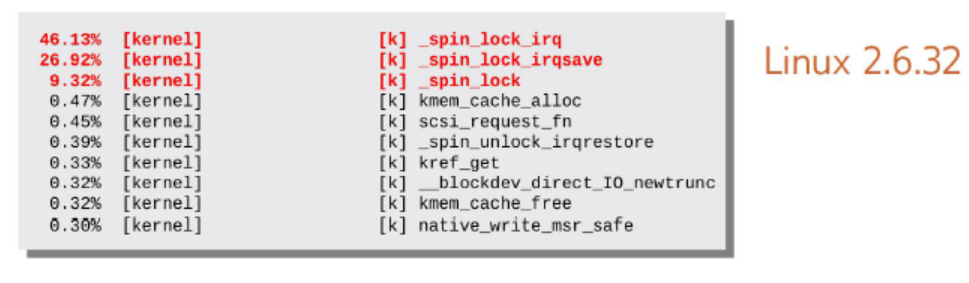
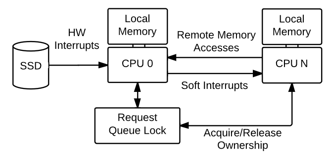
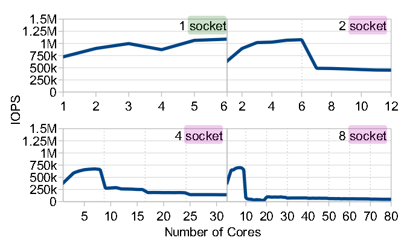
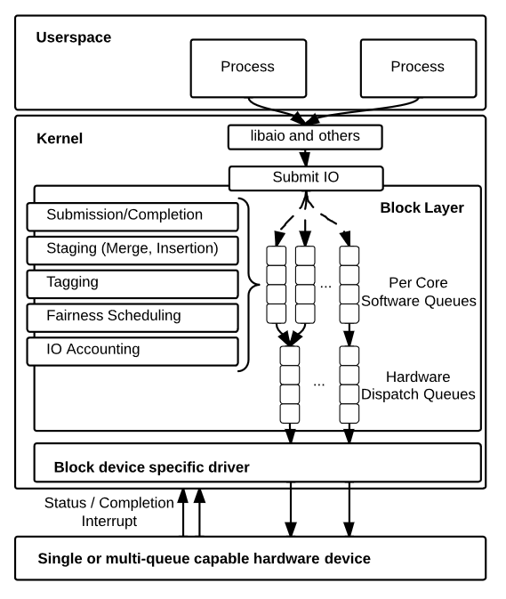
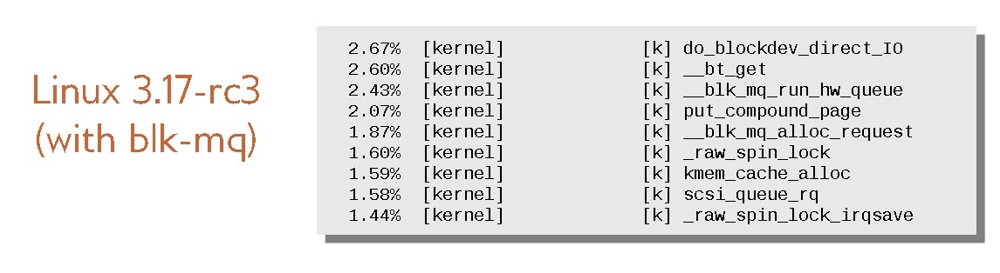
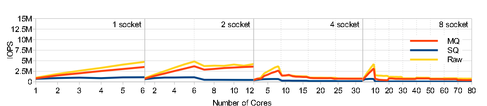

# blk mq (block multi-queue)
## block层的作用
&emsp;&emsp;简单地说，操作系统块层负责引导从应用程序到存储设备[2]的IO请求。块层作为存储设备和应用程序（文件系统）的中间层，它一方面允许应用程序以统一的方式访问不同的存储设备，另一方面为存储设备和驱动程序提供来自所有应用程序的单一入口点。

 
图1. io路径(1)

 

[图2. io路径(2) ](./Linux-storage-stack-diagram_v4.10.pdf)

Block 层连接着文件系统层和设备驱动层，`submit_bio` 开始，bio 就进入了 block 层，这些 bio 被 Block 层抽象成 request 管理，在适当的时候这些 request 离开 Block 层进入设备驱动层。IO 请求完成后，Block 层的软中断负责处理 IO 完成后的工作。Block 层主要负责：  
**○ 管理 IO 请求** 
1. bio的提交和完成处理，上层通过bio来统一描述发往块设备的IO请求 
2. IO请求暂存，如合并、排序等 
3. IO调度，如noop、cfq、deadline等 
**○ IO 统计** 

***
## single-queue
### 单队列处理流程

图3. blk单队列处理流程

&emsp;&emsp;Linux上传统的块设备层（Block Layer）和IO调度器（如cfq）主要是针对HDD（hard disk drivers）设计的。HDD设备的随机IO性能很差，吞吐量大约是几百IOPS（IOs per second），延迟在毫秒级，所以当时IO性能的瓶颈在硬件，而不是内核。但是，随着高速SSD（Solid State Disk）的出现并展现出越来越高的性能，百万级甚至千万级IOPS的数据访问已成为一大趋势，传统的块设备层已无法满足这么高的IOPS需求，逐渐成为系统IO性能的瓶颈。
为了适配现代存设备(高速SSD等)高IOPS、低延迟的IO特征，新的块设备层框架Block multi-queue（blk-mq）被提出。 
&emsp;&emsp;ps:在blk-mq提交之前，部分厂商已经基于sq（单队列）框架解决了这个问题。例如：nvme驱动。

 
图3. IOPS增长立方图

&emsp;&emsp;blk-mq框架原型在2011被提出，在Linux3.13(2014)年被合入
### 单队列存在的问题
当搭建了告诉存储器件时，单队列引入的软件开销变得突出（在多socket体系中尤为严重），
成为IO性能的瓶颈。多核体系中blk-sq的软件开销主要来自三个方面：
1. 争用请求队列锁:块层基本上同步共享访问一个独占资源:IO请求队列
    1. 当一个IO块被插入或从请求队列中移除时，这个锁必须被获取
    2. 当请求队列通过IO提交被操作时，这个锁必须被获取
    3. 当IOs提交时，block层继续进行优化，如插入(让IOs在将它们发布到硬件之前积累，以提高缓存效率
    4. IO重新排序
    5. 公平性调度 
    在这些操作之前必须获取到request queue lock. 这是锁资源争用的主要来源

 
图4. blk-sq热点统计

2. 硬件中断:IOPS增加会导致按比例增加中断数量，IOPS过高导致中断数量过高。今天的大多数存储设备都是这
样设计的:一个核心(在图3中的CPU 0内)负责处理所有硬件中断，并将它们作为软中断转发给其他核心来complete
这个IO。因此，单个核可能会花费相当多的时间来处理这些中断、上下文切换和污染L1和l2cache。其他cpu core
(在图3的CPU N中)也必须使用IPI来执行IO完成例程。因此，在许多情况下，完成一个IO需要两次中断和上下文切换。

 
图4. blk-sq中断处理瓶颈

3. 远程内存访问：当请求队列锁定跨CPU核心（或NUMA体系结构中的socket）进行远端内存访问时，请求队列争
用锁的情况会加剧。 每当IO在与发出它的内核不同的内核上complete时，就需要此类远程内存访问。 在这种情
况下，获取请求队列上的锁以将block IO从请求队列中删除会导致对存储在最后获得该锁的 core cacheline中
的锁状态的远程内存访问，然后将高速缓存行标记为在两个core上共享。 更新后，该副本将从远程缓存中显式
无效。 如果有多个core正在主动发出IO并因此争夺该锁，则与此锁关联的高速缓存行将在这些内核之间不断反弹。 

|Platform/Intel |SandyBridge-E  |Westmere-EP    |Nehalem-EX |Westmere-EX    |
|----           |----           |----           |----       |----           |
|Processor      |i7-3930        |KX5690         |X7560      |E7-2870        |
|Num. of Cores  |6              |12             |32         |80             |
|Speed (Ghz)|3.2|3.46|2.66|2.4|
|L3 Cache (MB)|12|12|24|30|
|NUMA nodes|1|2|4|8|

图4. 用于测试的设备列表

<!--

 
图4. blk-sq远端内存访问性能瓶颈

-->

 
图4. blk-sq远端内存访问性能瓶颈

&emsp;&emsp;IOPS(Input/Output Per Second)表示每秒处理的io数量，number of cores代表是的是，有多少个核在
提交io请求。从上图可以看出，当进程数量小于单个socket上的core时，随着cpu数量的提高，IOPS会保持并有一定程
度的提升，但是像2 socket、4 socket和8 socket，当cpu个数超过了单个socket的core个数（这样就会发生远端内存
访问），无论socket的数量多少，性能都会大幅度下降。
&emsp;&emsp;在复杂的四个和八个socket系统上，NUMA-factor很高并且缓存目录结构很大，请求队列锁的远程缓存行
无效的访问成本却高得多(性能会下降到一个很低的程度:大约125K)，但是在几年前已经有高端的SSD超过这个性能了，
这样的话，IO瓶颈的是卡在了KERNEL BLOCK层。

***

## muti-queue
### muti-queue处理流程
&emsp;&emsp;当重新设计块层以适应高numa-actor架构时，减少锁争用和远程内存访问是关键的挑战。有效地处理大量
的硬件中断超出了块层的控制范围(下面将详细介绍)，因为块层不能规定设备驱动程序如何与其硬件交互。在这一节中，
我们为Linux块层提出了一个两级多队列设计，并讨论了它与当前单队列块层实现的关键区别和优势。

 
图4. muti-queue处理流程

### 需求
基于上面对Linux block 层的现状分析，提出了3个新的需求:
1. **单一设备公平性(多个进程使用单一设备的公平性)** 
许多应用程序进程可能使用同一设备。需要保证的是一个进程不应使所有其他进程都饿死(公平调度)。这是块层的任务。
一般来说，像CFQ或Deadline调度之类的技术已用于在块层中实施公平性。如果没有设备访问权限的集中仲裁器，则应用
程序必须在自身之间进行协调以实现公平性，或者依赖于设备驱动程序（很少存在）中实现的公平性策略。 
2. **单设备和多设备的统计** 
块层应该便于系统管理员调试或监控对存储设备的访问。为系统性能监视和统计提供统一的接口，使应用程序和其他操
作系统组件能够对应用程序调度、负载均衡和性能做出智能决策。如果这些是由设备驱动程序直接维护的，那么几乎不
可能实现应用程序作者已经习惯的一致性的便利性。
3. **单设备的IO 暂存区(staging area)** 
为了提高性能并加强公平性，块层必须能够执行某种形式的IO调度。 为此，块层需要一个暂存区域，在将IO向下发送
到设备驱动程序之前，可以在其中进行缓冲。 使用过渡区域，块层可以对IO进行重新排序，通常是为了促进对随机访
问的顺序访问，或者可以对IO进行分组，以将更大的IO提交给底层设备。此外，staging区域允许块层根据服务质量或
由于deviceback-pressure(指示操作系统不应该发送额外的IO或有溢出设备缓冲能力的风险)调整其提交率。

### 框架
在我们的多队列设计中，提高可扩展性的关键点是通过使用功能不同的两级队列，将单个请求队列锁上的锁争用分配给多个队列
1. **软件(staging)队列** 

<!--
Rather than staging IO fordispatch in a single software queue, block IO requestsare now maintained in a 
collection of one or more re-quest queues.  These staging queues can be configured such  that  there  
is  one  such  queue  per  socket,  or  percore,  on the system.  So,  on a NUMA system with 4 sockets 
and 6 cores per socket,  the staging area maycontain as few  as 4 and as many as  24 queues.   
The variable nature of the request queues decreases the pro-liferation of locks if contention on a 
single queue is nota bottleneck.  With many CPU architectures offeringa large shared L3 cache per socket 
(typically a NUMAnode as well),  having just a single queue per proces-sor socket offers a good trade-off 
between duplicateddata  structures  which  are  cache  unfriendly  and  lockcontention.
-->

&emsp;&emsp;现在，将块IO请求保留在一个或多个请求队列的集合中，而不是在单个软件(staging)队列中IO进行分发。 
可以配置这些staging队列，以使系统上的每个socket或每个cpu core都存在一个这样的队列。 因此，在具有4个socket
并且每个socket 6个core的NUMA系统上，staging区域可能包含少至4个队列和多达24个队列。 如果单个队列上的争用不
是瓶颈，那么请求队列的可变性质将减少锁的数量(我觉得是减少队列数量)。 在许多CPU体系结构中，每个socket
（通常也为NUMA node）提供大型共享的L3缓存，每个处理器socket只有一个队列，这在缓存不友好和锁争用的重复数据
结构之间提供了很好的折衷方案。

2. **硬件(dispatch)队列** 
&emsp;&emsp;在IO进入staging队列之后，我们引入了一个新的中间队列层，称为硬件dispatch队列。队列中的调度后的
即将派发的块IO不会直接发送到设备驱动程序，而是将它们发送到硬件分派队列。 硬件调度队列的数量通常将与设备驱
动程序支持的硬件上下文的数量匹配。设备驱动程序可以选择支持消息信号中断标准MSI-X [25]支持的1到2048个队列。
因为在块层中不支持IO ordering，所以任何软件队列都可以提供任何硬件队列，而无需维护全局排序。 这使得硬件
实现一个或多个直接映射到NUMA节点或CPU的队列，并提供从应用程序到硬件的快速IO路径，这样就不需要访问
任何其他节点上的远程内存。

将之前的staging单个队列的两个换成功能分成两个(staging 和 dispatch):
1. 支持io调度(staging队列)
2. 控制提交速率:防止设备缓冲区溢出(dispatch队列)

软件级别队列中的条目数可以根据需要动态增加和缩小，以支持应用程序维护的出色队列深度，尽管与扩展内存和维护足
够的可用IO插槽的内存开销相比，队列扩展和收缩是一项相对昂贵的操作用来提供给支持大多数应用程序该功能。
而硬件调度队列的大小是有界的，并且与设备驱动程序和硬件支持的最大队列深度相对应。 如今，许多支持本地命令
排队的SSD支持的队列深度仅为32，尽管高端SSD存储设备可能具有更深的队列支持，以利用其闪存架构的内部高度并行性。
在许多消费型的SSD硬盘上发现32个队列深度不够用，需要增加，因为在此情形下如果有100w个IOPS，将导致每秒31000个
上下文切换，向设备发布IO的CPU开销与每个提交事件中批处理的IO数量成反比。

### 使用多队列后性能测试情况
1. **热点统计**

 
图4. 多队列热点统计

2. **iops立方图**

 
图4. muti-queue IOPS图示

3. **延迟统计**

||1 socket|2 sockets|4 sockets|8 sockets|
|----|----|----|----|----|
|SQ|50 ms|50 ms2|50 ms|750 ms|
|MQ|50 ms|50 ms|50 ms|250 ms|
|Raw|50 ms|50 ms|50 ms|250 ms|

上表统计了每个系统的最大延时

***

## 代码解读

### 主要数据结构[4]
[主要数据结构文档](./main_struct.md)

### block相关流程

1. 队列初始化流程 
[block 队列初始化流程文档](./blk_mq_init.md)

2. 入口流程  
[block 入口流程文档](./blk_mq_submit_bio.md)

3. make request流程分析 
[make request流程分析(链接)](https://blog.csdn.net/hu1610552336/article/details/111464548) 
[make request流程分析(自己)](./blk_mq_dispatch.md)

4. 队列映射流程 
[队列映射流程文档](./blk_mq_map.md)

5. 锁操作流程 
[锁操作流程文档](./blk_mq_lock.md)

## 参考资料
### 参考文档
[1] **[Linux Block IO: Introducing Multi-queue SSD Access onMulti-core Systems](./2013_SYSTOR.pdf) **
[2] **[High Performance Storage with blk-mq and scsi-mq](./scsi.pdf)**
### 参考链接
[3] https://www.thomas-krenn.com/en/wiki/Linux_Storage_Stack_Diagram (图2)  
[4] https://www.kernel.org/doc/html/latest/block/blk-mq.html  
[5] https://www.cnblogs.com/Linux-tech/p/12961286.html  
[6] http://www.liuhaihua.cn/archives/686055.html  
[7] https://md.easystack.work/blk_mq_nvme  
