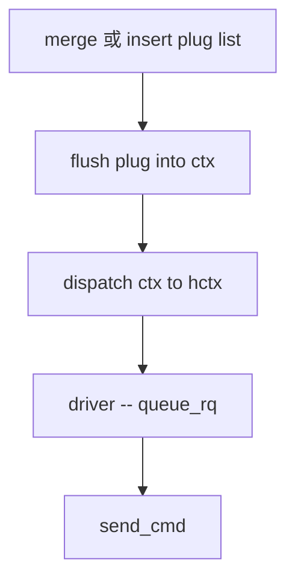
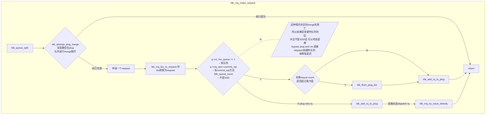
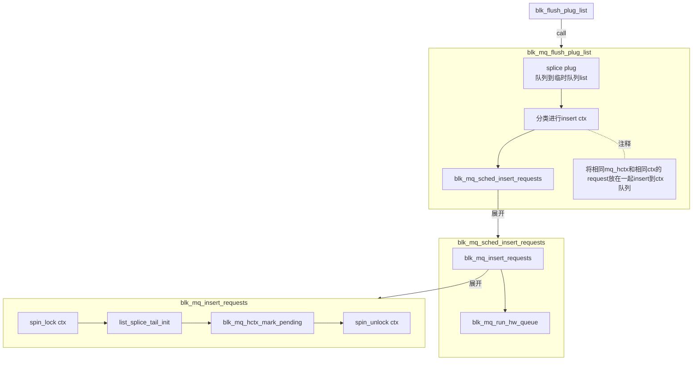
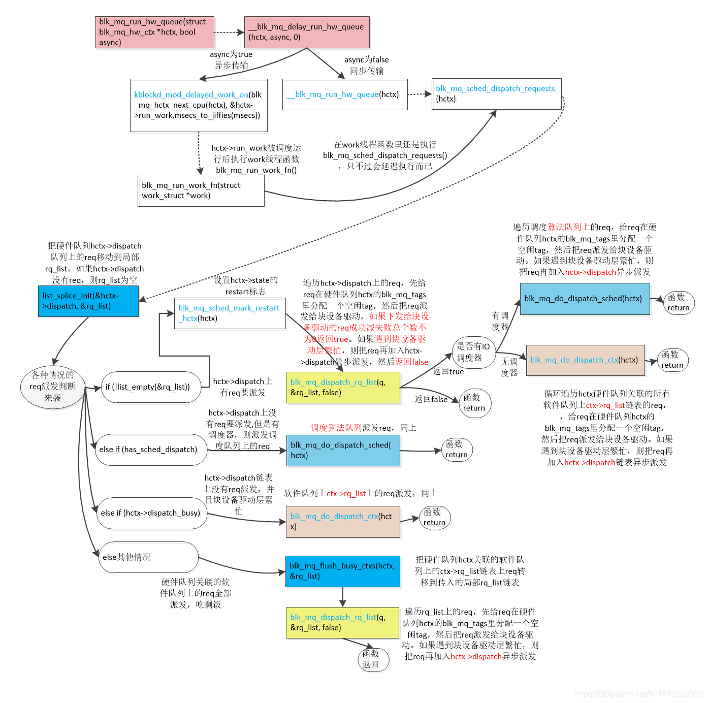

## blk_mq_make_request 流程
### 整体流程

### merge 或 insert plug list

### flush plug into ctx

***

### dispatch ctx to hctx

图6. 流程图

## 参考链接
https://blog.csdn.net/hu1610552336/article/details/111464548
