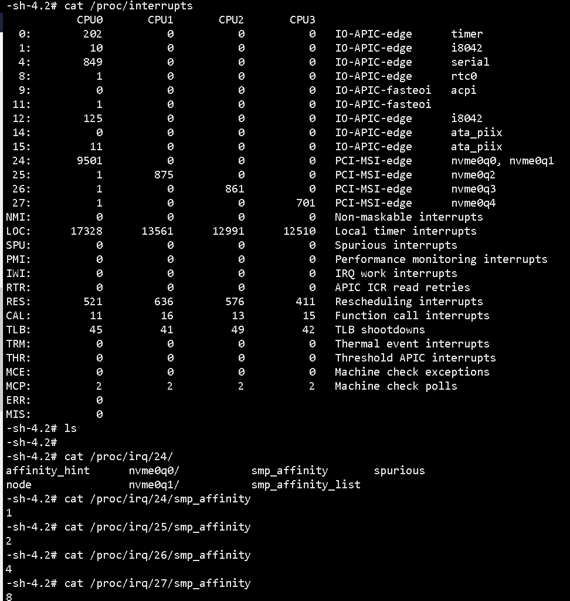

## 对于ctx和hctx映射的流程分析
分配映射的相关函数有两个

|函数|作用|
|----|----|
|blk_mq_update_queue_map|初始化blk_mq_tag_set->blk_mq_queue_map|

## blk_mq_update_queue_map
### 调用流程

```
nvme_reset_work
    nvme_dev_add
        blk_mq_alloc_tag_set
            this()
```

###  blk_mq_update_queue_map 流程
1.  blk_mq_update_queue_map

```C/C++
static int blk_mq_update_queue_map(struct blk_mq_tag_set *set)                                        
{                                                                                                     
    if (set->ops->map_queues && !is_kdump_kernel()) {                                                 
        int i;                                                                                        
                                                                                                      
        for (i = 0; i < set->nr_maps; i++)
            blk_mq_clear_mq_map(&set->map[i]);

        return set->ops->map_queues(set); //nvme 驱动走的该流程, 对应的函数为nvme_pci_map_queues
    } else {
        BUG_ON(set->nr_maps > 1);
        return blk_mq_map_queues(&set->map[HCTX_TYPE_DEFAULT]);
    }
}                                        
```
2. blk_mq_pci_map_queues

```C/C++
int blk_mq_pci_map_queues(struct blk_mq_queue_map *qmap, struct pci_dev *pdev,
                int offset)     //主要的是cpu亲和性                           
{                                                                             
    const struct cpumask *mask;                                               
    unsigned int queue, cpu;                                                  
                                                                              
    for (queue = 0; queue < qmap->nr_queues; queue++) {                       
        mask = pci_irq_get_affinity(pdev, queue + offset);		//在这里获取队列的亲和性
        if (!mask)                                                            
            goto fallback;                                                    
                                                                              
        for_each_cpu(cpu, mask)                                               
            qmap->mq_map[cpu] = qmap->queue_offset + queue;     //赋值硬件队列
    } 
                                                                              
    return 0;                                                                 
                                                                              
fallback:                                                                     
    WARN_ON_ONCE(qmap->nr_queues > 1);                                        
    blk_mq_clear_mq_map(qmap);                                                
    return 0;                                                                 
}
```


### CPU亲和性设置
目前找到的nvme设置亲和性的函数为
```C/C++
nvme_reset_work
	nvme_setup_io_queues
		nvme_setup_irqs
			pci_alloc_irq_vectors_affinity

static int nvme_setup_irqs(struct nvme_dev *dev, unsigned int nr_io_queues)   
{                                                                             
    struct pci_dev *pdev = to_pci_dev(dev->dev);                              
    struct irq_affinity affd = {                                              
        .pre_vectors    = 1,                                                  
        .calc_sets  = nvme_calc_irq_sets,                                     
        .priv       = dev,                                                    
    };                                                                        
    unsigned int irq_queues, this_p_queues;                                   
                                                                              
    /*                                                                        
     * Poll queues don't need interrupts, but we need at least one IO         
     * queue left over for non-polled IO.                                     
     */                                                                       
    this_p_queues = poll_queues;                                              
    if (this_p_queues >= nr_io_queues) {                                      
        this_p_queues = nr_io_queues - 1;                                     
        irq_queues = 1;                                                       
    } else {                                                                  
        irq_queues = nr_io_queues - this_p_queues + 1;                        
    }                                                                         
    dev->io_queues[HCTX_TYPE_POLL] = this_p_queues;                           
                                                                              
    /* Initialize for the single interrupt case */                            
    dev->io_queues[HCTX_TYPE_DEFAULT] = 1;                                    
    dev->io_queues[HCTX_TYPE_READ] = 0;                                       
                                                                              
    return pci_alloc_irq_vectors_affinity(pdev, 1, irq_queues,                //<--在这里会设置CPU亲和
                  PCI_IRQ_ALL_TYPES | PCI_IRQ_AFFINITY, &affd);               
}
```

从调试来看，发现nvme irq的处理像是进行了irq balance的处理，如下图所示(代码方面并没有看太明白)

<div style="text-align: center;">

<br/>
图4. nvme_irq分布
</div>

## 
