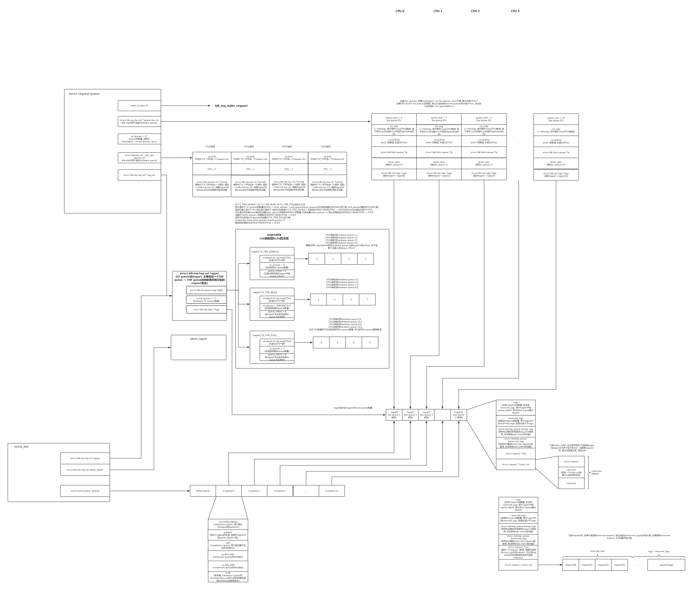

## 主要数据结构
### 数据结构关系图

<div style="text-align: center;">

<br />
图4. block && nvme 数据结构关系图
</div>

### 数据结构相关成员
1. **struct blk_mq_hw_ctx**<br />
&emsp;&emsp;描述硬件派发队列的数据结构
```C/C++
struct blk_mq_hw_ctx {
  struct {
	...
    struct list_head        dispatch;
	...
  };
  ...
  cpumask_var_t cpumask;
  ...
  void *driver_data;
  ...
  struct sbitmap          ctx_map;
  ...
  unsigned short          type;
  struct blk_mq_ctx       **ctxs;
};
```
**dispatch**<br/>
&emsp;&emsp;
Used for requests that are ready to be dispatched to the 
hardware but for some reason (e.g. lack of resources) could not be 
sent to the hardware. As soon as the driver can send new requests, 
requests at this list will be sent first for a fairer dispatch.

**cpumask**<br/>
&emsp;&emsp;
Map of available CPUs where this hctx can run.

**ctx_map**<br/>
&emsp;&emsp;
Bitmap for each software queue. If bit is on, there is a pending request in that software queue.

**type**<br/>
&emsp;&emsp;
HCTX_TYPE_* flags. Type of hardware queue.

**ctxs**<br/>
&emsp;&emsp;
Array of software queues.

2. **struct blk_mq_ctx** <br />
```C/C++
struct blk_mq_ctx {                                                                                    
    struct {                                                                                           
        spinlock_t      lock;                                                                          
        struct list_head    rq_lists[HCTX_MAX_TYPES];       //rq_lists  有个list_head  链接request     
    } ____cacheline_aligned_in_smp;

    unsigned int        cpu;
    unsigned short      index_hw[HCTX_MAX_TYPES];
#ifndef __GENKSYMS__
    struct blk_mq_hw_ctx    *hctxs[HCTX_MAX_TYPES];                                                    
#endif
	...
} ____cacheline_aligned_in_smp;                                                                        
```

**lock** <br/>
&emsp;&emsp;
队列锁，主要是锁rq_lists资源

**rq_lists**<br />
&emsp;&emsp;
软件队列结构，一个HCTX_TYPE一个队列

**cpu**<br />
&emsp;&emsp;
该队列代表的cpu index

**index_hw** <br />
&emsp;&emsp;
由于一个多个软件队列可以映射一个硬件队列，该index代表该软件队列在硬件队列中的index

3. **struct blk_mq_tag_set**[4]
```C/C++
struct blk_mq_tag_set {
  struct blk_mq_queue_map map[HCTX_MAX_TYPES];
  unsigned int            nr_maps;
  const struct blk_mq_ops *ops;
  unsigned int            nr_hw_queues;
  unsigned int            queue_depth;
  unsigned int            reserved_tags;
  unsigned int            cmd_size;
  int numa_node;
  unsigned int            timeout;
  unsigned int            flags;
  void *driver_data;
  struct sbitmap_queue    __bitmap_tags;
  struct sbitmap_queue    __breserved_tags;
  struct blk_mq_tags      **tags;
  struct mutex            tag_list_lock;
  struct list_head        tag_list;
};
```
**map**<br/>
&emsp;&emsp;
One or more ctx -> hctx mappings. One map exists for each 
hardware queue type (enum hctx_type) that the driver wishes 
to support. There are no restrictions on maps being of the 
same size, and it’s perfectly legal to share maps between 
types.(ctx->hctx的映射)

**nr_maps**<br />
&emsp;&emsp;
Number of elements in the map array. A number in the range
[1, HCTX_MAX_TYPES].

**ops**<br />
&emsp;&emsp;
Pointers to functions that implement block driver behavior.

**nr_hw_queues**<br />
&emsp;&emsp;
Number of hardware queues supported by the block driver 
that owns this data structure.

**queue_depth**<br />
&emsp;&emsp;
Number of tags per hardware queue, reserved tags 
included.

<!--
**reserved_tags**
&emsp;&emsp;
Number of tags to set aside for BLK_MQ_REQ_RESERVED tag 
allocations.

driver_data
    Pointer to data owned by the block driver that created this tag set.
-->

**__bitmap_tags**
<br />
&emsp;&emsp;
A shared tags sbitmap, used over all hctx’s

**tags**
<br />
&emsp;&emsp;
Tag sets. One tag set per hardware queue. Has `nr_hw_queues` elements.

4. **struct blk_mq_tags**
```C/C++
struct blk_mq_tags {
    unsigned int nr_tags;                   //tags最大数量, 一般来说要等于最大队列深度
    unsigned int nr_reserved_tags;          //保留tags数量

    atomic_t active_queues;                 //活跃队列数量

    struct sbitmap_queue bitmap_tags;       //保留tag的位图，如果使用了，相应的bit为1
    struct sbitmap_queue breserved_tags;

    //分配staic_rqs时，会分配多个连续的pages,
    //将pages分为多个如下大小，当需要request时，
    //就从这里面分配，类似slab
    struct request **rqs;                   
    struct request **static_rqs;			//这个是预分配的rqs
    struct list_head page_list;				//预分配的page链表
};
```
5. **enum hctx_type**<br />
&emsp;&emsp;硬件队列的类型<br />
|type|meaning|
|----|----|
|HCTX_TYPE_DEFAULT|All I/O not otherwise accounted for|
|HCTX_TYPE_READ|Just for READ I/O|
|HCTX_TYPE_POLL|Polled I/O of any kind.|
|HCTX_MAX_TYPES|Number of types of hctx.|

6. **struct blk_mq_queue_map**<br />
```C/C++
struct blk_mq_queue_map {
  unsigned int *mq_map;
  unsigned int nr_queues;
  unsigned int queue_offset;
};
```

**mq_map**
<br />
&emsp;&emsp;
CPU ID to hardware queue index map. This is an array with nr_cpu_ids 
elements. Each element has a value in the range [queue_offset, 
queue_offset + nr_queues).

**nr_queues**
<br />
&emsp;&emsp;
Number of hardware queues to map CPU IDs onto.

**queue_offset**
<br />
&emsp;&emsp;
First hardware queue to map onto. Used by the PCIe NVMe driver 
to map each hardware queue type (`enum hctx_type`) onto a distinct 
set of hardware queues. 

7. **struct request_queue**
```C/C++
struct request_queue {
    struct elevator_queue   *elevator;          //指向elevator对象的指针(和调度相关)

    struct blk_queue_stats  *stats;

    make_request_fn     *make_request_fn;       //将一个bio组封装成一个request并添加到request_queue
    dma_drain_needed_fn *dma_drain_needed;

    const struct blk_mq_ops *mq_ops;			//驱动赋值的mq_ops

    /* sw queues */
    struct blk_mq_ctx __percpu  *queue_ctx;     //软队列
    unsigned int        nr_queues;              //软件队列的个数

    unsigned int        queue_depth;			//队列深度

    /* hw dispatch queues */
    struct blk_mq_hw_ctx    **queue_hw_ctx;     //维护一个CPU和硬件队列关系之间的映射表
    unsigned int        nr_hw_queues;			//硬件队列个数

    struct backing_dev_info *backing_dev_info;
};
```
8. **struct request**
|S|C|
|----|----|
|D 	|driver member|
|B 	|block layer member|
|I 	|I/O scheduler member|

|Member 	|Flag 	|Comment|
|----|----|----|
|struct list_head queuelist| 	BI 	|Organization on various internal queues|
|void *elevator_private| 	I 	|I/O scheduler private data|
|unsigned char cmd[16]| 	D 	|Driver can use this for setting up a cdb before execution, see blk_queue_prep_rq|
|unsigned long flags| 	DBI 	|Contains info about data direction, request type, etc.|
|int rq_status| D 	|Request status bits|
|kdev_t rq_dev| 	DBI 	|Target device|
|int errors| 	DB 	|Error counts|
|sector_t sector| 	DBI 	|Target location|
|unsigned long hard_nr_sectors| 	B 	|Used to keep sector sane|
|unsigned long nr_sectors| 	DBI 	|Total number of sectors in request|
|unsigned long hard_nr_sectors| 	B 	|Used to keep nr_sectors sane|
|unsigned short nr_phys_segments| 	DB 	|Number of physical scatter gather segments in a request|
|unsigned short nr_hw_segments| 	DB 	|Number of hardware scatter gather segments in a request|
|unsigned int current_nr_sectors| 	DB 	|Number of sectors in first segment of request|
|unsigned int hard_cur_sectors| 	B 	|Used to keep current_nr_sectors sane|
|int tag| 	DB 	|TCQ tag, if assigned|
|void *special| 	D 	|Free to be used by driver|
|char *buffer| 	D 	|Map of first segment, also see section on bouncing SECTION|
|struct completion *waiting| 	D 	|Can be used by driver to get signalled on request completion|
|struct bio *bio| 	DBI 	|First bio in request|
|struct bio *biotail| 	DBI 	|Last bio in request|
|struct request_queue *q| 	DB 	|Request queue this request belongs to|
|struct request_list *rl| 	B 	|Request list this request came from|
