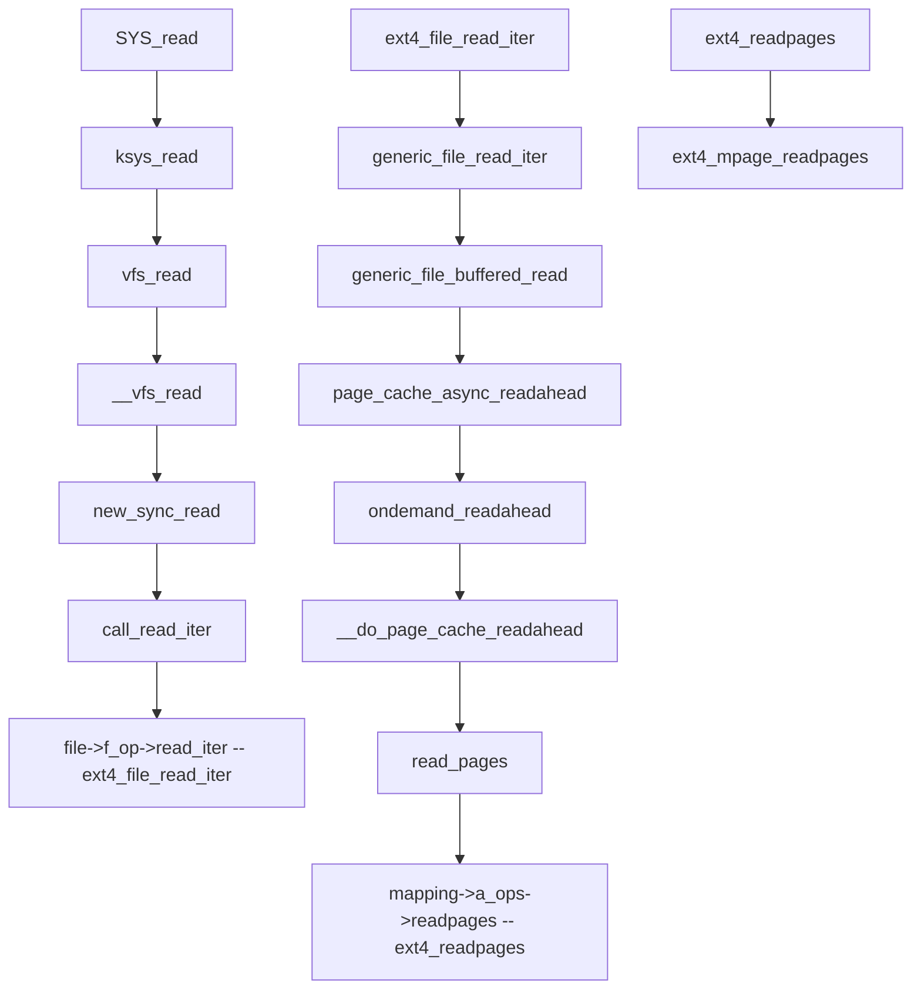

## 流程显示

```mermaid
graph TD
SYS_read --> ksys_read
ksys_read --> vfs_read
vfs_read --> __vfs_read
__vfs_read --> new_sync_read
new_sync_read --> call_read_iter
call_read_iter --> id1[file->f_op->read_iter -- ext4_file_read_iter]
ext4_file_read_iter --> generic_file_read_iter
generic_file_read_iter --> generic_file_buffered_read
generic_file_buffered_read --> page_cache_async_readahead
page_cache_async_readahead -->				ondemand_readahead
ondemand_readahead         -->              __do_page_cache_readahead
__do_page_cache_readahead -->                  read_pages
read_pages                -->                id2[mapping->a_ops->readpages -- ext4_readpages]
ext4_readpages --> ext4_mpage_readpages
```
