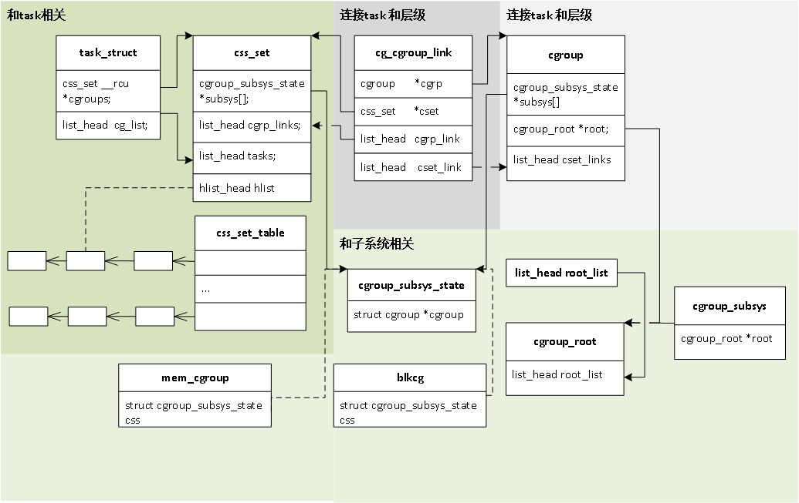

# cgroup 名词解释
## cgroup
控制组，提供了一个机制控制一组进程对某些资源的使用。cgroup
绑定一个进程集合到一个或多个子系统上。

## subsystem
子系统，是一个通过cgroup 提供的工具和接口来管理进程组的模块。
一个子系统是一个传统的"资源控制器"，他调度一组资源或者是提供
每一个组的资源上线，并且他可以做任何以一组进程为单位的任何事请
例如：虚拟化子系统

## hierarchy
层级树，是一组在一颗树范围内的组的cgroup的集合。每一个在系统中的task
都会在层级结构上的一个cgroup中，并且是一组子系统。每一个子系统有系统
特定状态(我觉得是提供的用户API不同，也就是VFS不同)连接到每个层级中的
cgroup上。每一个层级有一个相关联的cgroup VFS 实例。

在任意的时间点，可能存在多个活跃的task cgroup层级。每一个层级都是
系统中所有任务的分区。(也就说每个子系统都包含所有的task)

用户态的代码可以创建销毁cgroup通过在cgroup VFS中的实例名称(dentry名称)。
并且可以指定并查询分配task的cgroup，并且列出分配给cgroup的task PID。
这些创建和分配仅影响与cgroup文件系统实例关联的层次结构。


# 数据结构

## cgroup 数据结构关系

<div style="text-align: center;">

<br />
图1. cgroup 结构体关系
</div>

## 上面数据结构的解释:

|数据结构名称|作用|
|-|-|
|cgroup_subsys_state|简称css, 该数据结构表示一个层级中的一个子系统的状态, 该数据结构是和层级相关联的|
|css_set|css的集合，该数据结构是和进程相关连的代表一个进程的所有的css|
|cgroup|cgroup仅代表层级，每个层级可能会有一个或几个子系统|
|cg_cgroup_link|该数据结构用于连接css_set和cgroup，而css_set是和task相关的，所以一个cgroup中可能有好多个task, 而一个task可能在多个cgroup层级中, 所以是一个多对多的关系|
|cgroup_subsys|描述一个子系统|
|blkcg, mem_cgroup|可以看作cgroup_subsys_state是这些数据结构的抽象|


# cgroup 相关流程
## 流程简述
```
start_kernel
	cgroup_init_early
    cgroup_init
```

## cgroup_init_early 流程简述

<details>
<summary><code>cgroup_init_early</code></summary>

```
int __init cgroup_init_early(void)
{
    static struct cgroup_sb_opts __initdata opts;
    struct cgroup_subsys *ss;
    int i;

    init_cgroup_root(&cgrp_dfl_root, &opts);    //init cgroup
    cgrp_dfl_root.cgrp.self.flags |= CSS_NO_REF;

    RCU_INIT_POINTER(init_task.cgroups, &init_css_set);	//这里应该是将0号进程加入init_css_set

    for_each_subsys(ss, i) {
        WARN(!ss->css_alloc || !ss->css_free || ss->name || ss->id,
             "invalid cgroup_subsys %d:%s css_alloc=%p css_free=%p id:name=%d:%s\n",
             i, cgroup_subsys_name[i], ss->css_alloc, ss->css_free,
             ss->id, ss->name);
        WARN(strlen(cgroup_subsys_name[i]) > MAX_CGROUP_TYPE_NAMELEN,
             "cgroup_subsys_name %s too long\n", cgroup_subsys_name[i]);

        ss->id = i;                             //赋值id
        ss->name = cgroup_subsys_name[i];		//赋值ss->name
        if (!ss->legacy_name)
            ss->legacy_name = cgroup_subsys_name[i];	//赋值ss->legacy_name

        if (ss->early_init)								//如果有early_init调用early_init
            cgroup_init_subsys(ss, true);
    }
    return 0;
}
```

<details>
<summary><code>init_cgroup_root</code></summary>

```C/C++
void init_cgroup_root(struct cgroup_root *root, struct cgroup_sb_opts *opts)
{
    struct cgroup *cgrp = &root->cgrp;

    INIT_LIST_HEAD(&root->root_list);
    atomic_set(&root->nr_cgrps, 1);
    cgrp->root = root;							//赋值cgroup_root->cgrp->root
    init_cgroup_housekeeping(cgrp);	
    idr_init(&root->cgroup_idr);				//init_idr

    root->flags = opts->flags;
    if (opts->release_agent)					//以下几个if都执行不到
        strscpy(root->release_agent_path, opts->release_agent, PATH_MAX);
    if (opts->name)								
        strscpy(root->name, opts->name, MAX_CGROUP_ROOT_NAMELEN);
    if (opts->cpuset_clone_children)
        set_bit(CGRP_CPUSET_CLONE_CHILDREN, &root->cgrp.flags);
}
```
</details>
</details>

## cgroup_init 流程简述
```
int __init cgroup_init(void)
{
	//主要是赋值cftype->kf_ops
	BUG_ON(cgroup_init_cftypes(NULL, cgroup_base_files));
	BUG_ON(cgroup_init_cftypes(NULL, cgroup1_base_files)));
	
	...
	
	cgroup_setup_root(&cgrp_dfl_root, 0);
	
}
```

### cgroup_init_cftypes

<details>
<summary><code>cgroup_init_cftypes</code></summary>

```C/C++
/*
 * =============FILE:kernel/cgroup/cgroup.c=============
 * 实际上这个函数主要的作用是赋值cftype->kf_ops 和ss
 */
static int cgroup_init_cftypes(struct cgroup_subsys *ss, struct cftype *cfts)
{
    struct cftype *cft;

    for (cft = cfts; cft->name[0] != '\0'; cft++) {
        struct kernfs_ops *kf_ops;

        WARN_ON(cft->ss || cft->kf_ops);

        if (cft->seq_start)
            kf_ops = &cgroup_kf_ops;
        else
            kf_ops = &cgroup_kf_single_ops;

        /*
         * Ugh... if @cft wants a custom max_write_len, we need to
         * make a copy of kf_ops to set its atomic_write_len.
         */
        if (cft->max_write_len && cft->max_write_len != PAGE_SIZE) {
            kf_ops = kmemdup(kf_ops, sizeof(*kf_ops), GFP_KERNEL);
            if (!kf_ops) {
                cgroup_exit_cftypes(cfts);
                return -ENOMEM;
            }
            kf_ops->atomic_write_len = cft->max_write_len;
        }

        cft->kf_ops = kf_ops;		//赋值kf_ops
        cft->ss = ss;				//赋值ss，当然这里ss为NULL
    }

    return 0;
}
```
</details>

### cgroup_setup_root

<!--cgroup_setup_root BEG -->
<details>
<summary><code>cgroup_setup_root</code></summary>

```C/C++
int cgroup_setup_root(struct cgroup_root *root, u16 ss_mask)
{
    LIST_HEAD(tmp_links);
    struct cgroup *root_cgrp = &root->cgrp;
    struct kernfs_syscall_ops *kf_sops;
    struct css_set *cset;
    int i, ret;

    lockdep_assert_held(&cgroup_mutex);
	//分配id
    ret = cgroup_idr_alloc(&root->cgroup_idr, root_cgrp, 1, 2, GFP_KERNEL);
    if (ret < 0)
        goto out;
    root_cgrp->id = ret;
    root_cgrp->ancestor_ids[0] = ret;

    ret = percpu_ref_init(&root_cgrp->self.refcnt, css_release,
                  0, GFP_KERNEL);
    if (ret)
        goto out;

    /*
     * We're accessing css_set_count without locking css_set_lock here,
     * but that's OK - it can only be increased by someone holding
     * cgroup_lock, and that's us.  Later rebinding may disable
     * controllers on the default hierarchy and thus create new csets,
     * which can't be more than the existing ones.  Allocate 2x.
     */
	//分配2 * css_set_count 个 cgrp_cset_links
    ret = allocate_cgrp_cset_links(2 * css_set_count, &tmp_links);
    if (ret)
        goto cancel_ref;
    
    ret = cgroup_init_root_id(root);
    if (ret)
        goto cancel_ref;
	//这里会根据root选择是cgroup v1 还是cgroup v2
	//所以一般来说是通过root来判断cgroupv1还是v2
    kf_sops = root == &cgrp_dfl_root ?
        &cgroup_kf_syscall_ops : &cgroup1_kf_syscall_ops;
    //申请kernfs节点
    root->kf_root = kernfs_create_root(kf_sops,
                       KERNFS_ROOT_CREATE_DEACTIVATED |
                       KERNFS_ROOT_SUPPORT_EXPORTOP,
                       root_cgrp);
    if (IS_ERR(root->kf_root)) {
        ret = PTR_ERR(root->kf_root);
        goto exit_root_id;
    }
    root_cgrp->kn = root->kf_root->kn;
    
    //给顶层增加一部分文件
    ret = css_populate_dir(&root_cgrp->self);
    if (ret)
        goto destroy_root;

    ret = rebind_subsystems(root, ss_mask);
    if (ret)
        goto destroy_root;

    ret = cgroup_bpf_inherit(root_cgrp);
    WARN_ON_ONCE(ret);

    trace_cgroup_setup_root(root);

    /*
     * There must be no failure case after here, since rebinding takes
     * care of subsystems' refcounts, which are explicitly dropped in
     * the failure exit path.
     */
    list_add(&root->root_list, &cgroup_roots);
    cgroup_root_count++;

    /*
     * Link the root cgroup in this hierarchy into all the css_set
     * objects.
     */
    spin_lock_irq(&css_set_lock);
	//将css_set_table中的css_set加入到cgroup中, 建立cgroup<->css_set的多对多关系
    hash_for_each(css_set_table, i, cset, hlist) {
        link_css_set(&tmp_links, cset, root_cgrp);
        if (css_set_populated(cset))
            cgroup_update_populated(root_cgrp, true);
    }
    spin_unlock_irq(&css_set_lock);

    BUG_ON(!list_empty(&root_cgrp->self.children));
    BUG_ON(atomic_read(&root->nr_cgrps) != 1);

    kernfs_activate(root_cgrp->kn);
    ret = 0;
    goto out;

destroy_root:
    kernfs_destroy_root(root->kf_root);
    root->kf_root = NULL;
exit_root_id:
    cgroup_exit_root_id(root);
cancel_ref:
    percpu_ref_exit(&root_cgrp->self.refcnt);
out:
    free_cgrp_cset_links(&tmp_links);
    return ret;
}
```
</details>

实际上上面setup_root的函数流程主要分为一下几个部分
1. 分配idr(cgroup_root->idr),分配id(cgroup_root->cgrp->id)
2. 分配cset_link，数量为css_set_count * 2
3. 创建顶层kernfs，赋值给cgroup_root->kf_root
4. 创建为顶层kernfs增加文件节点(css_populate_dir)
5. 调用rebind_subsystems(这个不清楚作用)
6. 将所有进程加入到顶层cgroup中(link_css_set)
7. 使能kernfs root_cgrp


我们继续后面的流程
<!-- cgroup_init 2 BEG -->
<details>
<summary><code>cgroup_init part2</code></summary>

```C/C++
int __init cgroup_init(void)
{
	...
	for_each_subsys(ss, ssid) {	//遍历每一个ss
	    if (ss->early_init) {
	        struct cgroup_subsys_state *css =
	            init_css_set.subsys[ss->id];
	
	        css->id = cgroup_idr_alloc(&ss->css_idr, css, 1, 2,
	                       GFP_KERNEL);
	        BUG_ON(css->id < 0);
	    } else {
	        //未设置early_init
	        cgroup_init_subsys(ss, false);
	    }
	    /*
	     * cgroup.e_csets会连接该层级所有的css_set
	     */
	    list_add_tail(&init_css_set.e_cset_node[ssid],
	              &cgrp_dfl_root.cgrp.e_csets[ssid]);
	
	    /*
	     * Setting dfl_root subsys_mask needs to consider the
	     * disabled flag and cftype registration needs kmalloc,
	     * both of which aren't available during early_init.
	     */
	    if (cgroup_disable_mask & (1 << ssid)) {
	        static_branch_disable(cgroup_subsys_enabled_key[ssid]);
	        printk(KERN_INFO "Disabling %s control group subsystem\n",
	               ss->name);
	        continue;
	    }
	
	    if (cgroup1_ssid_disabled(ssid))
	        printk(KERN_INFO "Disabling %s control group subsystem in v1 mounts\n",
	               ss->name);
	
	    cgrp_dfl_root.subsys_mask |= 1 << ss->id;           //修改subsys_mask 
	
	    /* implicit controllers must be threaded too */
	    WARN_ON(ss->implicit_on_dfl && !ss->threaded);
	
	    if (ss->implicit_on_dfl)
	        cgrp_dfl_implicit_ss_mask |= 1 << ss->id;
	    else if (!ss->dfl_cftypes)
	        cgrp_dfl_inhibit_ss_mask |= 1 << ss->id;
	
	    if (ss->threaded)
	        cgrp_dfl_threaded_ss_mask |= 1 << ss->id;
	
	    if (ss->dfl_cftypes == ss->legacy_cftypes) {
	        WARN_ON(cgroup_add_cftypes(ss, ss->dfl_cftypes));
	    } else {
	        WARN_ON(cgroup_add_dfl_cftypes(ss, ss->dfl_cftypes));
	        WARN_ON(cgroup_add_legacy_cftypes(ss, ss->legacy_cftypes));
	    }
	
	    if (ss->bind)
	        ss->bind(init_css_set.subsys[ssid]);
	
	    mutex_lock(&cgroup_mutex);
	    css_populate_dir(init_css_set.subsys[ssid]);
	    mutex_unlock(&cgroup_mutex);
	}
	...
}
```
</details>
<!-- END-->

cgroup_init_subsys相当于初始化一个cgroup_subsys

<!--cgroup_init_subsys BEG -->
<details>
<summary><code>cgroup_init_subsys</code></summary>

```C/C++
static void __init cgroup_init_subsys(struct cgroup_subsys *ss, bool early)
{
    struct cgroup_subsys_state *css;

    pr_debug("Initializing cgroup subsys %s\n", ss->name);

    mutex_lock(&cgroup_mutex);

    idr_init(&ss->css_idr);             //初始化idr
    INIT_LIST_HEAD(&ss->cfts);

    /* Create the root cgroup state for this subsystem */
    ss->root = &cgrp_dfl_root;                                  //设置root
    css = ss->css_alloc(cgroup_css(&cgrp_dfl_root.cgrp, ss));   //调用css_alloc
    /* We don't handle early failures gracefully */
    BUG_ON(IS_ERR(css));
    init_and_link_css(css, ss, &cgrp_dfl_root.cgrp);            //初始化一个css，可能会挂入cgroup->rstat_css_list

    /*
     * Root csses are never destroyed and we can't initialize
     * percpu_ref during early init.  Disable refcnting.
     */
    css->flags |= CSS_NO_REF;

    if (early) {
        /* allocation can't be done safely during early init */
        //如果是early的话，就先不分配id, 是不安全的，在cgroup_init中会分配
        css->id = 1;                                            
    } else {
        css->id = cgroup_idr_alloc(&ss->css_idr, css, 1, 2, GFP_KERNEL);//分配id
        BUG_ON(css->id < 0);
    }

    /* Update the init_css_set to contain a subsys
     * pointer to this state - since the subsystem is
     * newly registered, all tasks and hence the
     * init_css_set is in the subsystem's root cgroup. */
    init_css_set.subsys[ss->id] = css;      //赋值init_css_set.subsys[]

    have_fork_callback |= (bool)ss->fork << ss->id;
    have_exit_callback |= (bool)ss->exit << ss->id;
    have_free_callback |= (bool)ss->free << ss->id;
    have_canfork_callback |= (bool)ss->can_fork << ss->id;

    /* At system boot, before all subsystems have been
     * registered, no tasks have been forked, so we don't
     * need to invoke fork callbacks here. */
    BUG_ON(!list_empty(&init_task.tasks));

    BUG_ON(online_css(css));

    mutex_unlock(&cgroup_mutex);
}
```

实际上在执行css_alloc()后，css_alloc会初始化好相当于"子类"成员，
例如mem_cgroup，不会初始化mem_cgroup->css,而
init_and_link_css会初始化mem_cgroup->css中的数据成员
<!--init_and_link_css BEG -->
<details>
<summary><code>init_and_link_css</code></summary>

```C/C++
static void init_and_link_css(struct cgroup_subsys_state *css,
                  struct cgroup_subsys *ss, struct cgroup *cgrp)
{
    lockdep_assert_held(&cgroup_mutex);

    cgroup_get_live(cgrp);

    memset(css, 0, sizeof(*css));
    css->cgroup = cgrp;					//初始化操作
    css->ss = ss;
    css->id = -1;
    INIT_LIST_HEAD(&css->sibling);
    INIT_LIST_HEAD(&css->children);
    INIT_LIST_HEAD(&css->rstat_css_node);
    css->serial_nr = css_serial_nr_next++;
    atomic_set(&css->online_cnt, 0);

    if (cgroup_parent(cgrp)) {
        css->parent = cgroup_css(cgroup_parent(cgrp), ss);	//赋值parent
        css_get(css->parent);
    }

    if (cgroup_on_dfl(cgrp) && ss->css_rstat_flush)			//这个不懂!!
        list_add_rcu(&css->rstat_css_node, &cgrp->rstat_css_list);

    BUG_ON(cgroup_css(cgrp, ss));
}
```
</details>
<!--init_and_link_css END-->

</details>
<!--cgroup_init_subsys  END-->

实际上上面是cgroup v2的初始化流程, 但是其中包括一些公共的函数例如
* `init_cgroup_root`
* `cgroup_setup_root`
* `cgroup_init_subsys`

这些v1初始化也会调到，那我们来看下v1初始化时，函数是如何调用的
