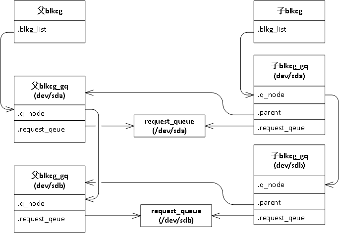

## 实验步骤
[实验步骤链接](./test.md)
## 相关函数流程

### cat blkio.throttle.io_serviced相关流程
入口函数如下

```C/C++
/*
 *blkio.throttle.io_serviced文件在CGROUP VFS层的
 * 回调函数注册
 */
static struct cftype throtl_legacy_files[] = {
    ...
	{
    	.name = "throttle.io_serviced",
    	.private = (unsigned long)&blkcg_policy_throtl,
    	.seq_show = blkg_print_stat_ios,
	},
    ...
}

//blkg_print_stat_ios函数数流程
int blkg_print_stat_ios(struct seq_file *sf, void *v)
{
    blkcg_print_blkgs(sf, css_to_blkcg(seq_css(sf)),
              blkg_prfill_rwstat_field, (void *)seq_cft(sf)->private,
              offsetof(struct blkcg_gq, stat_ios), true);
    return 0;
}

//blkcg_print_blkgs函数流程
void blkcg_print_blkgs(struct seq_file *sf, struct blkcg *blkcg,
               u64 (*prfill)(struct seq_file *,
                     struct blkg_policy_data *, int),
               const struct blkcg_policy *pol, int data,
               bool show_total)
{
    struct blkcg_gq *blkg;
    u64 total = 0;

    rcu_read_lock();
    hlist_for_each_entry_rcu(blkg, &blkcg->blkg_list, blkcg_node) {
        spin_lock_irq(&blkg->q->queue_lock);
        if (blkcg_policy_enabled(blkg->q, pol))
            total += prfill(sf, blkg->pd[pol->plid], data);
        spin_unlock_irq(&blkg->q->queue_lock);
    }
    rcu_read_unlock();

    if (show_total)
        seq_printf(sf, "Total %llu\n", (unsigned long long)total);
}
```

在这里`struct blkcg`代表一个cgroup blkio层级, 而`struct blkcg_gq`代表具体的一个
块设备在这个cgroup中的统计，而每一个`blkcg_gq`是通过`blkcg->blkg_list`链表串联
起来的。所以我们要看下什么时候会将`blkcg_gq`串到`blkcg->blkg_list`链表上。

### 将blkcg_gq串联blkcg->blkg_list流程
通过使用QEMU调试发现，主要有两个流程会触发该过程
1. 创建request_queue时(probe 块设备)
创建`request_queue`一般发生在块设备probe时，调用栈如下
```
blk_mq_init_queue(block层API)
    blk_alloc_queue_node
        blkcg_init_queue
            blkg_create
```
我们来看下具体函数实现

```C/C++
//===================FILE:block/blk-cgroup.c=================
struct blkcg blkcg_root;							//代表根层级的cgroup blkio

int blkcg_init_queue(struct request_queue *q)   
{
	...                                                
    blkg = blkg_create(&blkcg_root, q, new_blkg);	//从这里看加入到了根层级上
    if (IS_ERR(blkg))                            
        goto err_unlock;                         
	...
}

static struct blkcg_gq *blkg_create(struct blkcg *blkcg,   
                    struct request_queue *q,               
                    struct blkcg_gq *new_blkg)             
{
	...
	ret = radix_tree_insert(&blkcg->blkg_tree, q->id, blkg);     
	if (likely(!ret)) {                                          
    	hlist_add_head_rcu(&blkg->blkcg_node, &blkcg->blkg_list);	//在这里加入到blkg_list
    	list_add(&blkg->q_node, &q->blkg_list);                  
    	                                                         
    	for (i = 0; i < BLKCG_MAX_POLS; i++) {                   
    	    struct blkcg_policy *pol = blkcg_policy[i];          
    	                                                         
    	    if (blkg->pd[i] && pol->pd_online_fn)                
    	        pol->pd_online_fn(blkg->pd[i]);                  
    	}                                                        
	...
	}
	...
}

```
所以，在probe 块设备时，会将在创建一个`blkcg_gq`并且将它家到根层级的`blkcg`上
新创建的子层级在什么时候加上的呢，请看下面的流程

2. 发生bio请求时(发生在子层级第一次对该块设备发生bio请求)
使用qemu做实验,步骤为
```
1. 创建一个新blkio层级
2. 将当前shell进程加入到该层级中
3. 使用gdb远程调试qemu, 在 blkg_create 打断点
4. 对块设备/dev/nvme0n1发出bio请求(做了一个ls该块设备mount的子目录操作)
```
发现gdb断住，查看堆栈

```
#0  blkg_create (blkcg=0xffff8800057a7a00, q=0xffff880006764458, new_blkg=0x0 <irq_stack_union>) at block/blk-cgroup.c:184
#1  0xffffffff81630282 in blkg_lookup_create (blkcg=0xffff8800057a7a00, q=0xffff880006764458) at block/blk-cgroup.c:303
#2  0xffffffff8163317a in throtl_lookup_create_tg (td=0xffff880005459100, blkcg=0xffff8800057a7a00) at block/blk-throttle.c:540
#3  0xffffffff81635df4 in blk_throtl_bio (q=0xffff880006764458, bio=0xffff8800056f2cc0) at block/blk-throttle.c:1515
#4  0xffffffff81605a6d in generic_make_request_checks (bio=0xffff8800056f2cc0) at block/blk-core.c:1854
#5  0xffffffff81605ad3 in generic_make_request (bio=0xffff8800056f2cc0) at block/blk-core.c:1893
#6  0xffffffff81605d57 in submit_bio (rw=0, bio=0xffff8800056f2cc0) at block/blk-core.c:1983
#7  0xffffffff812de5bf in mpage_bio_submit (rw=0, bio=0xffff8800056f2cc0) at fs/mpage.c:62
#8  0xffffffff812ded85 in do_mpage_readpage (bio=0xffff8800056f2cc0, page=0xffffea0000020400, nr_pages=1, last_block_in_bio=0xffff8800001c3c58, map_bh=0xffff8800001c3bf0, first_logical_
block=0xffff8800001c3be8, get_block=0xffffffff8134be1e <ext2_get_block>) at fs/mpage.c:296
#9  0xffffffff812defed in mpage_readpage (page=0xffffea0000020400, get_block=0xffffffff8134be1e <ext2_get_block>) at fs/mpage.c:401
#10 0xffffffff8134bf27 in ext2_readpage (file=0x0 <irq_stack_union>, page=0xffffea0000020400) at fs/ext2/inode.c:792
#11 0xffffffff811e3f74 in __read_cache_page (mapping=0xffff880006248210, index=0, filler=0xffffffff8134bf04 <ext2_readpage>, data=0x0 <irq_stack_union>, gfp=131290) at mm/filemap.c:2163
#12 0xffffffff811e3fec in do_read_cache_page (mapping=0xffff880006248210, index=0, filler=0xffffffff8134bf04 <ext2_readpage>, data=0x0 <irq_stack_union>, gfp=131290) at mm/filemap.c:218
5
#13 0xffffffff811e4123 in read_cache_page (mapping=0xffff880006248210, index=0, filler=0xffffffff8134bf04 <ext2_readpage>, data=0x0 <irq_stack_union>) at mm/filemap.c:2232
#14 0xffffffff81346ba4 in read_mapping_page (mapping=0xffff880006248210, index=0, data=0x0 <irq_stack_union>) at include/linux/pagemap.h:381
#15 0xffffffff81347169 in ext2_get_page (dir=0xffff8800062480c0, n=0, quiet=0) at fs/ext2/dir.c:206
#16 0xffffffff81347445 in ext2_readdir (file=0xffff8800001cea00, ctx=0xffff8800001c3ec8) at fs/ext2/dir.c:311
#17 0xffffffff812a0f13 in iterate_dir (file=0xffff8800001cea00, ctx=0xffff8800001c3ec8) at fs/readdir.c:42
#18 0xffffffff812a1533 in SYSC_getdents (fd=3, dirent=0x26ab100, count=32768) at fs/readdir.c:215
#19 0xffffffff812a146c in SyS_getdents (fd=3, dirent=40546560, count=32768) at fs/readdir.c:196

```

3. 进入栈0，在228行打断点, C执行
```
 223|         ret = radix_tree_insert(&blkcg->blkg_tree, q->id, blkg);
 224|         if (likely(!ret)) {
 225|                 hlist_add_head_rcu(&blkg->blkcg_node, &blkcg->blkg_list);
 226|                 list_add(&blkg->q_node, &q->blkg_list);
 227|
 228+>                for (i = 0; i < BLKCG_MAX_POLS; i++) {
 229|                         struct blkcg_policy *pol = blkcg_policy[i];
 230|
 231|                         if (blkg->pd[i] && pol->pd_online_fn)
 232|                                 pol->pd_online_fn(blkg);
 233|                 }
 234|         }
```
查看`blkg->parent->blkcg`
```
(gdb) p blkg->parent->blkcg
$10 = (struct blkcg *) 0xffffffff82674ea0 <blkcg_root>
```

也就是说各个层级之前的blkcg关系图如下:
<div style="text-align: center;">

<br />
图1. cgroup blkio层级关系图(1)
</div>
