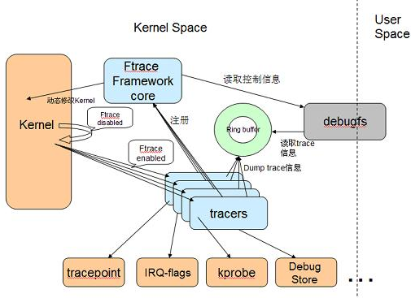
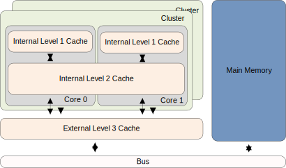
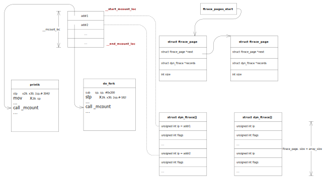
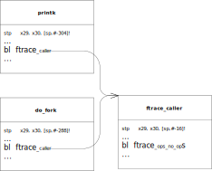

# ftrace
## ftrace简介
### ftrace框架
<div style="text-align: center;">

 <br/>
图1. ftrace框架
</div>

从框架上来看，ftrace很简单，底层是连接了各种各样的tracer，
ftrace将tracer打印的信息，存储到ringbuffer中，然后通过
debugfs和用户态交互，用来控制tracer的行为，以及ringbuffer中
信息的获取。
ftrace实际上就是做了一个对tracer的包装，使其可以
使用ftrace框架，来操作ringbuffer记录数据，使用debugfs和用户态交互。
ftrace其实角色更像是一个中间者。来连接各个tracer和kernel的底层资源。
(很像cgroup)。
其实ftrace并不复杂，复杂的是各个类型的tracer。这里，由于了解有限，
只简单介绍一个tracer实现: **function tracer**。

### ftrace用户态使用
关于ftrace的用户态使用这里不做介绍，可以参考kernel源码中的
doc: <br />
Documentation/trace/ftrace.rst
# function tracer
## 其他知识
### mcount && ftrace
mcount是gcc的一个特性, 通过`gcc -pg`可以在function中加入一个
stub, 我们可以写个小程序测试下:
1. 编写C代码
```C/C++
int main()
{
    return 0;
}
```
2. 将C代码翻译成汇编代码
```
gcc -pg -S  main.c -o main.S
     ^
```
3. 查看`main.S`文件
<details>
<summary>main.S</summary>

```C/C++
        .file   "main.c"
        .text
        .globl  main
        .type   main, @function
main:
.LFB0:
        .cfi_startproc
        pushq   %rbp
        .cfi_def_cfa_offset 16
        .cfi_offset 6, -16
        movq    %rsp, %rbp
        .cfi_def_cfa_register 6
1:      call    mcount				//在这个地方加入了mcount插桩点
        movl    $0, %eax
        popq    %rbp
        .cfi_def_cfa 7, 8
        ret
        .cfi_endproc
.LFE0:
        .size   main, .-main
        .ident  "GCC: (GNU) 8.3.1 20191121 (Red Hat 8.3.1-5)"
        .section        .note.GNU-stack,"",@progbits
```
</details>

这里再函数开始部分执行了`call mcount`指令,
在用户态程序中（连接了GLIBC），glibc库会实现mcount函数。
而内核中是这么做的:
* 使用`gcc -pg`在编译`.c->.o`在函数开始部分插入`call mcount`，
  （x86使用的是`call __fentry(gcc -pg -mfentry`, 这个会在函数运行时更早执行）
* 在编译阶段, 会调用`recordmount`程序扫描ELF header来找到所有`call mcount`指令的
地址，并将这些地址写入到`__mcount_loc`段, 然后覆盖之前的.o中的该段，在链接阶段，
会将所有的这些段合并到一起。在kernel初始化阶段会将这些`call mcount指令`替换成`nop`
指令
(参考Documentation/trace/ftrace.rst)

<details>
<summary>PS: x86 -mfentry编译后汇编代码:</summary>

```C/C++
        .file   "main.c"
        .text
        .globl  main
        .type   main, @function
main:
.LFB0:
        .cfi_startproc
1:      call    __fentry__
        pushq   %rbp
        .cfi_def_cfa_offset 16
        .cfi_offset 6, -16
        movq    %rsp, %rbp
        .cfi_def_cfa_register 6
        movl    $0, %eax
        popq    %rbp
        .cfi_def_cfa 7, 8
        ret
        .cfi_endproc
.LFE0:
        .size   main, .-main
        .ident  "GCC: (GNU) 8.3.1 20191121 (Red Hat 8.3.1-5)"
        .section        .note.GNU-stack,"",@progbits
```
</details>

## self modify code
其实function tracer是通过修改函数中插入的`nop`指令，使之调用
另一个function`ftrace_caller`，这里实际上涉及一个`self modify code`
问题
以arm64为例:
### icache dcache
CPU和主存之间也存在多级高速缓存，一般分为3级，分别是L1, L2和L3。
另外，我们的代码都是由2部分组成：指令和数据。L1 Cache比较特殊，
每个CPU会有2个L1 Cache。分别为指令高速缓存(Instruction Cache，
简称iCache)和数据高速缓存(Data Cache，简称dCache)。L2和L3一般
不区分指令和数据，可以同时缓存指令和数据。

<div style="text-align: center;">


</div>

### 为什么要区分icache dcache
iCache的作用是缓存指令，dCache是缓存数据。为什么我们需要区分数
据和指令呢？原因之一是出于性能的考量。CPU在执行程序时，可以同
时获取指令和数据，做到硬件上的并行，提升性能。另外，指令和数据
有很大的不同。例如，指令一般不会被修改，所以iCache在硬件设计上
是可以是只读的，这在一定程度上降低硬件设计的成本。所以硬件设计
上，系统中一般存在L1 dCache和L1 iCache，L2 Cache和L3 Cache。

### 一致性问题
我们的程序在执行的时候，指令一般是不会修改的。这就不会存在任何
一致性问题。但是，总有些特殊情况。例如`self-modifying code`，
这些代码在执行的时候会修改自己的指令。我们修改指令的步骤如下：
* 将需要修改的指令数据加载到dCache中
* 修改成新指令，写回dCache
实际上当我们`modify code`后, 实际上只是修改了dcache中的数据，而
内存和icache中的指令并没有改变，这样就造成了同步问题。
### 如何解决
一般来说都是由软件来维护cache的一致性, 在arm-A8手册中有详细说明:
`Example G4-1 Cache cleaning operations for self-modifying code`
详细指令为:
```
STR Rt, [Rn]
DCCMVAU Rn ; Clean data cache by MVA to point of unification (PoU)
DSB ; Ensure visibility of the data cleaned from cache
ICIMVAU Rn ; Invalidate instruction cache by MVA to PoU
BPIMVA Rn ; Invalidate branch predictor by MVA to PoU
DSB ; Ensure completion of the invalidations
ISB ; Synchronize the fetched instruction stream
```
1. dc指令clean data cache
2. dsb 确保clean data cache已经完成
3. ic指令invalidate inc cache
4. dsb确保ic指令执行完成
5. isb同步获取的指令流

## function tracer init相关流程
### 获取mcount指令
在我们设置function tracer跟踪器时，相当于会修改大部分function code中的
`nop`->`call ftrace_caller`，kernel是如何索引到这些地址的呢？实际上和
刚刚我们提到的`recordmoount`程序有关系
而其实在kernel初始化时，需要将`bl _mcount`替换成`nop`达到最小的性能损耗。
我们来看下代码:
```C/C++
//===========include/asm-generic/vmlinux.lds.h=============
#ifdef CONFIG_FTRACE_MCOUNT_RECORD
#define MCOUNT_REC()    . = ALIGN(8);               \
            __start_mcount_loc = .;         \
            KEEP(*(__mcount_loc))           \
            __stop_mcount_loc = .;
void __init ftrace_init(void)
{
    extern unsigned long __start_mcount_loc[];
    extern unsigned long __stop_mcount_loc[];
    unsigned long count, flags;
    int ret;
    local_irq_save(flags);
    ret = ftrace_dyn_arch_init();
    local_irq_restore(flags);
    if (ret)
        goto failed;
    count = __stop_mcount_loc - __start_mcount_loc;		//这两个地址区间, 存储这所有stub的地址
    if (!count) {
        pr_info("ftrace: No functions to be traced?\n");
        goto failed;
    }
    pr_info("ftrace: allocating %ld entries in %ld pages\n",
        count, count / ENTRIES_PER_PAGE + 1);
    last_ftrace_enabled = ftrace_enabled = 1;
    ret = ftrace_process_locs(NULL,
                  __start_mcount_loc,
                  __stop_mcount_loc);
    set_ftrace_early_filters();
    return;
 failed:
    ftrace_disabled = 1;
}
```
`ftrace_process_locs`
该函数比较长我们来分段看
```C/C++
static int ftrace_process_locs(struct module *mod,
                   unsigned long *start,
                   unsigned long *end)
{
    struct ftrace_page *start_pg;
    struct ftrace_page *pg;
    struct dyn_ftrace *rec;
    unsigned long count;
    unsigned long *p;
    unsigned long addr;
    unsigned long flags = 0; /* Shut up gcc */
    int ret = -ENOMEM;
    count = end - start;
    if (!count)
        return 0;
	//将这些地址做了排序
    sort(start, count, sizeof(*start),
         ftrace_cmp_ips, NULL);
	//首先要分配并初始化`ftrace_page` 结构体
    start_pg = ftrace_allocate_pages(count);
    if (!start_pg)
        return -ENOMEM;
	...
```
我们来看下ftrace_pages的结构
```C/C++
struct ftrace_page {
    struct ftrace_page  *next;		//指向下一个ftrace_page
    struct dyn_ftrace   *records;	//指向dyn_ftrace数组
    int         index;				//当前索引值
    int         size;				//大小
};
struct dyn_ftrace {
    unsigned long       ip; /* address of mcount call-site */ //stub指令地址
    unsigned long       flags;
    struct dyn_arch_ftrace  arch;
};
```
我们再来看下ftrace_allocate_pages
```C/C++
static struct ftrace_page *
ftrace_allocate_pages(unsigned long num_to_init)
{
    struct ftrace_page *start_pg;
    struct ftrace_page *pg;
    int order;
    int cnt;
    if (!num_to_init)
        return 0;
	//分配start_pg内存
    start_pg = pg = kzalloc(sizeof(*pg), GFP_KERNEL);
    if (!pg)
        return NULL;
    /*
     * Try to allocate as much as possible in one continues
     * location that fills in all of the space. We want to
     * waste as little space as possible.
     */
    for (;;) {
        cnt = ftrace_allocate_records(pg, num_to_init);	//分配records，也就是dyn_ftrace
        if (cnt < 0)
            goto free_pages;
        num_to_init -= cnt;								//这里可能分配了一部分，还需要再分配
        if (!num_to_init)
            break;
        pg->next = kzalloc(sizeof(*pg), GFP_KERNEL);	//修改next指向
        if (!pg->next)
            goto free_pages;
        pg = pg->next;
    }
    return start_pg;
 free_pages:											//内存分配失败流程
    pg = start_pg;
    while (pg) {
        order = get_count_order(pg->size / ENTRIES_PER_PAGE);
        free_pages((unsigned long)pg->records, order);
        start_pg = pg->next;
        kfree(pg);
        pg = start_pg;
    }
    pr_info("ftrace: FAILED to allocate memory for functions\n");
    return NULL;
}
```
从上面的流程可以看出`ftrace_allocate_records`可能分配了部分，相当于可能分阶段分配
我们来看下这个函数的流程
```C/C++
static int ftrace_allocate_records(struct ftrace_page *pg, int count)
{
    int order;
    int cnt;
    if (WARN_ON(!count))
        return -EINVAL;
	//get older
    order = get_count_order(DIV_ROUND_UP(count, ENTRIES_PER_PAGE));
    /*
     * We want to fill as much as possible. No more than a page
     * may be empty.
     */
	//这里保证不能有一个以上的整页空着
    while ((PAGE_SIZE << ordee) / ENTRY_SIZE >= count + ENTRIES_PER_PAGE)
        order--;
 again:
    pg->records = (void *)__get_free_pages(GFP_KERNEL | __GFP_ZERO, order);
    if (!pg->records) {		//内存分配失败可能会导致older--
        /* if we can't allocate this size, try something smaller */
        if (!order)
            return -ENOMEM;
        order >>= 1;
        goto again;
    }
    cnt = (PAGE_SIZE << order) / ENTRY_SIZE;
    pg->size = cnt;		//设置size
    if (cnt > count)
        cnt = count;
    return cnt;
}
```
这里导致没有分配count那么多(older--)的原因主要有两个:
* 分配连续页内存时，会造成一页以上的内存空余。
* 内存不够，减小内存分配
我们接着看`ftrace_process_locs`剩下的部分:
```C/C++
static int ftrace_process_locs(struct module *mod,
                   unsigned long *start,
                   unsigned long *end)
{
...
     mutex_lock(&ftrace_lock);
     /*
      * Core and each module needs their own pages, as
      * modules will free them when they are removed.
      * Force a new page to be allocated for modules.
      */
     if (!mod) {
         WARN_ON(ftrace_pages || ftrace_pages_start);
         /* First initialization */
		//如果不是模块的话, 设置ftrace_pages_start和start_pg
         ftrace_pages = ftrace_pages_start = start_pg;
     } else {
         if (!ftrace_pages)
             goto out;
         if (WARN_ON(ftrace_pages->next)) {
             /* Hmm, we have free pages? */
             while (ftrace_pages->next)
                 ftrace_pages = ftrace_pages->next;
         }
         ftrace_pages->next = start_pg;
     }
     p = start;
     pg = start_pg;
     while (p < end) {
         addr = ftrace_call_adjust(*p++);
         /*
          * Some architecture linkers will pad between
          * the different mcount_loc sections of different
          * object files to satisfy alignments.
          * Skip any NULL pointers.
          */
         if (!addr)
             continue;
         if (pg->index == pg->size) {		//刚刚初始化完，pg->index都是0
             /* We should have allocated enough */
             if (WARN_ON(!pg->next))
                 break;
             pg = pg->next;
         }
		 //根据__mcount_slot段中的内容，初始化dyn_ftrace 中的ip值
         rec = &pg->records[pg->index++];
         rec->ip = addr;
     }
    /* We should have used all pages */
    WARN_ON(pg->next);
    /* Assign the last page to ftrace_pages */
    ftrace_pages = pg;
    /*
     * We only need to disable interrupts on start up
     * because we are modifying code that an interrupt
     * may execute, and the modification is not atomic.
     * But for modules, nothing runs the code we modify
     * until we are finished with it, and there's no
     * reason to cause large interrupt latencies while we do it.
     */
    if (!mod)
        local_irq_save(flags);
	//去modify code, 将call _mcount ==> nop指令
    ftrace_update_code(mod, start_pg);
    if (!mod)
        local_irq_restore(flags);
    ret = 0;
 out:
    mutex_unlock(&ftrace_lock);
    return ret;
}
```
上面主要是做了两个事情:
* 更新ftrace_page->dyn_ftrace[].ip
* ftrace_update_code  将`call _mcount`指令替换为`nop`指令
我们通过上面的流程可以得到下图:

## init trace debugfs file
调用堆栈
```
tracer_init_tracefs
	ftrace_init_tracefs_toplevel
		ftrace_init_dyn_tracefs
			ftrace_create_filter_files
```
查看`ftrace_create_function_file`代码
```C/C++
int ftrace_create_function_file(struct trace_array *tr,
                 struct dentry *parent)
{
	trace_create_file("set_ftrace_filter", 0644, parent,
          ops, &ftrace_filter_fops);
	trace_create_file("set_ftrace_notrace", 0644, parent,
	          ops, &ftrace_notrace_fops);
}
```
`trace_create_file` 就是ftrace为tracer提供的接口，用于
创建debugfs文件
这里就不再展开。

## function tracer被设置相关流程
在用户态执行
`echo function > /sys/kernel/debug/tracing/current_tracer`
会设置当前的跟踪器为`function`跟踪器。
在`init_tracer_tracefs`中会注册该文件 `struct file_operations`

```C/C++
/*
调用堆栈为:
tracer_init_tracefs
   init_tracer_tracefs
*/
static void
init_tracer_tracefs(struct trace_array *tr, struct dentry *d_tracer)
{
    ...
    //tr 实际上是inode->i_private
    trace_create_file("current_tracer", 0644, d_tracer,
        tr, &set_tracer_fops);
    ...
}
//set trace
static const struct file_operations set_tracer_fops = {
    .open       = tracing_open_generic,
    .read       = tracing_set_trace_read,
    .write      = tracing_set_trace_write,
    .llseek     = generic_file_llseek,
};
```
### open
我们来看下`tracing_open_generic`
```C/C++
int tracing_open_generic(struct inode *inode, struct file *filp)
{
    if (tracing_disabled)
        return -ENODEV;
  	//将inode->i_private赋值给filp->private_data，实际上是struct trace_array
    filp->private_data = inode->i_private;
    return 0;
}
```
### write
我们来看下`tracing_set_trace_write`:
```C/C++
static ssize_t
tracing_set_trace_write(struct file *filp, const char __user *ubuf,
            size_t cnt, loff_t *ppos)
{
    struct trace_array *tr = filp->private_data;
    char buf[MAX_TRACER_SIZE+1];
    int i;
    size_t ret;
    int err;
    ret = cnt;
    if (cnt > MAX_TRACER_SIZE)
        cnt = MAX_TRACER_SIZE;
	//将用户空间字符串copy到内核空间
    if (copy_from_user(buf, ubuf, cnt))  //ubuf实际上是"function"
        return -EFAULT;
    buf[cnt] = 0;
    /* strip ending whitespace. */
    for (i = cnt - 1; i > 0 && isspace(buf[i]); i--)
        buf[i] = 0;
	//主要调用tracing_set_tracer
    err = tracing_set_tracer(tr, buf);
    if (err)
        return err;
    *ppos += ret;
    return ret;
}
```
`tracing_set_tracer`函数比较长，我们分段来看:
```C/C++
static int tracing_set_tracer(struct trace_array *tr, const char *buf)
{
    struct tracer *t;
#ifdef CONFIG_TRACER_MAX_TRACE
    bool had_max_tr;
#endif
    int ret = 0;
    mutex_lock(&trace_types_lock);
	//假如说之前是nop的话，可能不需要多大的
	//ringbuffer空间, 现在有了tracer后，需要扩充下ringbuffer空间
    if (!ring_buffer_expanded) {
        ret = __tracing_resize_ring_buffer(tr, trace_buf_size,
                        RING_BUFFER_ALL_CPUS);
        if (ret < 0)
            goto out;
        ret = 0;
    }
	//从trace_types链表中寻找function跟踪器
    for (t = trace_types; t; t = t->next) {
		//找到了直接break
        if (strcmp(t->name, buf) == 0)
            break;
    }
    if (!t) {
        ret = -EINVAL;
        goto out;
    }
	//如果发现function跟踪器，是当前跟踪器，直接goto out
    if (t == tr->current_trace)
        goto out;
	/* Some tracers won't work on kernel command line */
	//该trace被设置了在小于SYSTEM_RUNNING状态时，不能运行, 例如mmio_tracer
	if (system_state < SYSTEM_RUNNING && t->noboot) {
	    pr_warn("Tracer '%s' is not allowed on command line, ignored\n",
	        t->name);
	    goto out;
	}
	//只能运行于top level buffer， 这个trace_array的level不是很理解，需要再看下
	/* Some tracers are only allowed for the top level buffer */
	if (!trace_ok_for_array(t, tr)) {
	    ret = -EINVAL;
	    goto out;
	}
	//查看当前的tracer有没有被使用(有人在读trace_pipe文件)
	/* If trace pipe files are being read, we can't change the tracer */
	if (tr->current_trace->ref) {
	    ret = -EBUSY;
	    goto out;
	}
	...
```
上面主要做了三个事请:
* 扩充ringbuffer空间
* 从trace_types中查找需设置的跟踪器
* 做一些检查
我们接着看该函数
```C/C++
static int tracing_set_tracer(struct trace_array *tr, const char *buf)
{
	...
    tr->current_trace->enabled--; 	//enabled--, 表示该tracer不再使用了
    if (tr->current_trace->reset)
        tr->current_trace->reset(tr); 	//调用reset, 清空该tracer的一些资源
    /* Current trace needs to be nop_trace before synchronize_sched */
    tr->current_trace = &nop_trace;		//将current tracer临时设置为nop tracer
#ifdef CONFIG_TRACER_MAX_TRACE          //和trace snapshot有关, 先不了解
    had_max_tr = tr->allocated_snapshot;
    if (had_max_tr && !t->use_max_tr) {
        /*
         * We need to make sure that the update_max_tr sees that
         * current_trace changed to nop_trace to keep it from
         * swapping the buffers after we resize it.
         * The update_max_tr is called from interrupts disabled
         * so a synchronized_sched() is sufficient.
         */
        synchronize_sched();
        free_snapshot(tr);
    }
#endif
#ifdef CONFIG_TRACER_MAX_TRACE
    if (t->use_max_tr && !had_max_tr) {
        ret = tracing_alloc_snapshot_instance(tr);
        if (ret < 0)
            goto out;
    }
#endif
    if (t->init) {
        ret = tracer_init(t, tr);	//调用init
        if (ret)
            goto out;a dump_stack
    }
    tr->current_trace = t;         //设置current_trace
    tr->current_trace->enabled++;	//enable++
    trace_branch_enable(tr);
 out:
    mutex_unlock(&trace_types_lock);
    return ret;
}
```
上面代码主要是在将当前tracer替换成需要设置的tracer，
需要调用old_trace->reset, 并调用new_trace->init
我们看下function trace->init()函数, 实际上是`function_trace_init`
在这个函数中我们可以找到，和ftrace function 替换指令的相关细节流程.

### function_trace_init

```C/C++
static int function_trace_init(struct trace_array *tr)
{
    ftrace_func_t func;
    /*
     * Instance trace_arrays get their ops allocated
     * at instance creation. Unless it failed
     * the allocation.
     */
    if (!tr->ops)
        return -ENOMEM;
    /* Currently only the global instance can do stack tracing */
	//首先是global instance, 其次设置了TRACE_FUNC_OPT_STACK
	//关于trace_opt相关内容不做介绍，其实就是操作的下面的文件
	//sys/kernel/debug/tracing/options/func_stack_trace
    if (tr->flags & TRACE_ARRAY_FL_GLOBAL &&
        func_flags.val & TRACE_FUNC_OPT_STACK)
        func = function_stack_trace_call;
    else
		//没有设置的情况下会走这个
        func = function_trace_call;
	//会将tr->ops->func设置为func，实际上将global_ops->func赋值为function_trace_call
    ftrace_init_array_ops(tr, func);
    tr->trace_buffer.cpu = get_cpu();
    put_cpu();
	//这个里面会设置些和cmdline record相关的流程
    tracing_start_cmdline_record();
	//在这里面做基本的初始化操作
    tracing_start_function_trace(tr);
    return 0;
}
static void tracing_start_function_trace(struct trace_array *tr)
{
    tr->function_enabled = 0;
    register_ftrace_function(tr->ops);
    tr->function_enabled = 1;
}
int register_ftrace_function(struct ftrace_ops *ops)
{
    int ret = -1;
    ftrace_ops_init(ops);
    mutex_lock(&ftrace_lock);
	//主要在这个函数中, 进行的初始化
    ret = ftrace_startup(ops, 0);
    mutex_unlock(&ftrace_lock);
    return ret;
}
static int ftrace_startup(struct ftrace_ops *ops, int command)
{
    int ret;
	//ops是tr->ops ==global_ops
    if (unlikely(ftrace_disabled))
        return -ENODEV;
	//这里面会更新ops->func
    ret = __register_ftrace_function(ops);
    if (ret)
        return ret;
    ftrace_start_up++;
    /*
     * Note that ftrace probes uses this to start up
     * and modify functions it will probe. But we still
     * set the ADDING flag for modification, as probes
     * do not have trampolines. If they add them in the
     * future, then the probes will need to distinguish
     * between adding and updating probes.
     */
    ops->flags |= FTRACE_OPS_FL_ENABLED | FTRACE_OPS_FL_ADDING;
    ret = ftrace_hash_ipmodify_enable(ops);
    if (ret < 0) {
        /* Rollback registration process */
        __unregister_ftrace_function(ops);
        ftrace_start_up--;
        ops->flags &= ~FTRACE_OPS_FL_ENABLED;
        return ret;
    }
    if (ftrace_hash_rec_enable(ops, 1))
        command |= FTRACE_UPDATE_CALLS;
    ftrace_startup_enable(command);
    ops->flags &= ~FTRACE_OPS_FL_ADDING;
    return 0;
}
```
`__register_ftrace_function`

```C/C++
static int __register_ftrace_function(struct ftrace_ops *ops)
{
	if (ops->flags & FTRACE_OPS_FL_DELETED)
		return -EINVAL;
	if (WARN_ON(ops->flags & FTRACE_OPS_FL_ENABLED))
		return -EBUSY;
#ifndef CONFIG_DYNAMIC_FTRACE_WITH_REGS
	/*
	 * If the ftrace_ops specifies SAVE_REGS, then it only can be used
	 * if the arch supports it, or SAVE_REGS_IF_SUPPORTED is also set.
	 * Setting SAVE_REGS_IF_SUPPORTED makes SAVE_REGS irrelevant.
	 */
	if (ops->flags & FTRACE_OPS_FL_SAVE_REGS &&
	    !(ops->flags & FTRACE_OPS_FL_SAVE_REGS_IF_SUPPORTED))
		return -EINVAL;
	if (ops->flags & FTRACE_OPS_FL_SAVE_REGS_IF_SUPPORTED)
		ops->flags |= FTRACE_OPS_FL_SAVE_REGS;
#endif
	if (!core_kernel_data((unsigned long)ops))
		ops->flags |= FTRACE_OPS_FL_DYNAMIC;
    //将ops 加入到ftrace_ops_list中
	add_ftrace_ops(&ftrace_ops_list, ops);
    //前面主要在判断flags和设置flags
	/* Always save the function, and reset at unregistering */
	ops->saved_func = ops->func;
	if (ftrace_pids_enabled(ops))
		ops->func = ftrace_pid_func;
    
    //arm中这个函数为空
	ftrace_update_trampoline(ops);
	if (ftrace_enabled)
		update_ftrace_function();
	return 0;
}
```
`upodate_ftrace_function`
该函数比较长, 我们分段来看
```C/C++
static void update_ftrace_function(void)
{
	ftrace_func_t func;
	/*
	 * Prepare the ftrace_ops that the arch callback will use.
	 * If there's only one ftrace_ops registered, the ftrace_ops_list
	 * will point to the ops we want.
	 */
	set_function_trace_op = rcu_dereference_protected(ftrace_ops_list,
						lockdep_is_held(&ftrace_lock));
	/* If there's no ftrace_ops registered, just call the stub function */
	if (set_function_trace_op == &ftrace_list_end) {    //没有ftrace_ops注册, func为ftrace_stub
		func = ftrace_stub;
	/*
	 * If we are at the end of the list and this ops is
	 * recursion safe and not dynamic and the arch supports passing ops,
	 * then have the mcount trampoline call the function directly.
	 */
	} else if (rcu_dereference_protected(ftrace_ops_list->next,
			lockdep_is_held(&ftrace_lock)) == &ftrace_list_end) {
        //arm64 function tracer 执行的是这里, 赋值的func为ftrace_ops_no_ops
		func = ftrace_ops_get_list_func(ftrace_ops_list);
	} else {
		/* Just use the default ftrace_ops */
		set_function_trace_op = &ftrace_list_end;
		func = ftrace_ops_list_func;
	}
```

上面其实就是在选择func， arm64 选择的为`ftrace_ops_no_ops`

```C/C++
static void update_ftrace_function(void)
{
    ...
	update_function_graph_func();
	/* If there's no change, then do nothing more here */
	if (ftrace_trace_function == func)
		return;
	/*
	 * If we are using the list function, it doesn't care
	 * about the function_trace_ops.
	 */
	if (func == ftrace_ops_list_func) {     //更新ftrace_trace_function
		ftrace_trace_function = func;
		/*
		 * Don't even bother setting function_trace_ops,
		 * it would be racy to do so anyway.
		 */
		return;
	}
    //下面的流程是在不支持动态ftrace中执行的
#ifndef CONFIG_DYNAMIC_FTRACE
	/*
	 * For static tracing, we need to be a bit more careful.
	 * The function change takes affect immediately. Thus,
	 * we need to coorditate the setting of the function_trace_ops
	 * with the setting of the ftrace_trace_function.
	 *
	 * Set the function to the list ops, which will call the
	 * function we want, albeit indirectly, but it handles the
	 * ftrace_ops and doesn't depend on function_trace_op.
	 */
	ftrace_trace_function = ftrace_ops_list_func;
	/*
	 * Make sure all CPUs see this. Yes this is slow, but static
	 * tracing is slow and nasty to have enabled.
	 */
	schedule_on_each_cpu(ftrace_sync);
	/* Now all cpus are using the list ops. */
	function_trace_op = set_function_trace_op;
	/* Make sure the function_trace_op is visible on all CPUs */
	smp_wmb();
	/* Nasty way to force a rmb on all cpus */
	smp_call_function(ftrace_sync_ipi, NULL, 1);
	/* OK, we are all set to update the ftrace_trace_function now! */
#endif /* !CONFIG_DYNAMIC_FTRACE */
	ftrace_trace_function = func;
}
```

在上面的函数执行完后, `ftrace_trace_function`被赋值成`ftrace_ops_list_func`
即`ftrace_ops_no_ops`

```C/C++
static void ftrace_ops_no_ops(unsigned long ip, unsigned long parent_ip); 
```

`__register_ftrace_function`执行完后，返回到`ftrace_startup`函数中执行
`ftrace_startup_enable`去modify函数代码
```C/C++
static void ftrace_startup_enable(int command)
{
	if (saved_ftrace_func != ftrace_trace_function) {   //这里saved_ftrace_func改变了
		saved_ftrace_func = ftrace_trace_function;
		command |= FTRACE_UPDATE_TRACE_FUNC;            //command会赋值，表示更新_mcount或ftrace_caller中的ftrace_call函数
	}
	if (!command || !ftrace_enabled)
		return;
    //在这里会执行modify code
	ftrace_run_update_code(command);
}
static void ftrace_run_update_code(int command)
{
	int ret;
	ret = ftrace_arch_code_modify_prepare();
	FTRACE_WARN_ON(ret);
	if (ret)
		return;
	/*
	 * By default we use stop_machine() to modify the code.
	 * But archs can do what ever they want as long as it
	 * is safe. The stop_machine() is the safest, but also
	 * produces the most overhead.
	 */
	arch_ftrace_update_code(command);
	ret = ftrace_arch_code_modify_post_process();
	FTRACE_WARN_ON(ret);
}
```
`arch_ftrace_update_code`会modify code，默认是通过stop_machine来modify
code，这样相当于使各个cpu stop， 等待该CPU modify code完成，并且其他CPU
也完成cache flush操作，在继续执行，比较安全，但是性能代价比较高。
```C/C++
//从这里也可以看出来，是一个弱连接
void __weak arch_ftrace_update_code(int command)
{
    ftrace_run_stop_machine(command);
}
```
所以不同的arch可以实现自己的`arch_ftrace_update_code`, arm64之前也是用的
是default, 但是又来自己实现了一个:
```C/C++
void arch_ftrace_update_code(int command)
{
    ftrace_modify_all_code(command);
}
```

`ftrace_modify_all_code`比较长，我们分段看
```C/C++
void ftrace_modify_all_code(int command)
{
	int update = command & FTRACE_UPDATE_TRACE_FUNC;
	int err = 0;
	/*
	 * If the ftrace_caller calls a ftrace_ops func directly,
	 * we need to make sure that it only traces functions it
	 * expects to trace. When doing the switch of functions,
	 * we need to update to the ftrace_ops_list_func first
	 * before the transition between old and new calls are set,
	 * as the ftrace_ops_list_func will check the ops hashes
	 * to make sure the ops are having the right functions
	 * traced.
	 */
	if (update) {       //ftrace_caller会直接调用ftrace_ops
		err = ftrace_update_ftrace_func(ftrace_ops_list_func);
		if (FTRACE_WARN_ON(err))
			return;
	}
	if (command & FTRACE_UPDATE_CALLS)
		ftrace_replace_code(1);     //更新每个function中的nop -> call ftrace_caller
	else if (command & FTRACE_DISABLE_CALLS)
		ftrace_replace_code(0);
    ...
```
从上面可以看出被trace的函数首先会调用`ftrace_caller`，然后再`ftrace_caller`中再调用
`ftrace_ops_list_func`
我们先来看下`ftrace_caller`

```C/C++
ENTRY(ftrace_caller)
	mcount_enter
	mcount_get_pc0	x0		//     function's pc
	mcount_get_lr	x1		//     function's lr
	.global ftrace_call
ftrace_call:				// tracer(pc, lr);
	nop				// This will be replaced with "bl xxx"
					// where xxx can be any kind of tracer.
#ifdef CONFIG_FUNCTION_GRAPH_TRACER
	.global ftrace_graph_call
ftrace_graph_call:			// ftrace_graph_caller();
	nop				// If enabled, this will be replaced
					// "b ftrace_graph_caller"
#endif
	mcount_exit
ENDPROC(ftrace_caller)
```

我们来看下`ftrace_caller` `mcount_get_pc0` `mcount_get_lr`等函数

```C/C++
.macro mcount_enter
stp	x29, x30, [sp, #-16]!
mov	x29, sp
.endm
.macro mcount_get_pc0 reg
mcount_adjust_addr  \reg, x30   这个实际上取得的是调用ftrace的pc值
.endm
.macro mcount_get_lr reg
ldr	\reg, [x29]                 x29表示上一层栈的栈顶
ldr	\reg, [\reg, #8]            +8 实际上是上层的pc值，也就是function lr
mcount_adjust_addr	\reg, \reg
.endm
```

那么实际上会形成下面的调用栈

```
code    ------------printk                   stack
                                             ...      +304      -->栈底 printk
        stp     x29, x30, [sp,#-304]!        ...
        mov     x29, sp                      x30      +8        parent ip
        ...                           +----> x29      +0        -->栈顶 printk
        call ftrace_caller            |        
                                      |        
        ------------ftrace caller     |                         -->ftrace_caller stack
        stp x29, x30, [sp, #-16]!     |       x30      LR存储的是上个ret返回地址，也就是上个function时的pc
        mov x29, sp                   +-------x29      x29存储的是上个函数的栈顶
        get x30 -> x0                       
        get [[x29], #8] ->x1
        ...
        ----
```

而获取到的ip 和parent ip 复制到x0 x1 作为参数传递到ftrace_call所在指令的函数中：
其实`ftrace_call`所在的地址是作为一个stub点存在的, 该处的nop指令可以替换成需要
的函数。

我们再来看下`ftrace_update_ftrace_func`相关函数
```C/C++
int ftrace_update_ftrace_func(ftrace_func_t func)
{
	unsigned long pc;
	u32 new;

	pc = (unsigned long)&ftrace_call;                   //需要替换的指令
	new = aarch64_insn_gen_branch_imm(pc, (unsigned long)func,
					  AARCH64_INSN_BRANCH_LINK);        //得到一个新的跳转指令相当于call ftrace_caller

	return ftrace_modify_code(pc, 0, new, false);
}

static int ftrace_modify_code(unsigned long pc, u32 old, u32 new,
			      bool validate)
{
	u32 replaced;

	/*
	 * Note:
	 * We are paranoid about modifying text, as if a bug were to happen, it
	 * could cause us to read or write to someplace that could cause harm.
	 * Carefully read and modify the code with aarch64_insn_*() which uses
	 * probe_kernel_*(), and make sure what we read is what we expected it
	 * to be before modifying it.
	 */
	if (validate) {         //这里实际上执行不到
		if (aarch64_insn_read((void *)pc, &replaced))
			return -EFAULT;

		if (replaced != old)
			return -EINVAL;
	}
	if (aarch64_insn_patch_text_nosync((void *)pc, new))
		return -EPERM;

	return 0;
}
```
`aarch64_insn_patch_text_nosync`函数的作用是更新text段中的代码，并且无需进行同步
进行。

```C/C++
int __kprobes aarch64_insn_patch_text_nosync(void *addr, u32 insn)
{
	u32 *tp = addr;
	int ret;

	/* A64 instructions must be word aligned */
	if ((uintptr_t)tp & 0x3)
		return -EINVAL;

	ret = aarch64_insn_write(tp, insn);
	if (ret == 0)
		flush_icache_range((uintptr_t)tp,
				   (uintptr_t)tp + AARCH64_INSN_SIZE);

	return ret;
}

```

这里就涉及之前所说的，self-modify code后，flush icache 的操作了，这里不再展开

这个时候已经修改好 `ftrace_caller`中`ftrace_call`处的`nop`指令为`call ftrace_ops_no_ops`
接下来需要修改各个函数中的`nop`指令

返回`ftrace_modify_call_code`代码:
```C/C++
void ftrace_modify_all_code(int command)
{
    ...
	if (command & FTRACE_UPDATE_CALLS)      //走的这个分支
		ftrace_replace_code(1);
	else if (command & FTRACE_DISABLE_CALLS)
		ftrace_replace_code(0);
    ...
}

void __weak ftrace_replace_code(int enable)     //arm64实际上走的这个分支
{
	struct dyn_ftrace *rec;
	struct ftrace_page *pg;
	int failed;

	if (unlikely(ftrace_disabled))
		return;
/*
#define do_for_each_ftrace_rec(pg, rec)					\
	for (pg = ftrace_pages_start; pg; pg = pg->next) {		\
		int _____i;						\
		for (_____i = 0; _____i < pg->index; _____i++) {	\
			rec = &pg->records[_____i];
*/
	do_for_each_ftrace_rec(pg, rec) {

		if (rec->flags & FTRACE_FL_DISABLED)
			continue;

		failed = __ftrace_replace_code(rec, enable);
		if (failed) {
			ftrace_bug(failed, rec);
			/* Stop processing */
			return;
		}
	} while_for_each_ftrace_rec();
}
```
根据ftrace_pages_start遍历所有的 struct dyn_ftrace，然后再调用__Ftrace_replace_code

```C/C++
static int
__ftrace_replace_code(struct dyn_ftrace *rec, int enable)
{
	unsigned long ftrace_old_addr;
	unsigned long ftrace_addr;
	int ret;

	ftrace_addr = ftrace_get_addr_new(rec);

	/* This needs to be done before we call ftrace_update_record */
	ftrace_old_addr = ftrace_get_addr_curr(rec);

	ret = ftrace_update_record(rec, enable);

	ftrace_bug_type = FTRACE_BUG_UNKNOWN;

	switch (ret) {
	case FTRACE_UPDATE_IGNORE:
		return 0;

	case FTRACE_UPDATE_MAKE_CALL:
		ftrace_bug_type = FTRACE_BUG_CALL;
		return ftrace_make_call(rec, ftrace_addr);

	case FTRACE_UPDATE_MAKE_NOP:
		ftrace_bug_type = FTRACE_BUG_NOP;
		return ftrace_make_nop(NULL, rec, ftrace_old_addr);

	case FTRACE_UPDATE_MODIFY_CALL:
		ftrace_bug_type = FTRACE_BUG_UPDATE;
		return ftrace_modify_call(rec, ftrace_old_addr, ftrace_addr);
	}

	return -1; /* unknow ftrace bug */
}
```

这里首先获取了`ftrace_addr`的地址, 然后根据当前的`dyn_ftrace`做一些flags位检查:
然后去走不同的流程，而将nop tracer修改为function tracer 走的流程是FTRACE_UPDATE_MAKE_CALL

该函数不再展开，实际上和上面的流程差不多

执行到现在，ftrace modify code的流程基本完成了, `ftrace_modify_all_code`剩余的代码只是做一些特殊
情况的处理，不再展开。

被设置function 跟踪器的函数调用如下图所示:



