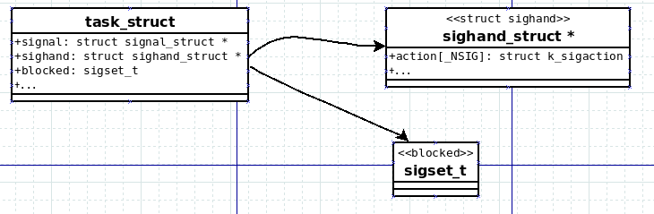

# 简述
signal是linux进程间通信方式中唯一的一种异步通信方式，可以打乱进程的
代码执行顺序，当进程收到一个信号时，并且该信号是可捕捉又设置了相关
的信号处理函数, 进程会中断当前的代码执行，去执行信号处理函数。实际上，
这很像中断，而kernel在实现signal机制的时候，也是仿照的中断去设计的。
在介绍相关数据结构时, 会结合中断机制介绍他们的异同。

signal有一大部分的需求是给用户态使用，让其实现异步的通信。另外一部分
需求是让内核作为信号的发送者，去控制进程的行为，例如当进程发生段错误
时，kernel 会给当前进程发送一个SIGSEGV信号。那先来简单看下主要的几个
系统调用，了解下signal机制的需求。

# 系统调用简介
## kill - 信号发送
用户态程序可以调用kill系统效用来向其他进程发送信号。

```C/C++
SYSCALL_DEFINE2(kill, pid_t, pid, int, sig)
```
|参数类型|参数|解释|
|--|--|--|
|pid_t|pid|接收信号的进程|
|int|sig|发送的信号类型|

## signal - 设置信号处理函数
用于设置信号处理函数。
```
SYSCALL_DEFINE2(signal, int, sig, __sighandler_t, handler)
```
|参数类型|参数|解释|
|--|--|--|
|int|sig|设置的信号类型|
|__sighandler_t|handler|信号处理函数指针|
其中`__sighandler_t`该类型的声明为:

```C/C++
typedef void __signalfn_t(int);
typedef __signalfn_t __user *__sighandler_t;
```

## ssetmask - 设置信号屏蔽掩码
用于设置信号掩码
```
SYSCALL_DEFINE1(ssetmask, int, newmask) 
```
|参数类型|参数|解释|
|--|--|--|
|int|newmask|掩码,　这里的掩码类型是一个 32位的整形类型|

从上面的系统调用可以看出，用户态进程可以通过`signal`设置
信号处理函数来处理信号，并且可以使用`ssetmask`设置屏蔽掩
码屏蔽相关信号，并且可以通过kill等相关系统调用发送信号给
其他进程．

这差不多就是用户态接口的需求．

# 数据结构


* 因为信号处理是和每个进程相关系的，所以信号相关数据结构都
  保存在`task_struct`结构体中
* sighand数据成员实际上是一个函数指针数组，每一个函数指针指
  向该信号的处理函数．
* blocked成员用来描述信号的屏蔽掩码. `sigset_t`数据类型定义为:
  `typedef unsigned long sigset_t;`

**NOTE**: 所以无论是从需求还是从实现看来，信号的实际上是
  对应了中断系统，主要是体现在下面的方面:
1) 需求端:
    * 信号从需求上是为了实现对进程的异步控制，而中断或异常是
    为了实现对CPU的异步控制．
2) 实现端:
    * 信号处理函数对应异常处理handle
    * 信号屏蔽掩码对应异常处理

# 内核代码流程
## 发送信号
向进程发送信号主要有两个主体:
1) 进程之间发送信号，例如刚刚提到的`kill()`系统调用.
2) 内核向进程发送信号，例如段错误机制.

我们都来看下.
### kill()系统调用流程

<details>
<summary>kill() && kill_something_info()</summary>

```C/C++
SYSCALL_DEFINE2(kill, pid_t, pid, int, sig)
{
	struct kernel_siginfo info;
    //memset(0)
	clear_siginfo(&info);
    //信号id
	info.si_signo = sig;
	info.si_errno = 0;
    //表明是用户态触发的
	info.si_code = SI_USER;
    /* 
     * 和namespace相关，主要是找到进程的pid和uid
     */
	info.si_pid = task_tgid_vnr(current);
	info.si_uid = from_kuid_munged(current_user_ns(), current_uid());

	return kill_something_info(sig, &info, pid);
}

static int kill_something_info(int sig, struct kernel_siginfo *info, pid_t pid)
{
	int ret;

	if (pid > 0) {
		rcu_read_lock();
		ret = kill_pid_info(sig, info, find_vpid(pid));
		rcu_read_unlock();
		return ret;
	}

	/* -INT_MIN is undefined.  Exclude this case to avoid a UBSAN warning */
	if (pid == INT_MIN)
		return -ESRCH;

	read_lock(&tasklist_lock);
    //如果不等于-1的情况
	if (pid != -1) {
        //(pid < 0 && pid != -1) && (pid == 0)
		ret = __kill_pgrp_info(sig, info,
				pid ? find_vpid(-pid) : task_pgrp(current));
	} else {
		int retval = 0, count = 0;
		struct task_struct * p;
        //遍历每一个task
		for_each_process(p) {
			if (task_pid_vnr(p) > 1 &&
					!same_thread_group(p, current)) {
				int err = group_send_sig_info(sig, info, p,
							      PIDTYPE_MAX);
				++count;
				if (err != -EPERM)
					retval = err;
			}
		}
		ret = count ? retval : -ESRCH;
	}
	read_unlock(&tasklist_lock);

	return ret;
}
```
</details>
这里针对pid值的不同，分为下面四种情况

|pid值|代表的意义|
|----|----|
|pid>0|将此信号发送给进程ID为pid的进程|
|pid==0|将此信号发送给进程组ID和该进程相同的进程|
|pid<0 |将此信号发送给进程组内进程ID为-pid的进程|
|pd==-1|将此信号发送给系统所有的进程|

PS: 参考链接: 
https://blog.csdn.net/chenbetter1996/article/details/80723453

这里我们只关注pid > 0 的情况, 这个分支发送信号给某个进程/线程组的情况．
几种情况代码路径基本上相同，最终都是给某个进程去发送signal

<details>
<summary>kill_pid_info()</summary>

```C/C++
int kill_pid_info(int sig, struct kernel_siginfo *info, struct pid *pid)
{
	int error = -ESRCH;
	struct task_struct *p;
    /*
     * 关于for()的commit　d36174bc2bce0372693a9cfbdef8b2689c9982cb
     *
     * 我这里理解是这样的，当进程创建了一个线程，然后在此线程执行exec
     * 相关系统调用，其中接收到一个信号，大概过程如下:
     *
     *----------------------------------------------------------------------------------------
     * 进程1                                进程2
     *                                      创建一个线程
     *  kill() 进程2的线程
     *      kill_pid_info()
     *          p = pid_task()
     *                                      调用exec()      这个时候实际上进程2的线程就会被销毁
     *  loop()找到leader
     *----------------------------------------------------------------------------------------
     *
     * 大概如上面这样，当一个进程去创建一个线程，但是该线程去exec时，会销毁进程中除主线程外的
     * 所有线程，那么这个时候如果进程1已经在前面获取到了pid_task()，那么如果线程此时还未销毁，
     * 那么将找到thread_group_leader?
     */
	for (;;) {
		rcu_read_lock();
		p = pid_task(pid, PIDTYPE_PID);
		if (p)
			error = group_send_sig_info(sig, info, p, PIDTYPE_TGID);
		rcu_read_unlock();
		if (likely(!p || error != -ESRCH))
			return error;

		/*
		 * The task was unhashed in between, try again.  If it
		 * is dead, pid_task() will return NULL, if we race with
		 * de_thread() it will find the new leader.
		 */
	}
}

```

</details>

* 和pid相关的代码，大多和pid命名空间有关，但是该部分代码和理清信号递送流程
没有太大关系，不再细述.

* PIDTYPE_TGID定义如下:

```C/C++
enum pid_type
{   
    //process ID
	PIDTYPE_PID,
    //Process Group ID
	PIDTYPE_PGID,
    //Session ID
	PIDTYPE_SID,
#ifndef __GENKSYMS__
    //THREAD GROUP ID
	PIDTYPE_TGID,
#endif
	PIDTYPE_MAX,
#ifdef __GENKSYMS__
	__PIDTYPE_TGID
#endif
};
```
可以看出该type为线程组ID，实际上这里是要把信号
发送给线程组内的所有的thread．

<details>
<summary>group_send_sig_info() *&& do_send_sig_info() && send_signal() </summary>

```C/C++
int group_send_sig_info(int sig, struct kernel_siginfo *info,
			struct task_struct *p, enum pid_type type)
{
	int ret;

	rcu_read_lock();
    //检查是否有权限杀死
	ret = check_kill_permission(sig, info, p);
	rcu_read_unlock();

	if (!ret && sig)
		ret = do_send_sig_info(sig, info, p, type);

	return ret;
}

int do_send_sig_info(int sig, struct kernel_siginfo *info, struct task_struct *p,
			enum pid_type type)
{
	unsigned long flags;
	int ret = -ESRCH;

	if (lock_task_sighand(p, &flags)) {
		ret = send_signal(sig, info, p, type);
		unlock_task_sighand(p, &flags);
	}

	return ret;
}

static int send_signal(int sig, struct kernel_siginfo *info, struct task_struct *t,
			enum pid_type type)
{
	int from_ancestor_ns = 0;

#ifdef CONFIG_PID_NS
	from_ancestor_ns = si_fromuser(info) &&
			   !task_pid_nr_ns(current, task_active_pid_ns(t));
#endif

	return __send_signal(sig, info, t, type, from_ancestor_ns);
}
```
</details>

上面的代码没有什么好说的，最终调用到`__send_signal`接口．

<details>
<summary>send_signal()</summary>

```C/C++
static int __send_signal(int sig, struct kernel_siginfo *info, struct task_struct *t,
			enum pid_type type, int from_ancestor_ns)
{
	struct sigpending *pending;
	struct sigqueue *q;
	int override_rlimit;
	int ret = 0, result;

	assert_spin_locked(&t->sighand->siglock);

	result = TRACE_SIGNAL_IGNORED;
	if (!prepare_signal(sig, t,
			from_ancestor_ns || (info == SEND_SIG_PRIV)))
		goto ret;
    /* 
     * 如果 != PIDTYPE_PID, 就使用t->signal->shared_pending
     * 这个shared_pending是多个task_struct 公用
     */
	pending = (type != PIDTYPE_PID) ? &t->signal->shared_pending : &t->pending;
	/*
	 * Short-circuit ignored signals and support queuing
	 * exactly one non-rt signal, so that we can get more
	 * detailed information about the cause of the signal.
	 */
	result = TRACE_SIGNAL_ALREADY_PENDING;
	if (legacy_queue(pending, sig))
		goto ret;

	result = TRACE_SIGNAL_DELIVERED;
	/*
	 * Skip useless siginfo allocation for SIGKILL and kernel threads.
	 */
    /*
     * 如果signal是SIGKILL, 该进程是一个内核线程
     */
	if ((sig == SIGKILL) || (t->flags & PF_KTHREAD))
		goto out_set;

	/*
	 * Real-time signals must be queued if sent by sigqueue, or
	 * some other real-time mechanism.  It is implementation
	 * defined whether kill() does so.  We attempt to do so, on
	 * the principle of least surprise, but since kill is not
	 * allowed to fail with EAGAIN when low on memory we just
	 * make sure at least one signal gets delivered and don't
	 * pass on the info struct.
	 */
	if (sig < SIGRTMIN)
		override_rlimit = (is_si_special(info) || info->si_code >= 0);
	else
		override_rlimit = 0;
    //alloc 一个sigqueue，用于挂在链表上        -------(1)
	q = __sigqueue_alloc(sig, t, GFP_ATOMIC, override_rlimit);
	if (q) {
        //连接到pending->list                   -------(2)
		list_add_tail(&q->list, &pending->list);
		switch ((unsigned long) info) {
		case (unsigned long) SEND_SIG_NOINFO:
			clear_siginfo(&q->info);
			q->info.si_signo = sig;
			q->info.si_errno = 0;
			q->info.si_code = SI_USER;
			q->info.si_pid = task_tgid_nr_ns(current,
							task_active_pid_ns(t));
			q->info.si_uid = from_kuid_munged(current_user_ns(), current_uid());
			break;
		case (unsigned long) SEND_SIG_PRIV:
			clear_siginfo(&q->info);
			q->info.si_signo = sig;
			q->info.si_errno = 0;
			q->info.si_code = SI_KERNEL;
			q->info.si_pid = 0;
			q->info.si_uid = 0;
			break;
		default:
        //一般走的这个流程
			copy_siginfo(&q->info, info);
			if (from_ancestor_ns)
				q->info.si_pid = 0;
			break;
		}

		userns_fixup_signal_uid(&q->info, t);

	} else if (!is_si_special(info)) {
		if (sig >= SIGRTMIN && info->si_code != SI_USER) {
			/*
			 * Queue overflow, abort.  We may abort if the
			 * signal was rt and sent by user using something
			 * other than kill().
			 */
			result = TRACE_SIGNAL_OVERFLOW_FAIL;
			ret = -EAGAIN;
			goto ret;
		} else {
			/*
			 * This is a silent loss of information.  We still
			 * send the signal, but the *info bits are lost.
			 */
			result = TRACE_SIGNAL_LOSE_INFO;
		}
	}

out_set:
	signalfd_notify(t, sig);
    //将信号set的相关掩码置位               ------(3)
	sigaddset(&pending->signal, sig);

	/* Let multiprocess signals appear after on-going forks */
	if (type > PIDTYPE_TGID) {
		struct multiprocess_signals *delayed;
		hlist_for_each_entry(delayed, &t->signal->multiprocess, node) {
			sigset_t *signal = &delayed->signal;
			/* Can't queue both a stop and a continue signal */
			if (sig == SIGCONT)
				sigdelsetmask(signal, SIG_KERNEL_STOP_MASK);
			else if (sig_kernel_stop(sig))
				sigdelset(signal, SIGCONT);
			sigaddset(signal, sig);
		}
	}
    //做一些通知操作                    ------(4)
	complete_signal(sig, t, type);
ret:
	trace_signal_generate(sig, info, t, type != PIDTYPE_PID, result);
	return ret;
}
```
</details>

1. 因为参数`struct kernel_siginfo　*info`是一个局部变量，并且需要将信号信息，连接到pending上．所以这里需要申请一个新的数据结构`sigqueue`
2. 连接到pending->list上
3. 将pending->signal->sig相关掩码置位
4. 做一些通知操作，让合适的thread去处理该信号
