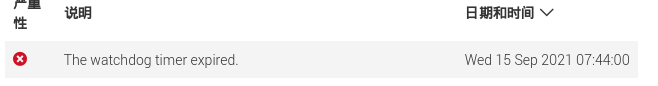
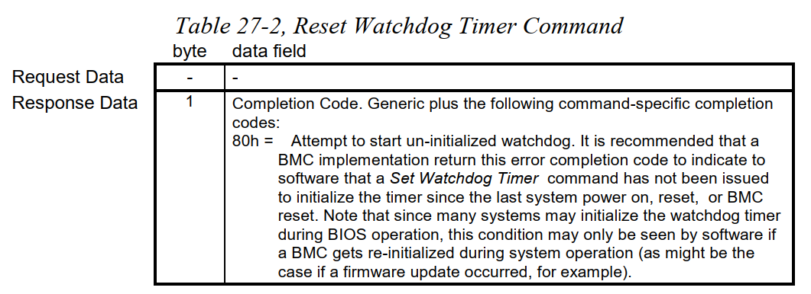
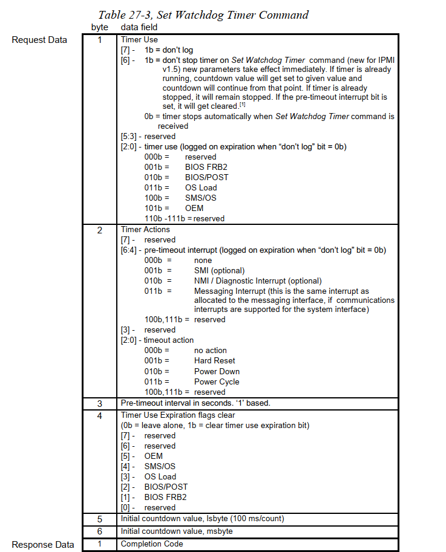
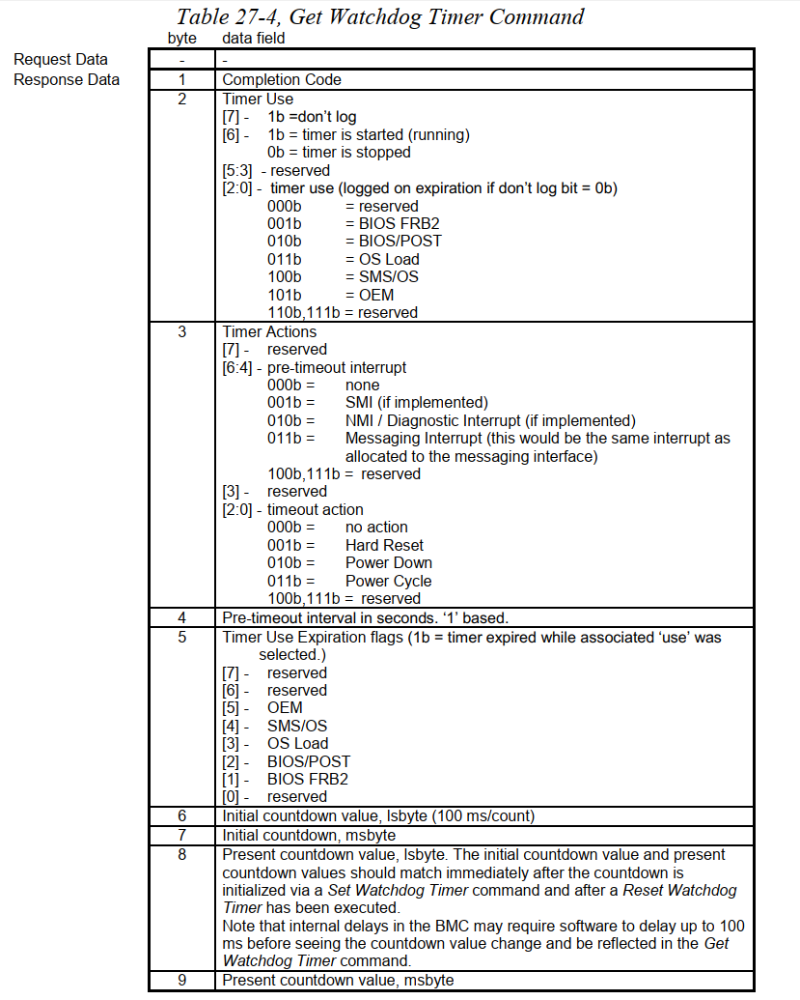

# 现象
在每次重启系统后，查看IPMI WEB SEL(system events log),都会出现
下面的告警打印:
* 华为IPMI界面打印<br/>

* DELL IPMI 界面打印<br/>


# 初步调查(询问厂商售后)
询问DELL和huawei售后，在查询到BIOS中ipmi watchdog已经被disable,
给出的一致性的结论是: 该日志是由上层软件产生的，并非有ipmi watchdog
触发生成．所以当时得出的假设是，是不是软件可以通过ipmi cmd，去使
BMC去记录日志．而并未是IPMI WATCHDOG超时触发记录．

但是经过后面调研，发现并非是这样．下面主要说下调查过程．

# 进一步调查
## 初步测试
一开始的测试是使用排除法，看看将ipmi相关驱动删除后，该日志还是
否会被记录，经过测试发现，ipmi_watchdog模块被移除后，日志就无法
记录，可以暂时得出的结论是，ipmi_watchdog会触发日志的记录．

## 初步查看代码
1. 查看ipmi_watchdog模块有没有直接记录日志的命令
经过查看代码并没有发现相关命令，只有ipmi watchdog cmd相关命令，
其中包括SET, GET和RESET, 下面会详细介绍．

因为该日志记录发生在系统初始化期间，所以查看ipmi_watchdog初始化
期间，有没有对ipmi_watchdog进行set操作

2. 查看ipmi_watchdog模块初始化操作
在ipmi_watchdog初始化期间，确实有对ipmi_watchdog进行set操作，操作
如下:
```
                ipmi_set_timeout
[   23.424482]  ipmi_new_smi+0x28/0x3c [ipmi_watchdog]
[   23.469231]  ipmi_register_smi+0x400/0x558 [ipmi_msghandler]
[   23.469245]  try_smi_init+0x500/0x7d0 [ipmi_si]
[   23.489798]  init_ipmi_si+0x98/0x17c [ipmi_si]
[   23.489800]  do_one_initcall+0x54/0x1d8
[   23.489804]  do_init_module+0x60/0x1f0
[   23.489805]  load_module+0x139c/0x16b8
[   23.489807]  __se_sys_init_module+0x168/0x280
[   23.489808]  __arm64_sys_init_module+0x24/0x30
```
如上面的堆栈所示，上面的堆栈表示的流程为：
系统初始化System Management Interface,　可以理解为BMC的消
息通道，初始化末尾，需要调用`ipmi_register_smi`对SMI进行注册，
注册后，需要去调用下每个watcher，让每个watcher进行简单的初
始化并进行功能验证，`ipmi_register_smi`代码如下:

```C/C++
int ipmi_register_smi(const struct ipmi_smi_handlers *handlers,
    void                     *send_info,
    struct device            *si_dev,
    unsigned char            slave_addr)
{
    ....
    /* After this point the interface is legal to use. */
    call_smi_watchers(i, intf->si_dev);
    ...
}
```
从注释中也可以看出, `call_smi_watchers`的作用之一，是为了
验证该wather是否正确使用该SMI．

查看`ipmi_new_smi`相关代码

```C/C++
static void ipmi_new_smi(int if_num, struct device *device)
{
   ipmi_register_watchdog(if_num);
}

static void ipmi_register_watchdog(int ipmi_intf)
{
    ...
     out:
   if ((start_now) && (rv == 0)) {
       /* Run from startup, so start the timer now. */
       start_now = 0; /* Disable this function after first startup. */
       ipmi_watchdog_state = action_val;
       ipmi_set_timeout(IPMI_SET_TIMEOUT_FORCE_HB);
       pr_info("Starting now!\n");
   } else {
       /* Stop the timer now. */
       ipmi_watchdog_state = WDOG_TIMEOUT_NONE;
       ipmi_set_timeout(IPMI_SET_TIMEOUT_NO_HB);
   }
}
```
在`ipmi_register_watchdog`函数末尾，会有两个分支，
分别进行了`ipmi_set_watchdog`的操作

首先查看第一个分支:
第一个分支表示，当`start_now`使能是，则使能watchdog.
第二个分支则表示，关闭watchdog
而start_now参数定义如下:
```C/C++
module_param(start_now, int, 0444);
MODULE_PARM_DESC(start_now, "Set to 1 to start the watchdog as"
        "soon as the driver is loaded.");
```
根据注释可以看出，该参数如果为1，则表示在该module load时，将
watchdog使能.

经过调试发现kernel走了下面的分支，也就是说，是需要关闭watchdog
这个那么关闭watchdog会触发ipmi sel么，我们需要结合ipmi 手册去
分析下`ipmi_set_timeout`这个接口.

## IPMI2.0 手册
PS: [手册链接](https://www.intel.cn/content/www/cn/zh/servers/ipmi/ipmi-intelligent-platform-mgt-interface-spec-2nd-gen-v2-0-spec-update.html?wapkw=ipmi)
这里只描述`27. BMC Watchdog Timer Commands`章节.

### Watcdog timer Actions
该action表示，如果watchdog timer expired会系统会触发什么动作:
* System Reset
* System Power Off
* System Power Cycle
* Pre-timeout Interrupt

### watchdog timer Use field
其中在watchdog中有一个字段可以用来描述该watchdog是处于那个阶段，
字段类型如下:
* BIOS FRB2 timeout
* BIOS POST timeout
* OS Load timeout
* SMS 'OS Watchdog' timeout
* OEM

根据huawei BMC sel 来看，该watchlog 设置应该是发生 `SMS 'OS 
Watchdog' timeout`阶段，也就是内核启动后的阶段。
(详细说明请见手册)

### Watchdog timer Event logging
默认情况下，BMC在watchdog timer expiration 发生的时候会去记录
一条日至，除非设置了`don't log`字段. 这个`don't log`字段会在
timer expiration的时候自动清空

### BMC watchdog timer commands类型

#### Reset Watchdog timer
这里的Reset命令起到了让watchdog running的作用，如果watchdog is running，
则让watchdog 继续保持running，并重置timer, 实际上就是喂狗操作。

命令格式如下：



#### Set Watchdog timer
Set Watchdog timer的作用是，设置当前watchdog的一些属性，例如超时时间，
在未设置don't stop标记位是，还可以将timer stop



从上面的字段来看，并没有让watchdog使能的字段, ipmi watchdog使能规则
如下:<br/>
* 如果执行命令之前 ipmi watchdog enable,并且don't stop flag标记位为 1, 
  则并不会enable, 并且将timeout的值更新到命令新设的值。
* 如果执行命令之前, ipmi watchdog enable, 并且don't stop flag标记位为0,
  则disable watchdog
* 如果执行命令之前，ipmi watchdog disable,则执行set命令则**不会**造成
  timer enable, 让timer enable的命令仅有reset命令

#### Get Watchdog timer
通过Get命令, 可以得到watchdog的状态，具体不再赘述，命令如下:



# 进一步查看代码

## set cmd
我们来看下set相关底层代码: ipmi命令发送接口

### __ipmi_set_timeout

```C/C++
static int __ipmi_set_timeout(struct ipmi_smi_msg  *smi_msg,
                  struct ipmi_recv_msg *recv_msg,
                  int                  *send_heartbeat_now)
{
    struct kernel_ipmi_msg            msg;
    unsigned char                     data[6];
    int                               rv;
    struct ipmi_system_interface_addr addr;
    int                               hbnow = 0;


    data[0] = 0;
	//================[1]========================
    WDOG_SET_TIMER_USE(data[0], WDOG_TIMER_USE_SMS_OS);

    if ((ipmi_version_major > 1)
        || ((ipmi_version_major == 1) && (ipmi_version_minor >= 5))) {
        /* This is an IPMI 1.5-only feature. */
		//================[2]========================
        data[0] |= WDOG_DONT_STOP_ON_SET;
    } else if (ipmi_watchdog_state != WDOG_TIMEOUT_NONE) {
        /*
         * In ipmi 1.0, setting the timer stops the watchdog, we
         * need to start it back up again.
         */
		//================[3]========================
        hbnow = 1;
    }

    data[1] = 0;
    WDOG_SET_TIMEOUT_ACT(data[1], ipmi_watchdog_state);
    if ((pretimeout > 0) && (ipmi_watchdog_state != WDOG_TIMEOUT_NONE)) {
        WDOG_SET_PRETIMEOUT_ACT(data[1], preaction_val);
        data[2] = pretimeout;
    } else {
        WDOG_SET_PRETIMEOUT_ACT(data[1], WDOG_PRETIMEOUT_NONE);
        data[2] = 0; /* No pretimeout. */
    }
    data[3] = 0;
    WDOG_SET_TIMEOUT(data[4], data[5], timeout);

    addr.addr_type = IPMI_SYSTEM_INTERFACE_ADDR_TYPE;
    addr.channel = IPMI_BMC_CHANNEL;
    addr.lun = 0;

    msg.netfn = 0x06;
	//================[4]========================
    msg.cmd = IPMI_WDOG_SET_TIMER;
    msg.data = data;
    msg.data_len = sizeof(data);
	//================[5]========================
    rv = ipmi_request_supply_msgs(watchdog_user,
                      (struct ipmi_addr *) &addr,
                      0,
                      &msg,
                      NULL,
                      smi_msg,
                      recv_msg,
                      1);
    if (rv)
        pr_warn("set timeout error: %d\n", rv);
    else if (send_heartbeat_now)
		//================[6]========================
        *send_heartbeat_now = hbnow;

    return rv;
}
```
这里主要解释几点:
1. 这里设置watchdog use field字段，表示是SMS/OS在使用watchdog，实际上
   就是表明是kernel在使用
2. `don't stop`标记只有在ipmi1.5之后的版本中才支持，所以这里要判断下
3. 如果ipmi_watchdog_state表示`watchdog timeout actions`, 如果是no action
   的话，则将设置hbnow = 1, 该标记位在末尾[5]处赋值给`send_heartbeat_now`
   后面会讲到
4. cmd表示的是cmd类型，watchdog 包括get set reset
5. 这个接口是命令发送接口，不再讲述

他的上一层接口主要是`_ipmi_set_timeout`

### _ipmi_set_timeout

```C/C++
static int _ipmi_set_timeout(int do_heartbeat)
{
    int send_heartbeat_now;
    int rv;

    if (!watchdog_user)
        return -ENODEV;

    atomic_set(&msg_tofree, 2);

    rv = __ipmi_set_timeout(&smi_msg,
                &recv_msg,
                &send_heartbeat_now);
    if (rv)
        return rv;

    wait_for_completion(&msg_wait);

	//================[1]========================
    if ((do_heartbeat == IPMI_SET_TIMEOUT_FORCE_HB)
        || ((send_heartbeat_now)
            && (do_heartbeat == IPMI_SET_TIMEOUT_HB_IF_NECESSARY)))
        rv = __ipmi_heartbeat();

    return rv;
}
```
这里需要解释下:

[1]处的代码如果参数为 IPMI_SET_TIMEOUT_FORCE_HB, 则表示强制
heartbeat, 实际上也就是reset操作.
如果参数为 IPMI_SET_TIMEOUT_HB_IF_NECESSARY, 并且set_heartbeat_now
使能的话，则进行heartbeat操作

这里实际上要讲到再ipmi1.5之前的版本，没有don't stop标记位的一些问题
（下面是个人理解）
如果watchdog is running , 现在要修改watchdog某些字段时（例如超时时间)，
需要执行完set命令，再去执行reset命令。 而有don't stop标记位时，只执行
set命令就可以了。但是这样的话，会造成timer关不掉的情况，kernel是怎么做的呢
我们主要看下`ipmi_close`接口

### ipmi_close

```C/C++
static int ipmi_close(struct inode *ino, struct file *filep)
{
    if (iminor(ino) == WATCHDOG_MINOR) {
		//================[1]========================
        if (expect_close == 42) {
            mutex_lock(&ipmi_watchdog_mutex);
            ipmi_watchdog_state = WDOG_TIMEOUT_NONE;
            _ipmi_set_timeout(IPMI_SET_TIMEOUT_NO_HB);
            mutex_unlock(&ipmi_watchdog_mutex);
        } else {
            pr_crit("Unexpected close, not stopping watchdog!\n");
            ipmi_heartbeat();
        }
        clear_bit(0, &ipmi_wdog_open);
    }

    expect_close = 0;

    return 0;
}
```
[1] 处的代码表示，希望在执行`ipmi_close`时，将watchdog关闭

关闭的方法实际上是, 将`ipmi_watchdog_state`设置为no action,
然后设置IPMI_SET_TIMEOUT_NO_HB, 这样进入底层接口时，假如说
有`don't stop`标记的话，那实际上也关不掉，但是呢，超时后，并
不会有任何的动作(power reset , power off ...), 这样就相当于
关闭了，但是会**记录一条日志**.

## reset cmd
reset命令相关底层接口为

```
int __ipmi_heartbeat(void)
```
该接口没有什么好说的，略过。而他的上层接口在下面的章节中会涉及。

### get cmd
kernel中并没有get cmd代码，没有使用该命令, 

# 结合代码、手册调试分析

## 对ipmi_register_watchdog执行的stop操作分析
现在再看下上面提到的那个问题, `ipmi_register_watchdog`执行了stop
操作会不会导致BMC记录日志呢, 我在代码中加入了一些调试，调试逻辑
大概如下：

```
通过get watchdog timer cmd 获取set cmd执行之前的watchdog的状态
  |
  |
set cmd ----实际上是stop cmd, 这里获取下set cmd命令值
  |
  |
通过get watchdog timer cmd 获取set cmd执行之后的watchdog的状态
```

得到的数据如下：

```
=======cmd exec Before state==========
data[1] = 0
data[2] = 3 (表示是timer stop的，并且上次是由OS loader设置的)
data[3] = 0
data[4] = 0
data[5] = 0
data[6] = 184
data[7] = 11
data[8] = 184
data[9] = 11

=======CMD data =====================
data[0]:68
data[1]:0
data[2]:0
data[3]:0
data[4]:100 (重新设置了下时间）
data[5]:0

=======cmd exec After state==========
data[1] = 0
data[2] = 4 (表示上次设置是SMS/OS)
data[3] = 0
data[4] = 0
data[5] = 0
data[6] = 100
data[7] = 0
data[8] = 100
data[9] = 0
```
结合上面的`get && set cmd`可以看出，在执行set cmd之前，
该timer 已经stop了，而这次的设置并没有执行reset命令，
该timer还是stop的，所以说记录的日志并不是该流程触发的。

## 增加调试信息，查看其他流程
经过调试，发现在系统启动后，有进程会去操作watchdog，
这个进程是wdctl命令

堆栈如下:

```
CPU: 14 PID: 15118 Comm: wdctl Tainted: G           OE    --------- -  - 4.18.0-147.5.1.el8_1.5es.14.wang23.aarch64 #1
Hardware name: Huawei TaiShan 200 (Model 2280)/BC82AMDDA, BIOS 1.70 01/07/2021
Call trace:
dump_backtrace+0x0/0x188
show_stack+0x24/0x30
dump_stack+0x90/0xb4
_ipmi_set_timeout.part.2+0x64/0xf0 [ipmi_watchdog]
_ipmi_heartbeat+0xac/0xc0 [ipmi_watchdog]
ipmi_heartbeat+0xa0/0xe4 [ipmi_watchdog]
ipmi_write+0xd0/0xf0 [ipmi_watchdog]
__vfs_write+0x48/0x90
vfs_write+0xac/0x1b8
ksys_write+0x6c/0xd0
__arm64_sys_write+0x24/0x30
el0_svc_handler+0xa0/0x128
el0_svc+0x8/0xc

和
CPU: 1 PID: 15118 Comm: wdctl Tainted: G           OE    --------- -  - 4.18.0-147.5.1.el8_1.5es.14.wang23.aarch64 #1
Hardware name: Huawei TaiShan 200 (Model 2280)/BC82AMDDA, BIOS 1.70 01/07/2021
Call trace:
dump_backtrace+0x0/0x188
show_stack+0x24/0x30
dump_stack+0x90/0xb4
_ipmi_set_timeout.part.2+0x64/0xf0 [ipmi_watchdog]
ipmi_close+0xb0/0xd8 [ipmi_watchdog]
__fput+0x9c/0x1d8
____fput+0x20/0x30
task_work_run+0xb0/0xe0
do_notify_resume+0x2c4/0x2f8
work_pending+0x8/0x10
```

首先看下第一个堆栈，第一个堆栈实际上执行了一个ipmi_write操作，
经过调试发现，是往设备文件写入了一个字符`V`

```C/C++
static ssize_t ipmi_write(struct file *file,
              const char  __user *buf,
              size_t      len,
              loff_t      *ppos)
{
    int rv;

    if (len) {
        if (!nowayout) {
            size_t i;

            /* In case it was set long ago */
            expect_close = 0;

            for (i = 0; i != len; i++) {
                char c;

                if (get_user(c, buf + i))
                    return -EFAULT;
                if (c == 'V')
					//如果是V的话，则设置expect_close = 42, 这个在刚刚的ipmi_close
					//接口中也看到过，实际上就是希望在进程退出时，可以将ipmi watchdog
					//stop
                    expect_close = 42;
            }
        }
        rv = ipmi_heartbeat();
        if (rv)
            return rv;
    }
    return len;
}
```

我们再来看下`ipmi_heartbeat`接口: 

```C/C++
static int ipmi_heartbeat(void)
{
    int rv;
	//===============[1]===============
    mutex_lock(&ipmi_watchdog_mutex);
    rv = _ipmi_heartbeat();
    mutex_unlock(&ipmi_watchdog_mutex);

    return rv;
}

static int _ipmi_heartbeat(void)
{
    int rv;

    if (!watchdog_user)
        return -ENODEV;

    if (ipmi_start_timer_on_heartbeat) {
        ipmi_start_timer_on_heartbeat = 0;
        ipmi_watchdog_state = action_val;
		//===============[2]===============
        rv = _ipmi_set_timeout(IPMI_SET_TIMEOUT_FORCE_HB);
    } else if (atomic_cmpxchg(&pretimeout_since_last_heartbeat, 1, 0)) {
        /*
         * A pretimeout occurred, make sure we set the timeout.
         * We don't want to set the action, though, we want to
         * leave that alone (thus it can't be combined with the
         * above operation.
         */
        rv = _ipmi_set_timeout(IPMI_SET_TIMEOUT_HB_IF_NECESSARY);
    } else {
        rv = __ipmi_heartbeat();
    }

    return rv;
}
```
这里说明几点:
1. 在执行ipmi watchdog cmd时，需要加锁，因为有一些资源是公用的，比如说
   等待队里额
2. 这里在open后，第一次write操作，都会走这个流程，这个刚刚也分析过，
   实际上就是执行了set cmd之后，又执行了reset命令将timer 使能。

那么查看到这，真相大白了，实际上是wdctl操作了watchdog，是watchdog使能，
然后又在wdctl执行完成后，走到了ipmi_close的流程，该流程想让watchdog stop，
但是呢，在新版的ipmi watchdog协议下，kernel使用了`don't stop`标记位，
watchdog实际上无法通过set命令stop，而是将action 设置为no action，然后
静等时间流逝触发watchdog timer expired，记录下日志.

我这边也调试了下，确认下自己的想法，调试流程如下:

```
通过get命令获取timer状态
		|
		|
	ipmi_write->ipmi_heartbeat（并获取set cmd信息)
		|
		|
通过get命令获取timer状态
		|
		|
	ipmi_close(获取set cmd信息)
		|
		|
通过get命令获取timer状态

```

得到信息如下:


```
1. 执行ipmi_write前，timer状态
data[1] = 0
data[2] = 4 (timer并未开启)
data[3] = 0 (no action)
data[4] = 0
data[5] = 0
data[6] = 100
data[7] = 0
data[8] = 100
data[9] = 0

2. 执行ipmi_write相关set cmd
data[0]:68 (设置don't stop标记)
data[1]:1 (设置action 为system power reset)
data[2]:0
data[3]:0
data[4]:100
data[5]:0
（之后还执行了reset命令，让timer使能)

3. 执行ipmi_write后，timer状态
data[1] = 0
data[2] = 68 (timer开启)
data[3] = 1  (action为system power reset)
data[4] = 0
data[5] = 0
data[6] = 100
data[7] = 0
data[8] = 98
data[9] = 0

4. 执行ipmi_close相关set命令
data[0]:68
data[1]:0 (将action修改为no action)
data[2]:0
data[3]:0
data[4]:100
data[5]:0

5. 执行ipmi_close后，timer状态
data[1] = 0
data[2] = 68 (timer 仍然使能)
data[3] = 0 (action 变为no action)
data[4] = 0
data[5] = 0
data[6] = 100
data[7] = 0
data[8] = 98
data[9] = 0
```

从上面来看, 当执行ipmi_close之后，timer仍然是使能的状态，
所以经过10s之后，会触发watchdog timer expired，记录日志

# 其他调试
这里我还调试以获取用户态进程的行为，
获取到了大概的相关父子进程链，以及cmdline
信息如下:

1. 进程链:

```
systemd->containerd-shim->bash->node-hagent->timeout->wdctl
```

2. cmdline
这里我只列下timeout的cmdline比较有代表性:

```
timeout cmdline : timeout 5 wdctl -F -T -O /dev/watchdog
```

# 结论

* 在ipmi1.5版本之后的IPMI + v6 kernel, 如果将timer running，
  再stop时，是无法关闭timer的，过配置的时间后， 则会触发超时，
  但是并不会影响系统的运行
* 目前主线版本kernel也是这样操作的，这样stop timer后，超时无法避免，
  但是通过don't log标记可以避免日志的产生，这样做是否合理，还
  需要和社区研发人员讨论下
* DELL记录watchdog timer expired这种类型的sel相对于huawei和IBM服务器 
  级别过高，但是向戴尔售后询问后，DELL表示新版本的固件，还是这样
  的处理方式
* 关于用户态行为，请reporter查看下是否还需要相关同事调研下
